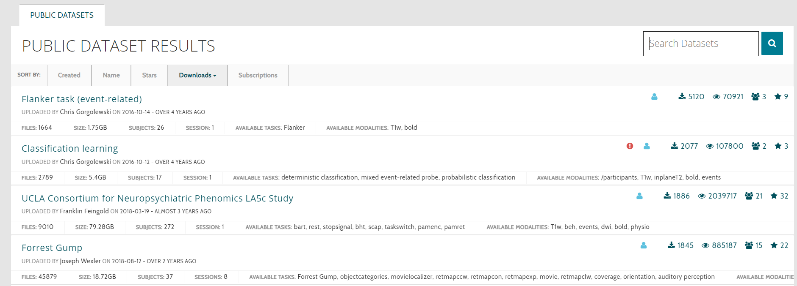
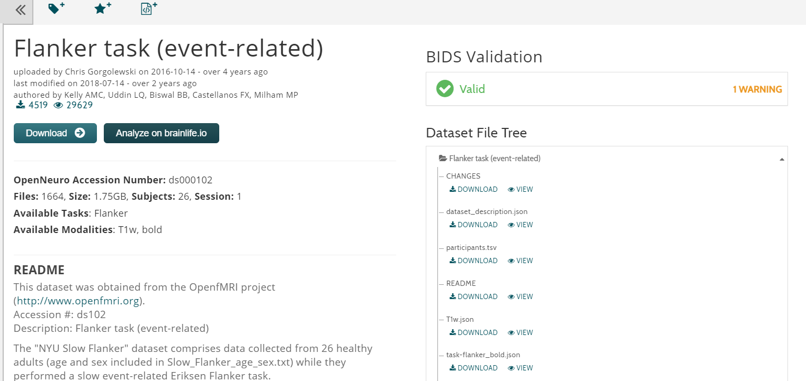

OpenNeuro
====================

Welcome to OpenNeuro

OpenNeuro(OpenfMRI) is an open-science neuroinformatics online database storing datasets from human brain imaging research studies.It accept Neuroimaging researchers upload their date to this site so third-party researchers could download the data and analyze it.

.. image:: OpenNeuro_1.PNG

`OpenNeuro <https://openneuro.org/>`__

.. toctree::
   :maxdepth: 1
   :caption: Start to Finish Analysis with AFNI

