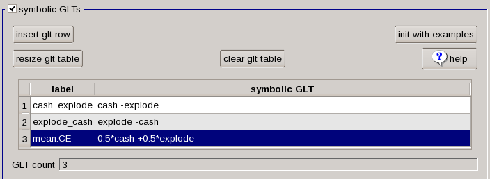
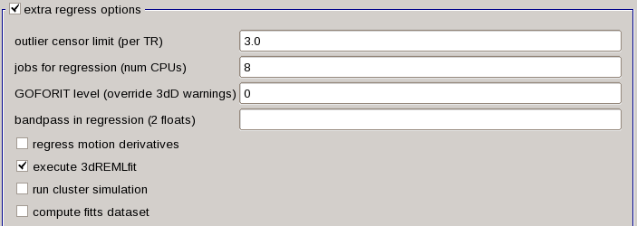
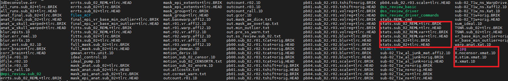
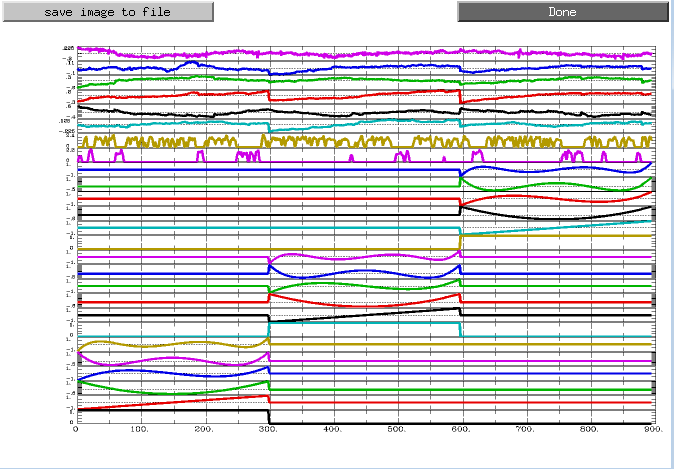
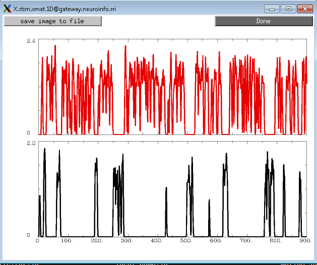

\Running the 1st level analysis
==============================

Previously, we have used **uber_subject.py** to set up the preprocessing for a single subject. You may remember that we removed one of the blocks called “regress”. Now, we will add the regress back and 
combine both preprocessing and 1st-level analysis.Let’s start a new script for the same subject, sub-02. First of all, we need to remove the preprocessed result by typing ``rm -r subject_results`` from 
sub-02 directory. And type ``uber_subject.py`` from the terminal. We will leave "analysis initialization" as the default setting like all the blocks keep as they are.

Let's copy what we did in the preprocessing such as ``fill the name tab``, ``anatomical dataset``, ``EPI dataset``, ``expect options``, ``extra align options``, ``extra tlrc options` . But this time, we need to do more with 3 more sections:

1 stimulus timing files 
2 symbolic GLTs 
3 extra regress options

Stimulus Timing Files
*********************

As we have created the timing files in the last chapter, click the **browse stim** to select the "explode.1D" and "cash.1D" files from sub-02/func. After you click the OK, there are 3 more columns jump 
up; “label”, “basis”, and “type”. “Label” is how the timing reference files in the command that does the model fitting (i.e., 3dDeconvolve), “basis” and “type” indicated that whaty kind of function we 
will apply to the timing files.

The default basis function is GAM, which specifies that the onset times should be convolved with the canonical HRF as we discussed before from the statistics and modeling chapter. This basis function 
requires the height of the HRF as the parameter for estimation, which roughly corresponds to the amount of neural activity in response to that condition. The tab below, “init file types” specify the type 
of convolution we are going to use. The default setting is times, which means to convolve all of the time-points specified in the timing file and generate a parameter estimate for the HRF that on average 
fits all of the occurrences.

.. image:: Stimulus_timing.PNG

Symbolic GLTs
*************

The following section, ``Symbolic GLTs`` allows you to specify general linear tests after the AFNI estimated the beta weights from the different conditions from the above section. let's take the “init 
with examples” as an example. After you click it, there are two contrasts: C-E, and mean. CE. The first contrast uses contrast weights to specify how the contrast between different conditions will be 
calculated, and it prepares the contrast weights to the labels we have specified from “stimulus timing files” section. the default of no sign in a contrasting weight is +1, while a negative sign will 
assign a contrasting weight of -1. Therefore, the line here shows that we assign weight to the parameter estimate for the Cash condition with +1, and assign weight to the parameter estimate for the 
explode condition with -1. The second contrast, use different computation, takes the average of the two conditions by multiplying 0.5 for both.

In general, the sum of contrast weights of different conditions should be 0, and the sum of the average of contrast weights across conditions should be 1.

Let’s change this GLT syntax table and to set up the contrasts. In the first row, change the “label” column to "cash_explode", and in the later “symbolic GLT” column, do **cash -explode**. similarly, the 
second row we need to specify a contrast of explode_cash as well as explode -cash. Then, click ``insert glt row`` and put the **0.5*cash +0.5*explode** the section will look like this:

Extra Regress Options
*********************

Lastly, let's check out the other options. The first one, “outlier censor limit”, will remove any TRs from this analysis that has been censored outlier fraction greater than the number we put on the 
right side. (For example, by ``3dToutcount``, if we type 3 in there, which will signify any voxels in a TR that have signal intensity greater than 3 standard deviations from the other voxels in brain 
mask.) If this is left at 0.0, then will be no TRs will be censored based on the output from ``3dToutcount``. We will use the default setting now.

The next section, “jobs for regression (num CPUs)”, indicate how many processors we can use for the regression analysis. You can use the maximum number of CPUs that you can spare. We will set it to 8. 
“GOFORIT level (override 3dD warnings)” will ignore any warnings about the design matrix detected by 3dDeconvolve. In general, you will want 3dDeconvolve to throw a warning and stop running when it finds 
a high level of collinearity among two or more regressors.

The “bandpass in regression” tab will be used for resting-state analyses to remove both low and high frequency fluctuations. And low-pass filtering (i.e., removing high frequency signal) risks will be 
applied to removing actual signal related to the task. 

There are four more options in addition. 1 “Regress motion derivatives” will model higher-order derivatives of the motion regressors, which can capture more complex head movements. This is useful for 
populations that tend to move a lot, such as children or clinical subjects; and as long as you have a long time-series of data (more than 200 TRs in a run). 2 The “run cluster simulation” box unchecked, 
as this computes whether a cluster is statistically significant in real time as you change the thresholding slider. We will do inference later at a group level later. 3 I do, however, check the “execute 
REMLfit” option, as this will create a separate statistical dataset that better accounts for temporal autocorrelation than the traditional ``3dDeconvolve`` approach. 4 Later on, we can use the output 
from ``3dREMLfit`` to use information about the variability of the subject’s parameter estimates in order to create more precise group-level inference maps.

The Ideal Time-Series and the GLM
*********************************

let’s take a look at how the model we just created relates to the GLM. As we know that each voxel has a BOLD time-series (our outcome measure), which is Y in this GLM.  We also have our two regressors, 
which we will represent with x1 and x2. These regressors constitute our design matrix, which we represent with a large X.

So far, all of these variables are known - Y is measured from the data, and x1 and x2 are made by convolving the HRF and the timing onsets. Since matrix algebra is used to set up the design matrix and 
estimate the beta weights, the orientations are turned ninety degrees: Normally we think of the time axis as going from left to right, but instead it is depicted as going from top to bottom. In other 
words, the onset of the run begins at the top of the timecourse.

The beta weights of the GLM equation is B1 and B2. These signify our estimate of the amount of HRF for each regressor to best match the original data in Y. The last term in this equation is E, which 
represents the residuals, or the difference between our ideal time series and the data after estimating the beta weights. As you might know it, If the model is good, the residuals will decrease, and one 
or more of the beta weights are more likely to be statistically significant.

Examining the Output
********************

When the AFNI finishes, ``cd`` to the folder "sub-02/subject_results/group.BART/subj.sub_02/sub_02.results." You can see all the preprocessed files, what's more, you will also see statistical datasets: 
files with "stats.sub_02+tlrc" has been analyzed by ``3dDeconvolve`` approach, and file like "stats.sub_02_REML+tlrc" has accounted for temporal autocorrelation.

There are also some see files beginning with an “X”, such as X.xmat.1D. These represent different parts of the design matrix. For example, you can view these design matrix by typing ``aiv X.jpg``

.. image:: Design_matrix.PNG

For a different view, looking at all of the regressors and stimulus in separate rows, type ``1dplot -sepscl X.xmat.1D`` and ``X.stim.xmat.1D``.

