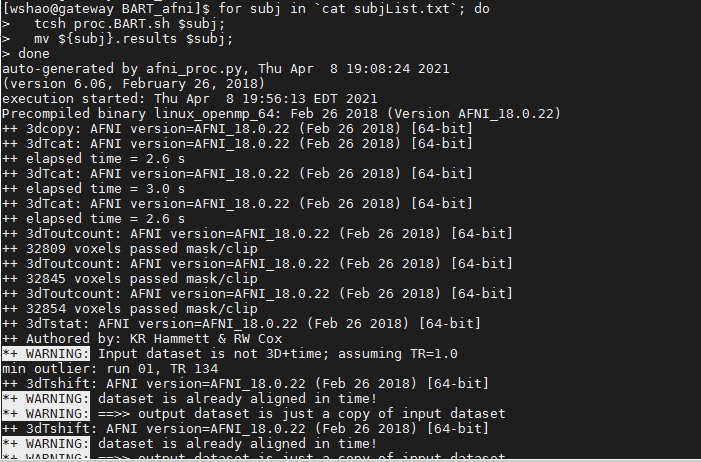

Automation
==========

Since we have 16 subjects and each subject has 3 runs. In total, we need to repeat all the preprocessing and 1st level analysis in AFNI_GUI 48 times! it is not hard but it is a really tedious job and you 
could make errors easily. As Joey from Friends said, there’s gotta be a better way, and there is.

Here is the script that makes your life easier!

Creat a design file
*******************

We have analyzed the first subject, sub-02, and created a file called **proc.sub_02**. This file contained a list of AFNI commands, composed in a manner determined by ``uber_subject.py GUI`` which we 
played before. Now it is time to ``cp`` this file to the BART directory that has all of your subjects, and rename it as **proc_BART.sh**. Let's go to the directory which has the "pro.sub_02" file and 
type this::

  cp proc.sub_02 ../../../../proc.BART.sh

After that, you are able to find the proc.BART.sh in your BART directory, We are going to 2 things:

1 Remove every reference to sub-02, and turn those strings into a new variable. For example, we will change the script so that it will replace the variable in our script with the string whatever we want, 
and analyze the corresponding subject’s data.

2 We will replace the paths to be more generalizable so that AFNI can find the corresponding input data.

To begin with, open the proc_BART.sh with a text editor like nano or other editors. Scroll down a little bit, which contains the following code::

  # the user may specify a single subject to run with
  if ( $#argv > 0 ) then
      set subj = $argv[1]
  else
      set subj = sub_02
  endif

This is a conditional statement. The first few lines state that if the user provides an argument as input, then set the variable “subj” to whatever the argument is. If you look through the rest of the 
script **proc_BART.sh**, you will see numerous lines that contain the variable “$subj”. which is our argument. Another part we need to change is the paths which involves the sub-02 such as we will need 
to replace these with the “$subj” variable. typy “Ctrl+W” and "Ctrl+R" to replace it as ``${subj}``.

Next, we will need to replace the relative path. As you can see in the script, there are several lines of code that contain paths starting with **/home/wshao/BART_afni/**. We will replace this with the 
$PWD or the whatever current working directory path you have, This will ensure that the script will be adapted to the your work environment. For example, you can change the **/home/wshao/BART_afni/** to 
``$PWD``

you can download the script from `here can make the some changes for you dataset if necessary.   

Automating the Analysis
***********************

When you done the set up for the **proc_BART.sh**, use this updated preprocessing script in a for-loop to loop over all of the subjects in our dataset. with this code::

  for subj in `cat subjList.txt`; do
    tcsh proc.BART.sh $subj;
    mv ${subj}.results $subj;
  done 

you can write this code in a new script and ``bash`` it or run this code in your terminal directly. 

.. image:: For_prof_BART.PNG

