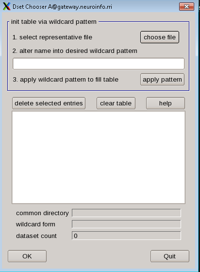

Group_analysis
==============

one of the goals in fMRI analysis is to generalize the results from the sample to the population. In other words, if we see the pattern of brain activity in our sample, it is reasonable to infer that 
these changes would would most likely happe in the population as well?

In order to test this, a group-level analysis (second-level analysis) is needed. we need to calculate the standard error and the mean for a contrast estimate, and then test whether the average estimate 
is statistically significant. There are two ways to do this group-level analysis in AFNI:

1 3dttest, which uses only the contrast estimates in testing for statistical significance
2 3dMEMA, which accounts for both the difference between the parameter estimates, and the variability of that contrast.

uber_ttest.py
^^^^^^^^^^^^^

We can use an AFNI GUI to set up our group-level analyses like we did with ``uber_subjects.py``. type the command ``uber_ttest.py`` from the terminal and press return, you will see:

.. image:: ttest.PNG

The first tab, “program”, allows 3dttest and 3dMEMA. The difference between these two is that 3dMEMA will count the variability of the estimate as well, and give more weight to those subjects who have 
lower variability in their estimates. For now, we use “3dttest”. In the next part, the “script name” and “dset prefix” tab, type "cash-explode_ttest". For the “mask dset”, choose the 
**mask_group+tlrc.HEAD** located in the results directories.

Using wildcards, we can select each of the subject statistical datasets. Click “get subj dsets” from “datasets A”, select a representative file. Select a subjects’ statistical datasets such as 
"stats.sub-02+tlrc.HEAD", and replace the last two numbers of sub-"02" with two question marks "sub-??". Then click on “apply pattern”. If all of the subjects we analyzed are the same way and have the 
same directory structure, there will be 16 entries in the field below. 

At the bottom of the “datasets A” section, you will see a few additional fields. In “set name (group of class), write cash-explode, and in “data index/label” type 7.

Why 7, type 3dinfo -verb stats.sub-02+tlrc from the results directorie

.. image:: wildcard.PNG

