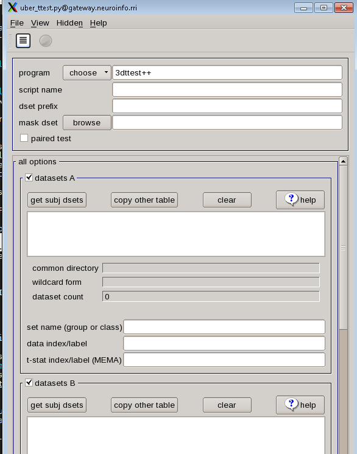
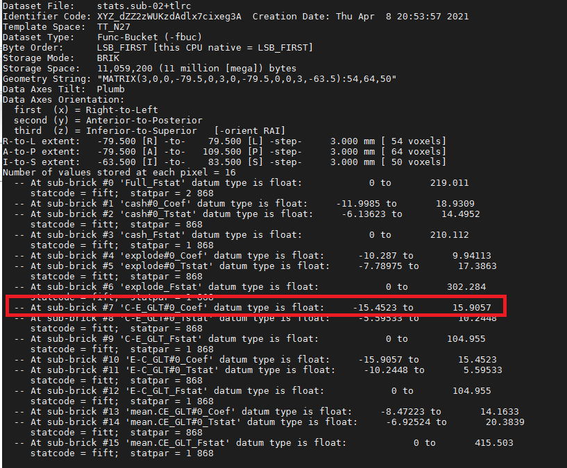
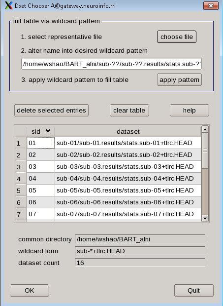
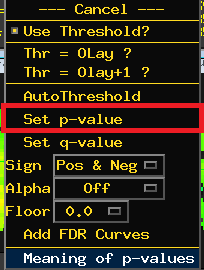
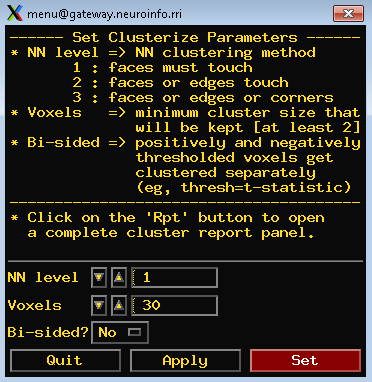
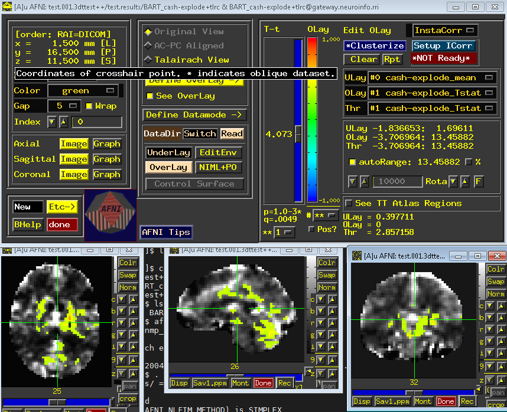
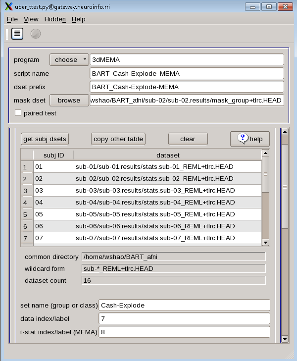

Group_analysis
==============

one of the goals in fMRI analysis is to generalize the results from the sample to the population. In other words, if we see the pattern of brain activity in our sample, it is reasonable to infer that 
these changes would would most likely happe in the population as well?

In order to test this, a group-level analysis (second-level analysis) is needed. we need to calculate the standard error and the mean for a contrast estimate, and then test whether the average estimate 
is statistically significant. There are two ways to do this group-level analysis in AFNI:

1 3dttest, which uses only the contrast estimates in testing for statistical significance
2 3dMEMA, which accounts for both the difference between the parameter estimates, and the variability of that contrast.

uber_ttest.py
^^^^^^^^^^^^^

We can use an AFNI GUI to set up our group-level analyses like we did with ``uber_subjects.py``. type the command ``uber_ttest.py`` from the terminal and press return, you will see:

The first tab, “program”, allows 3dttest and 3dMEMA. The difference between these two is that 3dMEMA will count the variability of the estimate as well, and give more weight to those subjects who have 
lower variability in their estimates. For now, we use “3dttest”. In the next part, the “script name” and “dset prefix” tab, type "cash-explode_ttest". For the “mask dset”, choose the 
**mask_group+tlrc.HEAD** located in the results directories.

Using wildcards, we can select each of the subject statistical datasets. Click “get subj dsets” from “datasets A”, select a representative file. Select a subjects’ statistical datasets such as 
"stats.sub-02+tlrc.HEAD", and replace the last two numbers of sub-"02" with two question marks "sub-??". Then click on “apply pattern”. If all of the subjects we analyzed are the same way and have the 
same directory structure, there will be 16 entries in the field below. 

At the bottom of the “datasets A” section, you will see a few additional fields. In “set name (group of class), write cash-explode, and in “data index/label” type 7.

Why 7?, type 3dinfo -verb stats.sub-02+tlrc from any results directories such as **sub-02.results**. you will see this:

This will show all of the sub-briks and the labels accordingly. As we are looking for the contrast estimates for cash-explode. The output of 3dinfo shows that this is located in sub-brik 7(C-E). The
sub-brik that contains the label “Coef” means that it is a parameter (or contrast) estimate.  “Tstat” indicates a t-statistic. "Fstat” means an F-statiastic.

After you have done all the steps, we should see a form looks like this:

As with the uber_subject.py script, there are buttons at the top of the GUI for both generating the script and then running the script. First click on the icon that looks like a sheet of paper with lines 
on it, which will show you the command that has been generated. Review it to see how it has inserted all of your inputs into a command called ``3dttest++``, which will run the actual group-level 
analysis. Then click on the green “Go” icon to run the test.

Viewing the Results
^^^^^^^^^^^^^^^^^^^

When ``Go`` has been finished, You will see a new directory called "group_results" has been created if you go back to Terminal and type ``ls``, ``cd`` to test.001.3dttest++. Which contains the script we 
just produced (“BART_cash-explode_ttest”), another folder called test.results, which contains the group-level output. Load this in the afni viewer, set an uncorrected p-value of 0.001 (by right-clicking 
on the “p=” ) and clusterize the data to 40, which show clusters with an extent of 30 voxels or more.

3dMEMA
^^^^^^

Close the AFNI viewer, and go back to the uber_ttest.py GUI, and make the following changes:

1 Change the “program” from 3dttest++ to 3dMEMA.
2 Change the “script name” and “dset prefix” to BART_Cash-ExplodeCash-Explode .
3 Click on “get subj dsets”, and select a subject’s statistical dataset such as stats.sub-02_REML+tlrc. Use the wildcards as above to select all of the subjects’ REML datasets.
4 In the field “t-stat index/label (MEMA)”, type 8. The sub-briks of the REML dataset, which should be in an order identical to the non-REML statistical dataset, indicate that sub-brik #8 is the 
t-statistic associated with the contrast estimate of “incongruent-congruent.”

As before, click on the script generator icon, and then click on the green “Go” button. This model estimation will take longer, and you will see a progress report for each slice that has been analyzed; 
in total, it should take only a couple of minutes.

When it has finished, you will see a new directory in the group_results folder called test.002.3dMEMA, with a sub-directory called test.results. Navigate to that folder, and overlay the results as 
before. Are the effects in the same location? Do these effects look stronger or weaker? Why?

