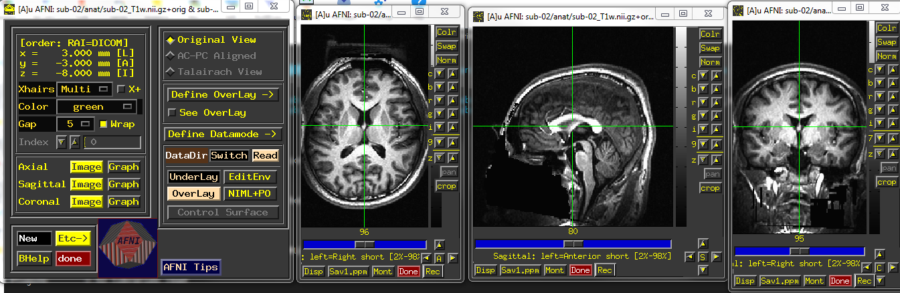
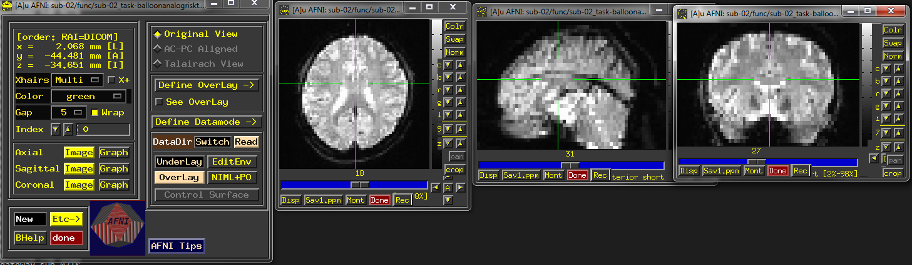
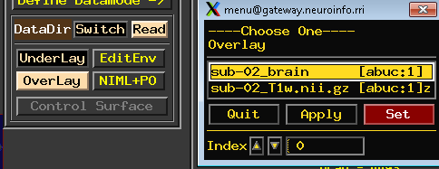
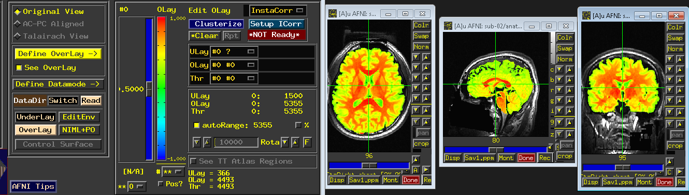

Preprocessing
=============

Remember our drink menu? It is a little different for what we should do in AFNI but overall there are very similar, Anyway, let’s have a couple of drinks before the meal:

Inspecting the image
^^^^^^^^^^^^^^^^^^^^

Before we are actually running the analysis, it is beneficial for us to check the data for any problems such as scanner spikes, incorrect orientation, or poor contrast, and so on. Although it might be 
unnecessary for the open neuroimaging data, it is really important for you to check the image before when it comes to your own data.

Let's start from **sub-02**, ``cd`` to ``BART_afni/sub-02/anat`` directory and type ``afni`` to open the AFNI graphical user interface. you might see this

.. image:: AFNI_cashlog.PNG

That because AFNI will look for any images in the current directory by default - and load all of them into the program. If you want to load only the anatomical T1 image into the AFNI viewer, you would 
either go to sub-02/anat and type type: ``afni sub-02_T1w.nii.gz`` or type ``afni anat/sub-02_T1w.nii.gz`` from ``sub-02`` directory

  T1 anat image of sub-02

When you are done with the anatomical image, click on the ``Read`` button from the menu at the top of your screen. In the “Directories” sidebar, double-click on the filepath that ends in two dots such as 
.., which indicates one directory above the current directory. Then double-click on the func directory in the “Sessions” sidebar. This loads all of the images in the func directory, which you can look at 
the AFNI viewer.

  
   functional image of sub-02

If you want to go back to look at the anat image again, click on **Switch** and select the another session. Inspect the image by clicking around in one of the viewing windows. Notice how the other 
viewing windows and crosshairs change as a result - this is because MRI data is collected as a three-dimensional image, and moving along one of the dimensions will change the other windows as well.

Be careful with two things:
 
1 Lines that look like ripples in a pond. These are called **Gibbs Ringing Artifacts**, and they may indicate an error in the reconstruction of the MR signal from the scanner. These ripples may also be 
caused by the subject moving too much during the scan. In either case, if the ripples are large enough, they may cause preprocessing steps like brain extraction or normalization to fail.

.. image:: AFNI_Gibbt.gif

2 Abnormal intensity differences within the grey or the white matter. These may indicate pathologies such as aneurysms or cavernomas, and they should be reported to your radiologist right away; make sure 
you are familiar with your laboratory’s protocols for reporting artifacts. You can take a `gallery of pathologies <http://www.mrishark.com/brain1.html/>`__ as a reference. 

You might notice there is a black block/missing information on the face areas, it is because all the data from the open-source dataset need to be defaced for the purpose of privacy.

Skull stripping
^^^^^^^^^^^^^^

When it comes to skull stripping, AFNI has 2 options for you.The first one would be ``3dSkullStrip``, which is the command for brain extraction. Now, cd to ``BART_afni/sub-02/anat`` and type 
``3dSkullStrip``, you will see this doesn't work and the program give you error messages, it is because we need to specify more details such as the ``-input`` flag, which stands for the input command as 
well as the file ``sub-02_T1w.nii.gz``. Therefore, the actual command would be ``3dSkullStrip -input sub-02_T1w.nii.gz``. type it and wait for a few minutes, you will see two new files 
**skull_strip_out+orig.BRIK** and **skull_strip_out+orig.HEAD** . use ``afni`` look at either one of the two files, 4 new windows will appear, and you can see the resutls.
 
.. image:: AFNI_skull_option1.PNG

You might not satisfied the quality of skull stripping and the output file name also could be confusing. Don't worry, you also can add more, ``3dSkullStrip -push_to_edge -input sub-02_T1w.nii.gz -prefix 
sub-02_brain`` would be a good choice. ``-push_to_edge`` can help you avoid removing any cortex parts since we rather have more dura than the lack of cortex. ``-prefix`` will label the output file name 
rather than the default setting. Therefore, the actual command for a good skull stripping would be::

  3dSkullStrip -push_to_edge -input sub-02_T1w.nii.gz -prefix sub-02_brain
 
Check the quality 
*****************

You can take the new skull stripping file as overlay with the origal T1 anat file as underlay by type ``afni sub-02_brain+orig.BRIK sub-02_T1w.nii.gz`` , and go to the central area, apply the underlay 
and overlay.

.. image:: AFNI_underlay.PNG

 
Type ``3dSkullStrip -help`` from you terminal to look more information of this command

The second option would be easier to use and more intuitive becuase it associated with a new graphical interface developed by AFNI in recent years, **uber_subject.py**  

uber_subject 
^^^^^^^^^^^^

.. image:: AFNI_preprocess.png

Motion correction
^^^^^^^^^^^^^^^^^

Slice-Timing Correction
^^^^^^^^^^^^^^^^^^^^^^^

Smoothing
^^^^^^^^^

Registration and Normalization
^^^^^^^^^^^^^^^^^^^^^^^^^^^^^^

Check the Preprocessed Data
^^^^^^^^^^^^^^^^^^^^^^^^^^^

uber_subject

epi = echo planar image
