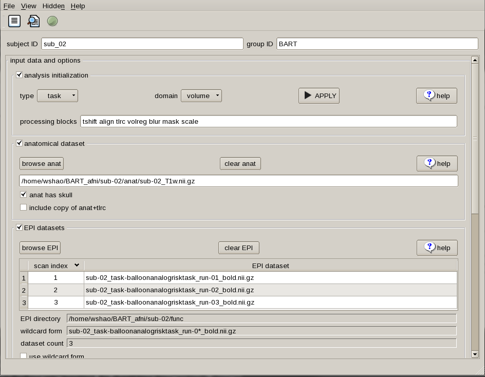

Preprocessing
=============

Remember our drink menu? It is a little different for what we should do in AFNI but overall there are very similar, Anyway, let’s have a couple of drinks before the meal:

Inspecting the image
^^^^^^^^^^^^^^^^^^^^

Before we are actually running the analysis, it is beneficial for us to check the data for any problems such as scanner spikes, incorrect orientation, or poor contrast, and so on. Although it might be 
unnecessary for the open neuroimaging data, it is really important for you to check the image before when it comes to your own data.

uber_subject
************

Skull stripping
^^^^^^^^^^^^^^^

Motion correction
^^^^^^^^^^^^^^^^^

Slice-Timing Correction
^^^^^^^^^^^^^^^^^^^^^^^

Smoothing
^^^^^^^^^

Registration and Normalization
^^^^^^^^^^^^^^^^^^^^^^^^^^^^^^

Check the Preprocessed Data
^^^^^^^^^^^^^^^^^^^^^^^^^^^

uber_subject

epi = echo planar image
