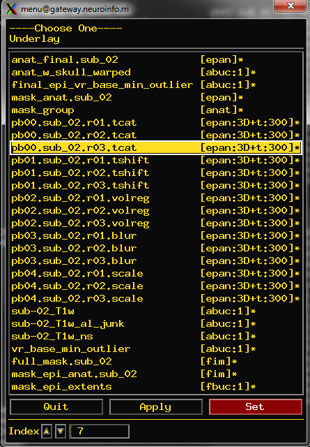
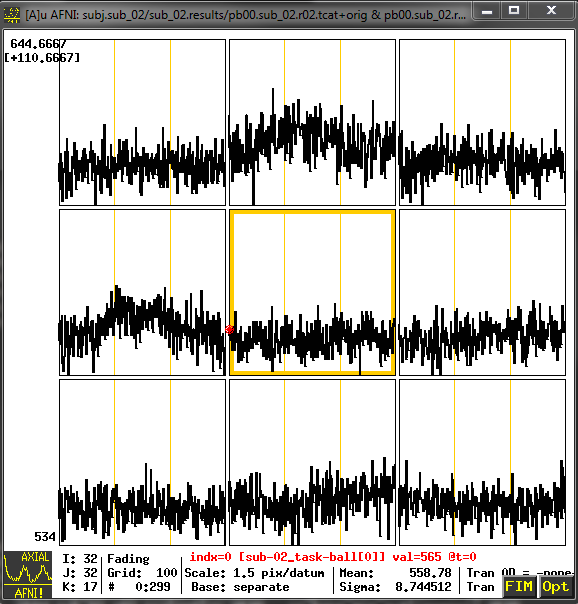
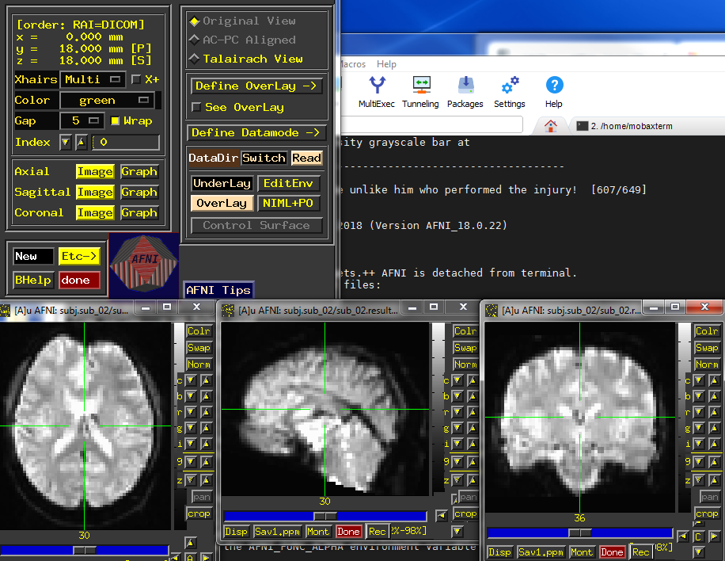

Check the preprocessed data
===========================

After the script generated by uber_subject.py has completed, navigate to the directory containing the preprocessed data. By default, AFNI will create a new directory tree in the following format:

cd sub-02/subject_results/group.BART/subj.sub_02/sub_02.results

In which subjects name and group name are specified in the subject ID and group ID tab from the uber_subject.py GUI we did. 

.. note::
  
  Later on

Look at the Preprocessed files
^^^^^^^^^^^^^^^^^^^^^^^^^^^^^^

You can see all the different images and files from each step of preprocessing. Especially, these files starting from "pb" (Processing Block) are preprocessed functional images and the files with "T1w" 
are the preprocessed anatomical images. 

.. figure:: AFNI_subje_resut.png

  The files containing the “pb” are the preprocessed functional images, the files with the “T1w” string are the preprocessed anatomical images. the name ""3dTshift"" means that these images have been 
  slice-time corrected by the "3dTshift" command.

Processed Functional Image
^^^^^^^^^^^^^^^^^^^^^^^^^^

After check with different files in the preprocessed data directory, let's tale a close look, type ``afni`` to open the AFNI GUI. Click the "Underlay", and choose "pb00.sub_02.r01.tcat", click on the 
""Graph"" next to any of the Axial, Sagittal, or Coronal views to view the time-series. You also can see the same image when you open "pb00.sub_02.r02.tcat" and "pb00.sub_02.r03.tcat"; it is because the 
initial volumes of dataset had had been in OpenNeuro. 

The **Underlay** menu has two columns: The left column is the file name, and the right contains header information about the file. “epan” indicates that it is an echo-planar image (functional image as we 
introduced from last chapter), whereas “abuc” stands for a anatomical image. “3D+t:300” indicates that it is a 3-dimensional with 300 volumes (time points) image

Aligned and Co-Registered image
^^^^^^^^^^^^^^^^^^^^^^^^^^^^^^^

The next file to look at is the "pb02.sub_02.r01.volreg+tlrc.BRIK", which has 3 meanings:

1 Motion-corrected, each volume in the time-series for this run has been aligned to a reference volume. 

2 Co-registered to the anatomical image, the functional image has registered into anatomical image.

3 the images also have been normalized to a standardized space, which is MNI152 template.

If you click on the pb02... images, you will notice that there is a section of the AFNI GUI that has “Original View”, “AC-PC Aligned”, and “Talairach View”. In this images, the “Talairach View” is 
highlighted, which indicated that these images have been normalized. you can click the different locations of the images to see the differences.

Smoothed image
^^^^^^^^^^^^^^

The following preprocessing step is smoothing, which averages the signal of nearby voxels together in order to boost any signal that is there, and to cancel out noise. These images will look more blurry 
as a function of the size of the smoothing kernel that you apply to the data; in this case, a smoothing kernel of 4mm will blur the data slightly, but not by much. Look at the images to make sure that 
the blurring looks reasonable, as in the figure below.

.. image:: AFNI_smooth.png

Scaled image
^^^^^^^^^^^^

Viewing the Masks
*****************

Viewing the Anatomical Images
*****************************
