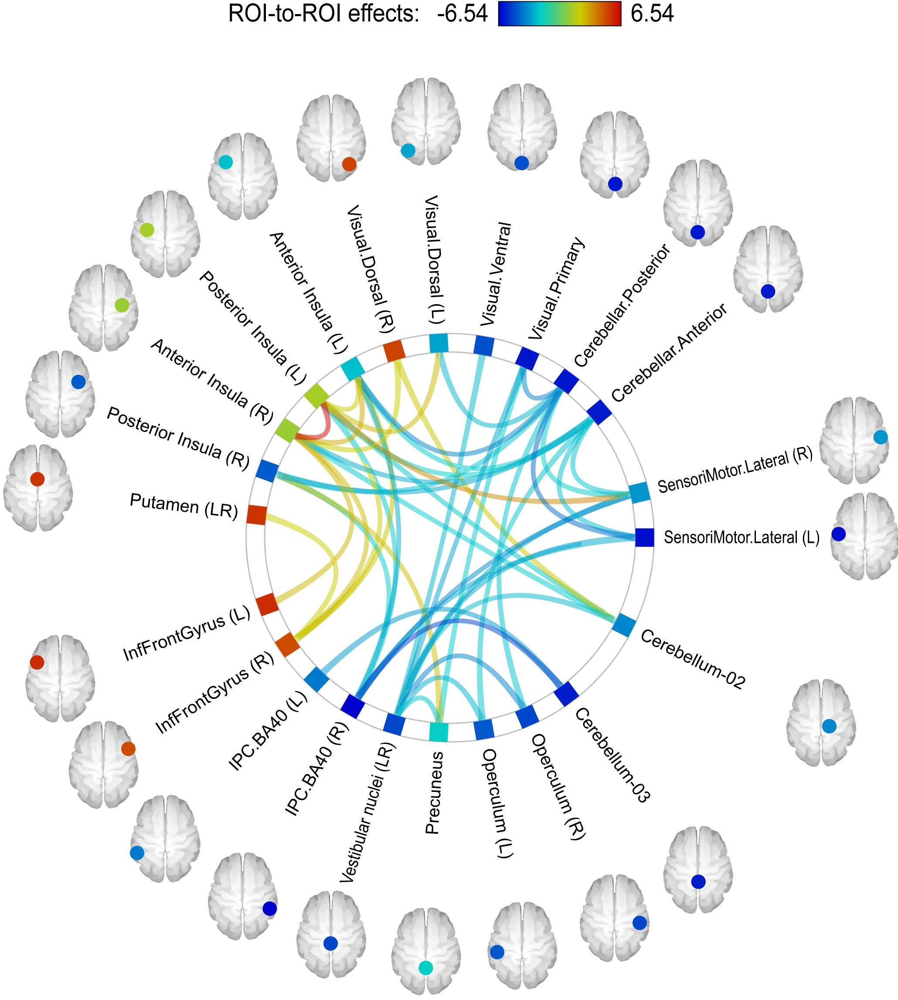

CONN introduction
=================

CONN is a Matlab-based cross-platform imaging software for the computation, display, and analysis of functional connectivity in fMRI data in the resting 
state and during task. The CONN is known as a SPM toolbox, a suite of commands that is designed to be used as an add-on to SPM. you can find more details in 
`here <https://web.conn-toolbox.org/>`__. You can doload the The CONN from `here <https://www.nitrc.org/projects/conn>`__.  Click on the download button to 
begin downloading the latest version.

This module will focus on the functional connectivity with the SPM-depend tool name CONN. In general, the correlation in BOLD signal between two distinct 
regions of the brain. This correlation can be analyzed when the subject is doing a task (i.e., task-based connectivity), or when the subject is at rest - 
relaxed and alert, but not doing any particular task (i.e., resting-state connectivity).

In the following tutorials, you will learn how to perform resting-state connectivity analyses on a dataset. We will use the CONN toolbox to run the analyses, 
which includes both creating correlation maps for each voxel of the brain, and generating connectomes that visualize the strength of the connectivity between 
different regions.

Previous tutorial 
^^^^^^^^^^^^^^^^^ 

Before going on, you may want to work through the SPM tutorials. These will introduce you to Matlab and SPM, which you will need to run the CONN toolbox. 
Note that SPM is a prerequisite for the CONN toolbox, meaning that you will need to download and install SPM before you can use CONN. The rest of the 
tutorials in the SPM module aren’t required, although a better understanding of how SPM preprocesses fMRI data will prepare you to use the CONN toolbox.

