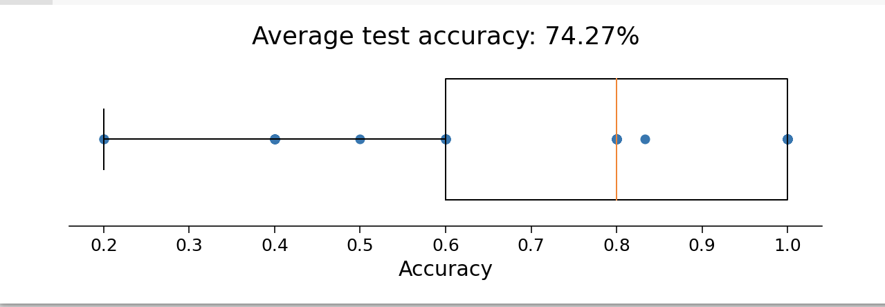

Logistic regression
===================

After you have familiar with the idea that running GLM on python, let's try more models on the HCP dataset. If you already forget the dataset, plesae go to the 
Dataset instructions on pp. 24-25,36 and 50-51 of the `HcP Reference Manual 
<https://www.humanconnectome.org/storage/app/media/documentation/s1200/HCP_S1200_Release_Reference_Manual.pdf>`__. In order to use this dataset, please 
electronically sign the HCP data use terms at `ConnectomeDB <https://db.humanconnectome.org/app/template/Login.vm>`__.

First question first, what is the logistics model? In general, the logistic model has been applied for the probability of binary classes or event existing such 
as pass/fail, win/lose, alive/dead or healthy/sick. This can be extended to model several classes of events such as determining whether an image contains a cat, 
dog, lion, etc. Each object would be assigned a probability between 0 and 1.In regression analysis, logistic regression is estimating the parameters of a 
logistic model. If you want to know more, here is a good video for `logistic regression <https://www.youtube.com/watch?v=yIYKR4sgzI8&t=7s>`__.

Now, as we can see the brain activation under different conditions as a group, we can use the **Logistic regression** for decoding the data. In the context of 
HCP dataset and gambling project, It means that we can predict the brain activation of different conditions based on the output of GLM we analyzed before::

  X = data
  X_1 = data.T
  Y = res_reg
  Y_1 = Y.T

  # Define the model
  log_reg = LogisticRegression(penalty="none")

  # fit the model
  log_reg.fit(X_1, Y_1)
  y_pred = log_reg.predict(X_1)

Now we need to evaluate the model's predictions. We'll do that with an accuracy score. The accuracy of the classifier is the proportion of trials where the
predicted label matches the true label::

  def compute_accuracy(X, y, model):
  #Compute accuracy of classifier predictions.

  Args:
      X (2D array): Data matrix
      y (1D array): Label vector
      model (sklearn estimator): Classifier with trained weights.
    Returns:
      accuracy (float): Proportion of correct predictions.

  y_pred = model.predict(X)
  accuracy = (y == y_pred).mean()
  return accuracy

  # Compute train accurcy
  train_accuracy = compute_accuracy(X_1, Y_1, log_reg)
  print(f"Accuracy on the training data: {train_accuracy:.2%}")

It seems like that the Classification accuracy on the training data is 100%! That might sound impressive, but there is a concept called overfitting: the 
classifier may have learned something idiosyncratic about the training data. If that’s the case, it won’t have really learned the underlying data->decision 
function, and thus won’t generalize well to new data. To check this, we can evaluate the cross-validated accuracy::

  accuracies = cross_val_score(LogisticRegression(max_iter=5000,penalty='none'), X_1, Y_1, cv=50) # k=50 crossvalidation

Let's plot the accuracy on the test data::

  #markdown Run to plot out these `k=50` accuracy scores.
  f, ax = plt.subplots(figsize=(8, 3))
  ax.boxplot(accuracies, vert=False, widths=.7)
  ax.scatter(accuracies, np.ones(50))
  ax.set(
    xlabel="Accuracy",
    yticks=[],
    title=f"Average test accuracy: {accuracies.mean():.2%}"
  )
  ax.spines["left"].set_visible(False)

