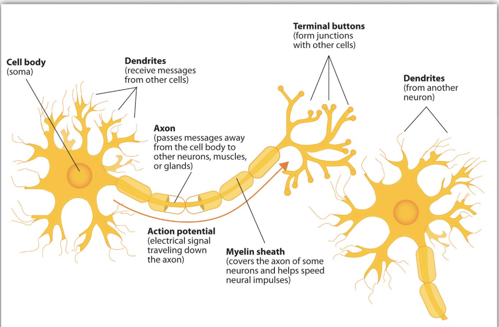

Multilayer perceptron
=====================

Supervised learning
*******************

Let's start with the parent of the parent of MLP, **Supervised learning**. 

machine learning was born - a computer was built that could approximate a function given known input and output pairs from it.

The key realization was that if the neural net neurons were not quite Perceptrons, but were made to compute the output with an activation function that 
was still non-linear but also differentiable, as with Adaline, not only could the derivative be used to adjust the weight to minimize error, but the chain 
rule could also be used to compute the derivative for all the neurons in a prior layer and thus the way to adjust their weights would also be known

The units are therefore stochastic - they behave according to a probability distribution, rather than in a known deterministic way

According to Wikipedia, Multilayer perceptron (MLP) is a kind of feedforward deep neural network where is become very popular in recent years.There are 
three layers of MLP: an input layer, a hidden layer and an output layer. MLP utilizes a supervised learning technique called **backpropagation** for 
training.Its multiple layers and non-linear activation distinguish MLP from a linear perceptron. It can distinguish data that is not linearly separable.

