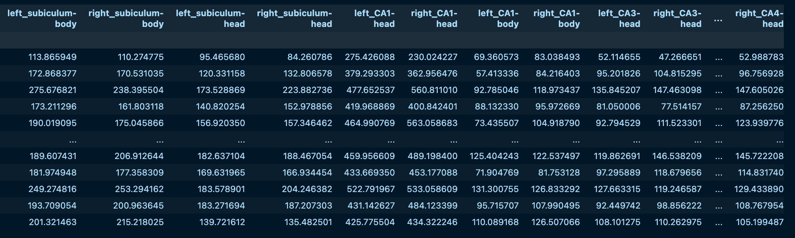
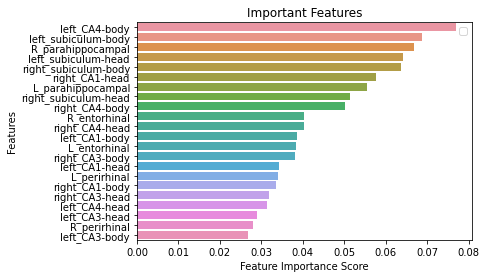

Random Forest 
=============

According to Wikipedia, Random forests(RF) is an ensemble learning method for classification, regression and other tasks that operates by constructing a 
multitude of decision trees from training data. For classification tasks, the prediction of the random forest is the class selected by most trees. Random 
decision forests correct for decision trees' habit of overfitting to their training set. In general, although the data characteristics may affect the 
performance RF, Random forests outperform decision trees. More more information, please see this `Random forest <https://www.youtube.com/watch?v=J4Wdy0Wc_xQ>`__.

To demonstrate RF, we are going to use another dataset named `ADNI <http://adni.loni.usc.edu/>`__. 

ADNI
****

The Alzheimer’s Disease Neuroimaging Initiative (ADNI) unites researchers with study data as they work to define the progression of Alzheimer’s disease (AD). 
ADNI researchers collect, validate and utilize data, including MRI and PET images, genetics, cognitive tests, CSF and blood biomarkers as predictors of the 
disease. Study resources and data from the North American ADNI study are available through this website, including Alzheimer’s disease patients, mild cognitive 
impairment subjects, and elderly controls.

First of all, let's use FreeSurfer to preprocess the data to get the volume assessment from 106 mild impaired cognition(MCI) and 84 from healthy control 
people(NC), and put all of the data into a single file. Next, select the 6 ROI(regions of interest) volume with target label from the left and right hemisphere 
and organize a volume matrix into a CSV file named ROI_data.

'left_subiculum-body','right_subiculum-body','left_subiculum-head','right_subiculum-head','left_CA1-head','right_CA1-head','left_CA1-body','right_CA1-body','left_CA3-h$

Next, divide the file into two datasets, the 6 ROI volume and the target label(1 for MCI, 0 for NC)::

  ROI_X = ROI_data.iloc[:, 0:-1]  # Features

  ROI_y = ROI_data.iloc[:, -1] # Labels

Next, let's split the dataset into two training and testing dataset with a random_state::

  X_train, X_test, y_train, y_test = train_test_split(ROI_X, ROI_y, test_size=0.25,random_state = 34) 

As we specify the test_size = 0.25,which means that we are going to use 25% data for the test and 75% data for the trainning.

Since the task is a binary classification. Thus, we need to use the RandomForest Classifier. Fortunately, many RFs model have been developed on Python::

  from sklearn.ensemble import RandomForestClassifier

  #Create a Gaussian Classifier with 2000 decision trees 
  clf=RandomForestClassifier(n_estimators=2000)

  #Train the model using the training sets y_pred=clf.predict(X_test)
  clf.fit(X_train,y_train)

  y_pred=clf.predict(X_test)

Next, let's evaluate the the accuracy of this RF model.

  #Import scikit-learn metrics module for accuracy calculation
  from sklearn import metrics

  # Model Accuracy, how often is the classifier correct?
  print("Accuracy:",metrics.accuracy_score(y_test, y_pred))

In order to futher assess the accuracy of the RFs, we can use the recall and precision of the RF:: 

  print(classification_report(y_test, y_pred, labels=[1,0]))

Given the nature of RF, we can visualize  the importance of top features:: 

  the # Creating a bar plot
  sns.barplot(x=feature_imp, y=feature_imp.index)
  # Add labels to your graph
  plt.xlabel('Feature Importance Score')
  plt.ylabel('Features')
  plt.title("Important Features")
  plt.legend()
  plt.figure(figsize=(1000,1100))
  plt.show()

