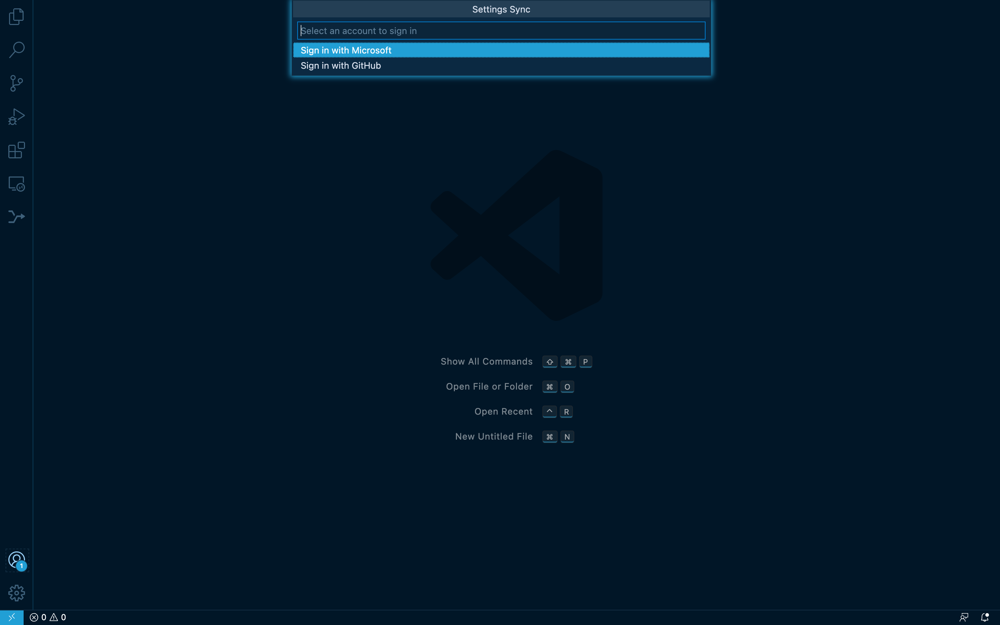
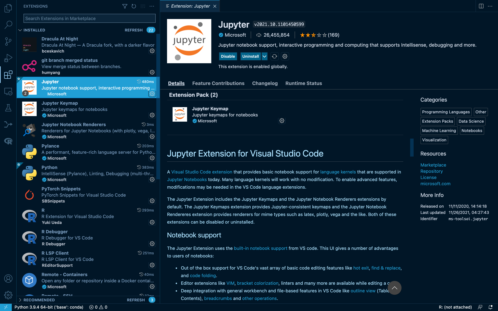

Visual studio code
==================

What is visual studio code(VSC)? Acoording to Wikipedia, VSC is a source-code editor made by Microsoft for Windows, Linux and macOS. It has many features 
including debugging,syntax highlighting, intelligent code completion, snippets, code refactoring, and embedded Git. You can also install all kinds of 
extensions that allow addtional function. VSC Visual Studio Code was ranked the most popular developer environment in Stack Overflow survey 2021.

You cna go to `HERE <https://code.visualstudio.com/>`_ to download the right version.

Click `HERE <https://code.visualstudio.com/docs/setup/setup-overview>`_ for **set up** and **get started** as you follow the instructions

After everything is set up, you are supposed to see this when you click the VSC icon on your laptop.

.. image:: Beginning.png

Now, let's do some prework before we actually use VSC to analyze the data. One of the best functions of VSC is that you can connect VSC with you GitHub, 
therefore, you can get rid of what you have learned from **Appetizer 3** and combine git add/commit/push into simpler operation

Click the left bottom corner sign in to your Github account in order to Sync the information.

You might want to add some extensions such as Python, R and jupyter notebook in your VSC so that we can implement the code undee these languages.

