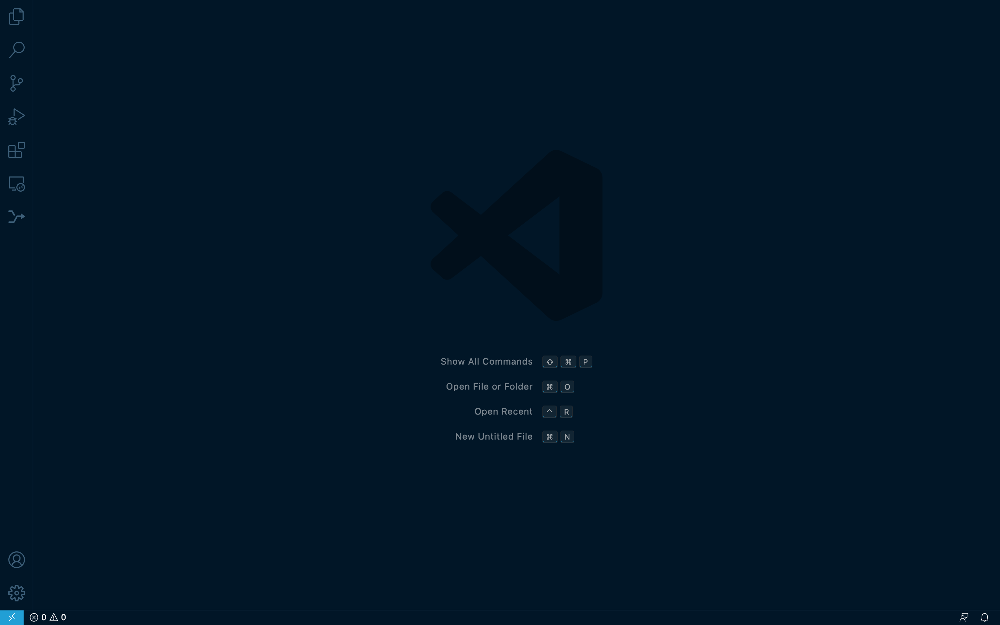

Visual studio code
==================

What is visual studio code(VSC)? Acoording to Wikipedia, VSC is a source-code editor made by Microsoft for Windows, Linux and macOS. It has many features 
including debugging,syntax highlighting, intelligent code completion, snippets, code refactoring, and embedded Git. You can also install all kinds of 
extensions that allow addtional function. VSC Visual Studio Code was ranked the most popular developer environment in Stack Overflow survey 2021.

You cna go to  `HERE <https://code.visualstudio.com/>'_ to download the right version.

Click `HERE <https://code.visualstudio.com/docs/setup/setup-overview>`_ for **set up** and **get started** as you follow the instructions

After everything is set up, you are supposed to see this when you click the VSC icon on your laptop.

One of the best function of VSC is that you can connect VSC with you GitHub, therefore, you can get rid of what you have learned from Appetizer 3 and 
combien git add/commit/push into more simpler operation
