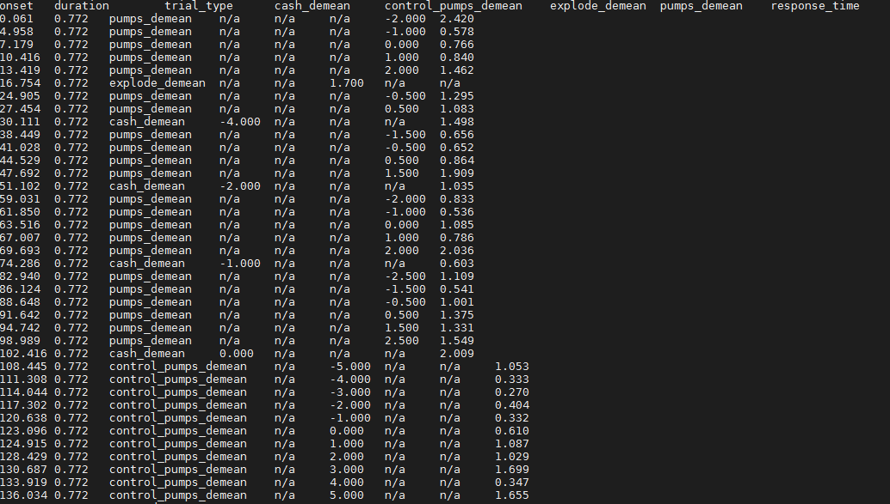
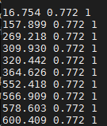
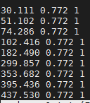
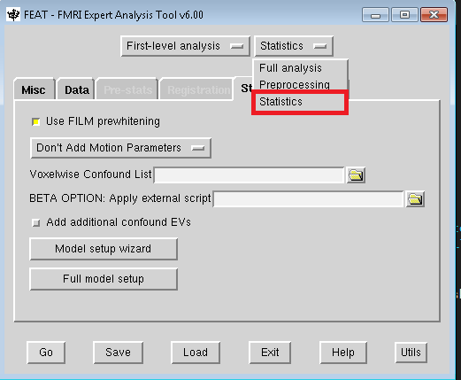
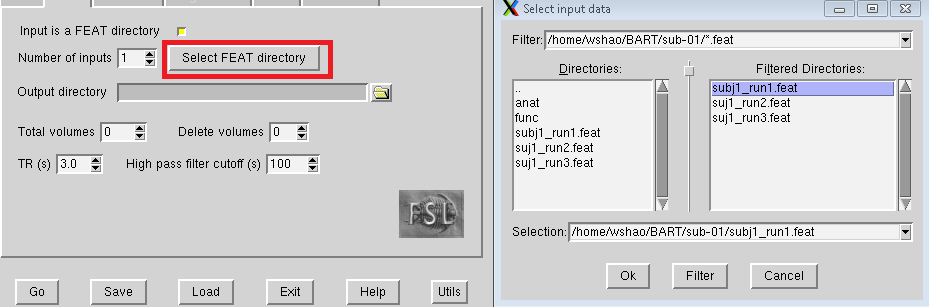
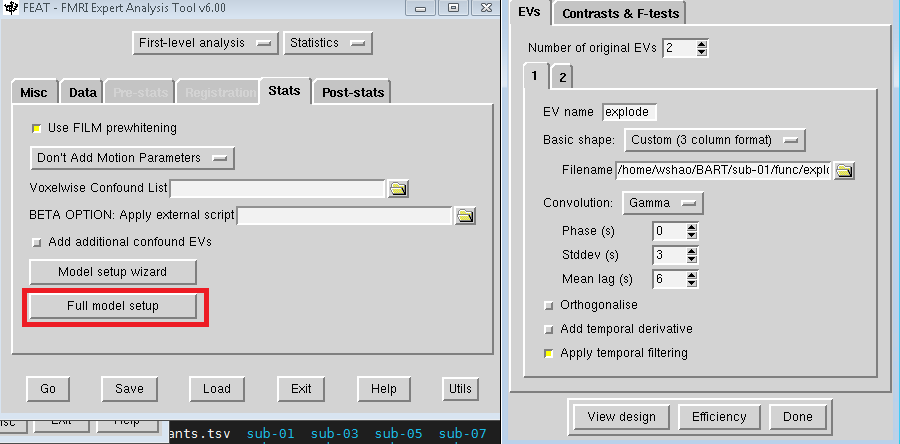
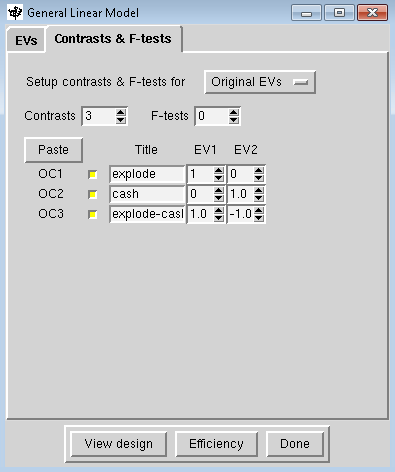
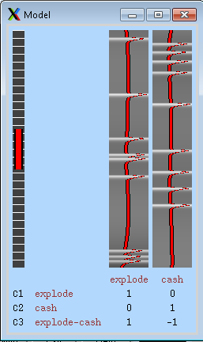

1st level analysis
==================

I hope you had fun with FSL with the preprocessing learning. As you might remember, our goal is to gain the first-hand experience. With this in mind, we are ready go to the next, 1st level (individual) 
fMRI analysis. So, The first thing for 1st level analysis is to create the model with a ideal time-series so that we can apply the estimated beta weights into each regressors.

In the func directory of each subject from BART directory. You can find 3 files end with **events.tsv**. These files contain three important pieces of information that we need:

  1 the experimental condition name

  2 the onset time of trial for each condtion, relative to the onset of the scan

  3 The duration of each trial

All of these information can help us to build the time-series files for BART.  

Create the time-series
^^^^^^^^^^^^^^^^^^^^^^

We learned from the dataset previously, There are 4 different conditions for the BART experiment:

  pump

  control_pump

  explode                                                                                                                                                                                                          
 
  cash out

Although it is really convenient see all the information from the **events.tsv** files, we still need to transfer the format and content of these files so that FSL can understand. we will create the timing 
file for each condition, and split them according to which run the condition was in. However, We will only analyze the **explode** and **cash out** condition in this documentation.

What we need from the time series files?

Timings files for the pump trials that occurred during the first run, second run and third run, which will be pump_run1.txt, pump_run2.txt and pump_run3.txt

Timings files for the control trials that occurred during the first run, second run and third run, which will be control_run1.txt, control_run2.txt and control_run3.txt

Each of these timing files will have same format consisting of three columns, in the following order:

  1 Onset time, in seconds, relative to the start of the scan

  2 Duration of the trial, in seconds

  3 Parametric modulation(discuss later)

The script
**********

It is not hard to imagine that if you manually extract the information and input the data into new files, it is time-consuming and very painful. Let alone the mistakes you might make during the 
process.Fortunately, there are some scripts that can help you with that.

Now, go to the BART directory and create a file with a text editor such as nano or vim, copy the script below and save it as **BART_timing.sh**::

  #!/bin/bash

  #Check whether the file subjList.txt exists; if not, create it
  if [ ! -f subjList.txt ]; then
        ls -d sub-?? > subjList.txt
  fi

  #Loop over all subjects and format timing files into a format that FSL can understand
  for subj in `cat subjList.txt` ; do
        cd $subj/func #Navigate to the subject's func directory, which contains the event files

        #Extract the onset and duration for the pump,control,explode, and cash out trials for each run. 
        cat ${subj}_task-balloonanalogrisktask_run-01_events.tsv | awk '{if ($3=="pumps_demean") {print $1, $2, "1"}}' > pump_run1.txt
        cat ${subj}_task-balloonanalogrisktask_run-02_events.tsv | awk '{if ($3=="pumps_demean") {print $1, $2, "1"}}' > pump_run2.txt
        cat ${subj}_task-balloonanalogrisktask_run-03_events.tsv | awk '{if ($3=="pumps_demean") {print $1, $2, "1"}}' > pump_run3.txt

        cat ${subj}_task-balloonanalogrisktask_run-01_events.tsv | awk '{if ($3=="control_pumps_demean") {print $1, $2, "1"}}' > control_run1.txt
        cat ${subj}_task-balloonanalogrisktask_run-02_events.tsv | awk '{if ($3=="control_pumps_demean") {print $1, $2, "1"}}' > control_run2.txt
        cat ${subj}_task-balloonanalogrisktask_run-03_events.tsv | awk '{if ($3=="control_pumps_demean") {print $1, $2, "1"}}' > control_run3.txt

        cat ${subj}_task-balloonanalogrisktask_run-01_events.tsv | awk '{if ($3=="explode_demean") {print $1, $2, "1"}}' > explode_run1.txt
        cat ${subj}_task-balloonanalogrisktask_run-02_events.tsv | awk '{if ($3=="explode_demean") {print $1, $2, "1"}}' > explode_run2.txt
        cat ${subj}_task-balloonanalogrisktask_run-03_events.tsv | awk '{if ($3=="explode_demean") {print $1, $2, "1"}}' > explode_run3.txt

        cat ${subj}_task-balloonanalogrisktask_run-01_events.tsv | awk '{if ($3=="cash_demean") {print $1, $2, "1"}}' > cash_run1.txt
        cat ${subj}_task-balloonanalogrisktask_run-02_events.tsv | awk '{if ($3=="cash_demean") {print $1, $2, "1"}}' > cash_run2.txt
        cat ${subj}_task-balloonanalogrisktask_run-03_events.tsv | awk '{if ($3=="cash_demean") {print $1, $2, "1"}}' > cash_run3.txt

        cd ../..
  done

After you create the **BART_timing.sh**, run the script by the command ``bash BART_timing.sh`` and wait for a few seconds. you can check the results by ``cd`` to the func directory of each subject 
directory.

.. image:: FSL_4conditions.PNG

Eventually, you will see

Run the first level analysis
^^^^^^^^^^^^^^^^^^^^^^^^^^^^

Let's have fun with individual analysis!
 
Data and Stats tab
******************

Navigate to the ``sub-01`` directory, and type ``fsl`` from the terminal, open the FEAT GUI, and from the dropdown menu in the upper right of the **Data** tab, change “Full Analysis” to “Statistics”. 
This will grey out the Pre-stats and Registration tabs. You will also see a button called **Input is a FEAT director**. Click on the button, and select the FEAT directory subj1_run1.feat that you created 
before from the preprocessing. Click ``OK`` and ignore the warning message.

Next, go to the Stats tab. Click on “Full model setup”, and change the Number of original EVs (or Explanatory Variables, FSL’s term for regressors) to 2. This will create two tabs, one for each 
regressor. In the EV name field for regressor 1, type “explode”. Click on the dropdown menu next to Basic shape, and select “Custom (3 column format)”. This reveals a field called “Filename”; click on 
the folder icon to select the timing file explode_run1.txt. Uncheck the “Add temporal derivative” button and click on the “2” tab, repeat these steps, selecting the timing file “cash_run1.txt” at this 
time.

Design matrix
*************

When you have done with the model set up, click on the ``Contrasts & F-tests tab``. This is where you specify which contrast maps you would like to create after the beta weights for each condition have 
been estimated. In this experiment, we are interested in three contrasts:

1 The average beta weight for the explode condition compared to baseline

2 The average beta weight for the cash out condition compared to baseline

3 The difference of the average beta weights between the explode and cash conditions

So, Set the number of contrasts to 3, and type the following contrast names in each row, along with the following contrast weights in the EV1 and EV2 columns:

1 explode [1 0]

2 cash out [0 1]

3 explode-cash [1 -1] 

Click the Done button (or view design), which will open a **Design Matrix** window. The leftmost column represents the high-pass filter, which is the threshold that removes any frequencies that are 
longer than the length of the red bar. The two columns on the right represent the ideal time-series for both regressors(IV), and they correspond to the order that the timing files indicated; in other 
words, the first column is the ideal time-series for the explode condition, and the second column is the ideal time-series for the cash out condition.

The red line represents what we think the time-series of the voxel should look like if it is responsive to that regressor. The white bars represent the HRF that is convolved with the onset of each trial 
for that condition. The length of the white bar indicates the duration time. Take another look at the timing files for each condition and see if the correspondence between the onset times, duration and 
the design matrix makes sense.

Post-stats
**********

.. imageLL FSL_post_stats.PNG

The last tab in the FEAT GUI is called Post-stats. There are many options here, and the only two function you are likely to change are ones labeled “Z threshold” and “Cluster P threshold”, which are the 
thresholds that determine which voxels are statistically significant for each contrast. This is makes more sense when we do the group-level analysis.For now, just leave it as it is.

After you filled the blanks, Click ``GO`` and go to make a nice coffee since it requires 7-10 minutes to process the data. 
