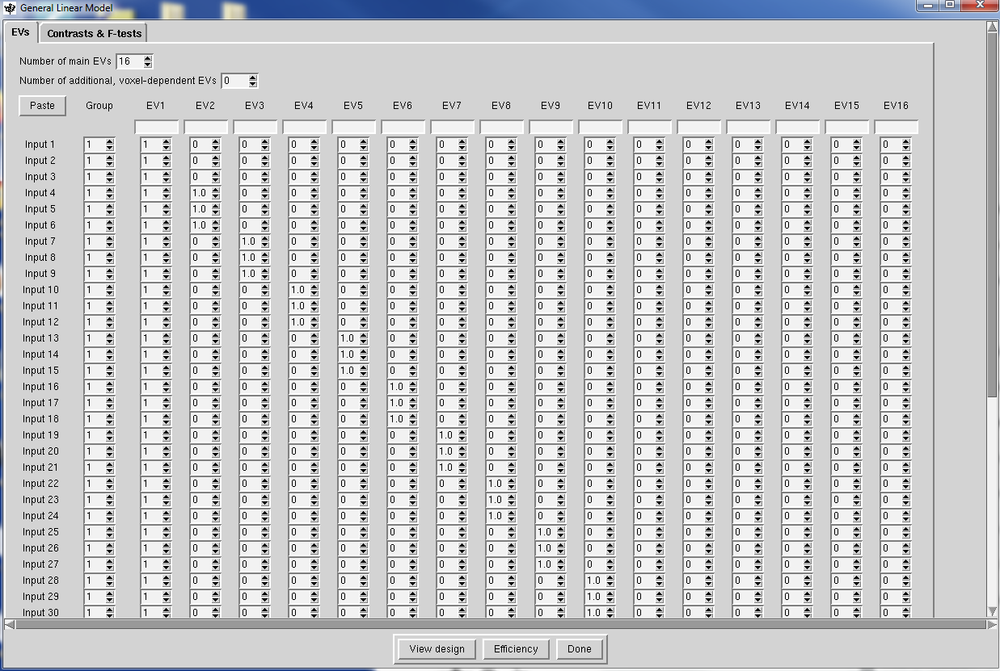
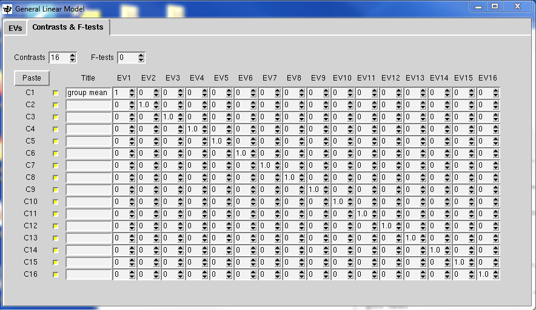

2nd level analysis
==================

Once the script has been completed for all the runs of all subjects in the BART dataset. you can go further and do 2nd-level analysis. in FSL, 2nd-level is a group analysis in which we averaging together 
the parameter estimates within each subject and contrast estimates from the 1st-level analyses. Now, ``cd`` to the BART directory, open the FEAT GUI from the terminal. from the dropdown menu select 
"Higher-Level Analysis".

Select the FEAT directories
***************************

From Data tab, We have two options 1 **Inputs are lower-level FEAT directories** and 2 **Inputs are 3D cope images from FEAT directories**. Choosing option 1 since we have used the FSL to process all the 
data before. Option 1 is the default setting as well.

Since we have 16*3 = 48 FEAT directories in total. Change the Number of inputs to 48, and then click the ``Select FEAT directories``, the ``Paste``. 

Now, Open a new terminal, ``cd`` to the BART directory, type::

  ls -d $PWD/sub-??/run*

This will print an absolute path to each FEAT directory. The -d option means to only list directories, and $PWD expands to an absolute path pointing to the current working directory. Within the current 
directory, any directory starting with sub- and ending with two digits (represented by the ?? ) is added to the path. Finally, within each subject directory, any directory beginning with the string run 
will be appended to the path name (e.g., run1.feat and run2.feat).

.. image:: FSL_wildcards.png

Use ``Ctrl+c`` and ``Ctrl+y`` to copy and paste the 48 runs.feat into the dashboard.
 
In the Data tab, you will also need ensure to select 3 lower-level copes boxes. This would tell FSL to run a 2nd-level analysis for 3 contrast, which correspond to:

1 The contrast estimate for the explode condition

2 The contrast estimate for the cash-out condition

3 The contrast estimate for explode vs cash-out
 
In the ``Output directory`` tab, type ``BART_2ndLevel``. This is where the results of the 2nd level analysis will be saved.

Creating the GLM 
****************

The Stats tab will look different from when you used it for 1st-level analysis - you can now choose different types of models:: 

1 Fixed Effects: Do not generalize from the sample - just take the average

2 Mixed Effects: Simple OLS (Ordinary Least Squares): This will perform a t-test on the average parameter estimates calculated for each subject, without taking into account the variability between the 
runs for each subject

3 Mixed Effects: FLAME 1: Weight each subject’s parameter estimate by the variance of that contrast estimate. In other words, a subject with relatively low variance will be weighted more, and a subject 
with relatively high variance will be weighted less

4 Mixed Effects: FLAME 1+2: A more rigorous version of FLAME 1. It takes much longer, and is only helpful for analyzing small samples (e.g., 10 subjects or fewer)

Given we only want to know the average of the parameter estimates across the runs within each subject. So, we will use the ``Fixed Effects`` option. select it and go to ``Full Model Setup``button.

This will display a window with the number of rows representing the number of individual parameter estimates - in our case, 48. For the Number of main EVs, change this to 16, which is the number of 
subjects in our dataset. Then change the numbers in each column to 1 where you want to take the average for the parameter estimates for that subject. In this case, the first three rows for column 1 would 
be changed to 1, and the next three rows for column 2 would be changed to 1, and so on.

When you have finished the ``EVs``, click on the ``Contrasts & F-tests`` tab, and change the number of ``Contrasts`` to 16. Change all of the numbers on the diagonal to 1. This will create a single 
contrast estimate for each subject that is the average of that subject’s parameter estimates.

When you complete the GLM and contrasts setting, click ``Done``, a design matrix will show up. make sure it is ok, and click ``Go``.

