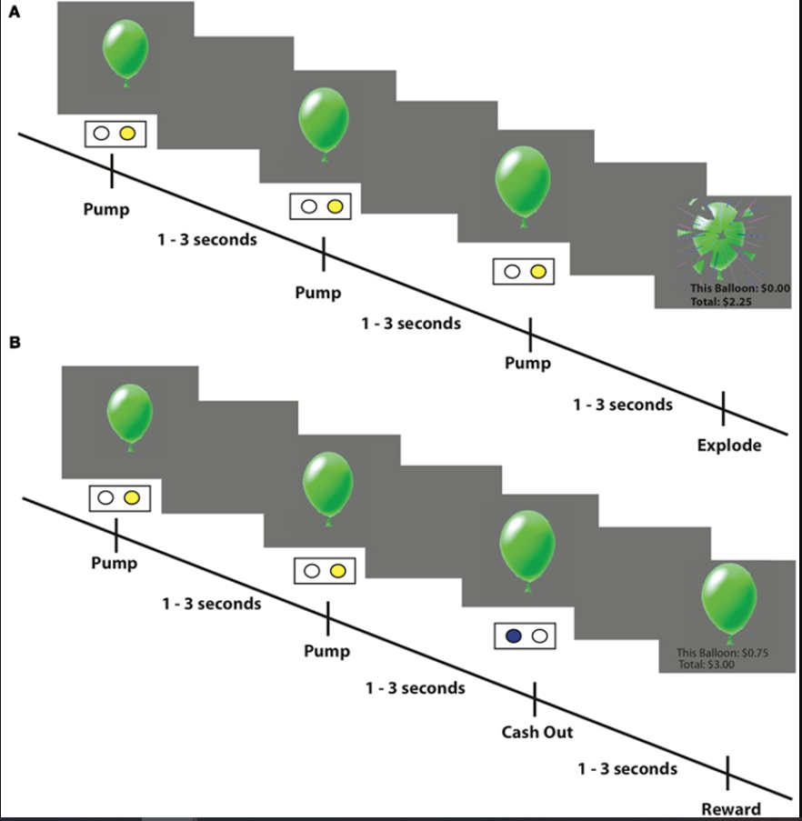
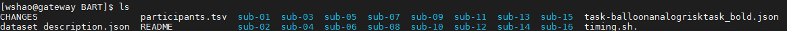
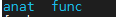
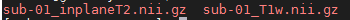
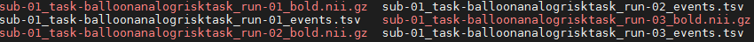

BART and data downloading
=========================

One of the interesting topics from psychology is risky behavior. In order to gain a bettering understanding of how the brain reacts when people make a decision, there are many many interesting 
experiment paradigms, Ballon analog risk task is one of them.

In Balloon analog risk task(BART), Participants can manipulate the Ballon to control the risk and reward. Tom Schonberg and his colleagues scanned participants using fMRI while they completed the Balloon 
Analog Risk Task. As the picture shows, escalating risk-taking occurs under uncertainty and might be experienced either as the accumulation of greater potential rewards, or as exposure to 
increasing possible losses and decreasing expected value.

     (A) An example of an explosion trial: participants press one of two buttons to inflate puffs of air into a balloon presented on a computer screen. Every successful pump adds $0.25 to their temporary 
     bank for that trial. If the balloon explodes before the participant cashes out then nothing is won on that trial. However, an explosion does not affect the cumulative total winnings earned on prior 
     trials. (B) An example of a cash-out trial where the participant decided to stop pumping the balloon and earn the amount accumulated up to that point.

In the BART, subjects inflate simulated balloons, and accrue monetary rewards for each successive “pump” during a particular trial. A trial is defined as a balloon that can be pumped a certain number of 
times and the trial can conclude in two different ways. On the one hand, the participant can “cash-out” at any point during the trial and secure the cumulative winnings up to that point for that balloon 
in their cumulative total “bank.” On the other hand, a balloon may explode. In this case, participants would lose the money accumulated on that trial alone (but not the total accumulated during previous 
cash-out trials). Each trial began with a balloon displaying a value of $0.25 and the value of the balloon increased by $0.25 for each successive pump. During each trial, participants were presented with 
one of three types of “reward” balloons, each having a different explosion probability and signified by a different color: red, green, or blue. But participants was not informed the odds of explosion 
probability.

As a control task, participants intermittently inflated a gray “control” balloon (maximum 12 pumps) that did not explode and had no associated monetary value. The participants were instructed to inflate 
the control balloon until it disappeared from the screen, and the next trial began. Unlike with reward balloons, participants had no control over how many times they could inflate the control balloon 
before the trial ended.

for more information, please go `here <https://www.frontiersin.org/articles/10.3389/fnins.2012.00080/full/>`__ 

Dowloading the data
*******************

As an Open Source dataset, BART dataset has a standardized structure: Each subject folder contains an anatomical directory and a functional directory labeled anat and func, thess contain the anatomical 
and functional images collected during the experiment. The func directory also contains onset times, or timestamps for when the subject underwent different trials. This format is known as Brain Imaging 
Data Structure, as we saw in previous chapter `BIDS <https://neuroimage-book02.readthedocs.io/en/latest/OpenNeuro/Neuroimage_data.html>`__. As an example of the BIDS format. The func directory of BART 
contains functional data, three runs of$timestamps of which condition happened at what time. You can open these as a text file or as a spreadsheet.

Now, go to `there <https://openneuro.org/datasets/ds000001/versions/1.0.0>`__ , download the data and save it as ``BART`` in our home directory. 

       
As you can see, we have 16 subjects. **participants.tsv** will tell you the demographic information of subjects, **task-balloonanalogrisktask_bold.json** contains TR information. You can preview all of 
these information from the OpenNeuro data web.

Let's take a close look 

``cd`` to sub-01, you will find two directories, anat and func that correspond anatomical and functional. These are two important directories that we will visit most.

**anat** includes all the anatomical images such as T1 and T2 (if possible).

**func** has all the functional images, end with **bold.nii.gz** as well as trial-related files end with **events.tsv**.

Whenver you're are ready, let's go to next
