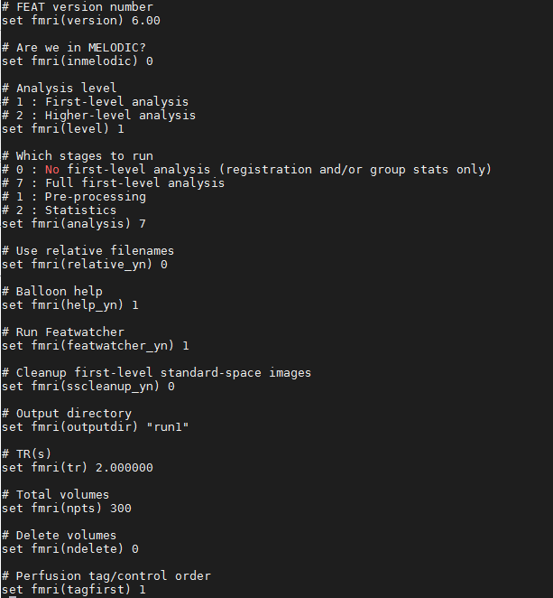
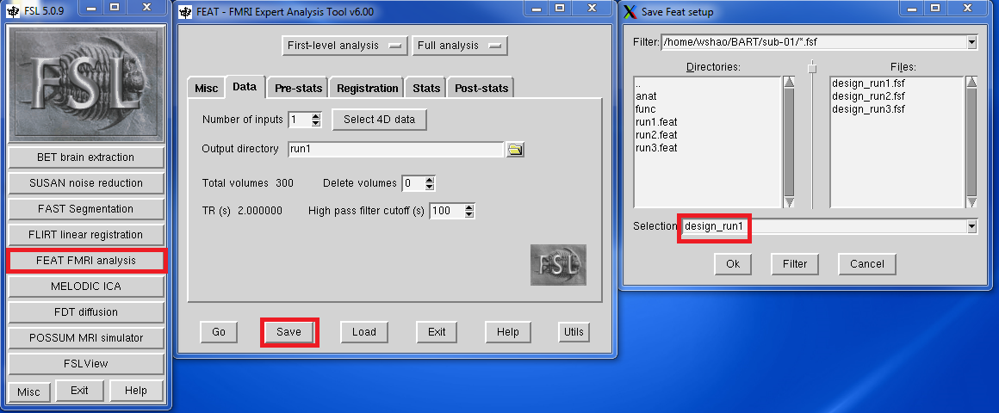
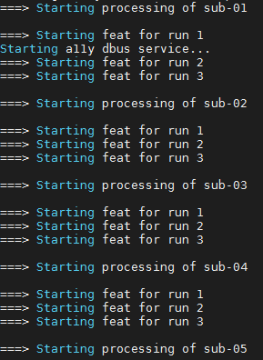

Automation 
========== 

Since we have 16 subjects and each subject has 3 runs. In total, we need to repeat all the preprocessing and 1st level analysis 48 times! it is not hard to do but really tedious and you could make errors 
easily. As Joey from **Friends** said, there's gotta be a better way, and there is. 

Here is the script that makes your life easier!  

Creat a design file
*******************

When you analyzed the run1 from sub-01 manually, a directory called run1.feat was created. There are many files and sub-directories within that directory. One of these files, **design.fsf** is the one 
that contains all of the information that transferred from the FEAT GUI created by you before. If you open up the design.fsf file in a text editor. You can see all the steps and data in which you made 
before.

  
  for example, output directory is run1, TR is 2, and we have the total volumes 300

Now, try to recall all the steps from your long-term memory system because we will create a design.fsf template for all the steps from preprocessing and 1st level analysis so that we can apply this 
design.fsf to all the subjects and runs with a few modifications.

First thing first, ``cd`` to ``sub-01`` and ``rm`` all the **.feat** files we created. Reopen FSL GUI from the sub-01 directory. Click ``FEAT FMRI analysis`` :

1 Start from Data tab, select ``Full Analysis``, use ``Select 4D data`` to feed the input bold.nii.gz file, name the output directory run1 

2 select the brainskull stripping anat image we did at the first time (I hope you still keep this file) and to finish the **Registration** tab as we previous learn

3 go to the **Stats** tab and click the **Full model setup** to repeat the steps we did

After you finish all the steps, instead of clicking ``Go``, click the ``Save`` button and name your file as **design_run1**

 
Adding the scirpt 
**************

Once you create the template design file, what we need to do next is to apply this file into all 16 subjects directory with some changes. And excute the file with FSL.

Once again, here is the script you need to copy and save it as **prepro_model.sh** in your BART directory::

  #!/bin/bash

  # Generate the subject list to make modifying this script
  for id in `seq -w 1 16` ; do
      subj="sub-$id"
      echo "===> Starting processing of $subj"
      echo
      cd $subj
        
        # If the brain mask doesn’t exist, create it
        if [ ! -f anat/${subj}_T1w_brain.nii.gz ]; then
            echo "Skull-stripped brain not found, using bet with a fractional intensity threshold of 0.35"
            bet2 anat/${subj}_T1w.nii.gz \
                anat/${subj}_T1w_brain_f02.nii.gz -f 0.35
        fi

        # Copy the design files into the all the subject directory, and change “sub-01” content of original design files to different subject accordingly
        cp ../design_run1.fsf .
        cp ../design_run2.fsf .
        cp ../design_run3.fsf .  

        # Change “sub-01” content of original design files to match different subjects accordingly 
        sed -i "s|sub-01|${subj}|g" design_run1.fsf
        sed -i "s|sub-01|${subj}|g" design_run2.fsf
        sed -i "s|sub-01|${subj}|g" design_run3.fsf
  
        # Now everything is set up to run feat
        echo "===> Starting feat for run 1"
        feat design_run1.fsf
        echo "===> Starting feat for run 2"
        feat design_run2.fsf
        echo "===> Starting feat for run 2"
        feat design_run3.fsf
                echo

    # Go back to the directory containing all of the subjects, and repeat the loop
    cd ..
  done

  echo "job is done"

After everything is set, type ``bash prepro_model.sh`` to run the script and take a break, it is time for another episode from Friends.

The script will loop over all of the 16 subjects in the BART dataset and do the preprocessing, statistical model and 1st level analysis for each run. The time should take around 1-2 hours. Be sure to do 
quality checks for each subject after this has been done. 
