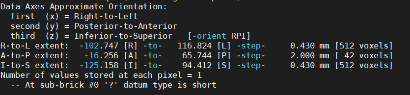

FSL
===

What is FSL?

FSL (The FMRIB Software) is a comprehensive library of analysis tools for fMRI, MRI and DTI brain imaging data. It runs on Apple and PCs (both Linux, and Windows via a Virtual Machine),  Most of the tools can be run both from the command line and as GUIs ("point-and-click" graphical user interfaces)

You go to `FSL <https://fsl.fmrib.ox.ac.uk/fsl/fslwiki/FslInstallation/>`_ find the right version of FSL to dowload and install  

.. image:: FSL_install.PNG

.. image:: FSL_install2.PNG

After successful install FSL and set it up, let's analyze the data to gain some first-hand experience. You can find date from `OpenNeuro <https://openneuro.org/>`__ as we learned before.

Ballon Analogue Risk Task(BART)

The Balloon Analogue Risk Task (BART) is a computerized measure of risk taking behavior. The BART models real-world risk behavior through the conceptual frame of balancing the potential for reward versus loss. In the task, the participant is presented with a balloon and offered the chance to earn money by pumping the balloon up by clicking a button. Each click causes the balloon to incrementally inflate and money to be added to a counter up until some threshold, at which point the balloon is over inflated and explodes. Thus, each pump confers greater risk, but also greater potential reward. If the participant chooses to cash-out prior to the balloon exploding then they collect the money earned for that trail, but if balloon explodes earnings for that trial are lost. Participants are not informed about the balloons breakpoints; the absence of this information allows for testing both participants' initial responses to the task and changes in responding as they gain experience with the task contingencies. Risk taking is a related, but phenomenologically distinct process from impulsivity._ 

<https://www.frontiersin.org/articles/10.3389/fnins.2012.00080/full/>`__

Create a timing files that FSL can understand

One of the useful function from FSL is fslswapdim, it can change the orientation of image. Therefore, you can have the same orentation to process

For example, let's say you have a T2 image looks like this: 

.. image:: FSL_orientation_before.PNG

but the T1 image is this

.. image:: FSL_T1_orientation.PNG

So, you can want to change the orientation so that the T1 and T2 can match, type::

fslswapdim T2.nii.gz x -z y T2.reorientated.nii.gz

Now, you get the new orientated T2.

