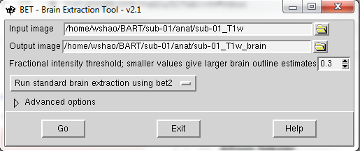
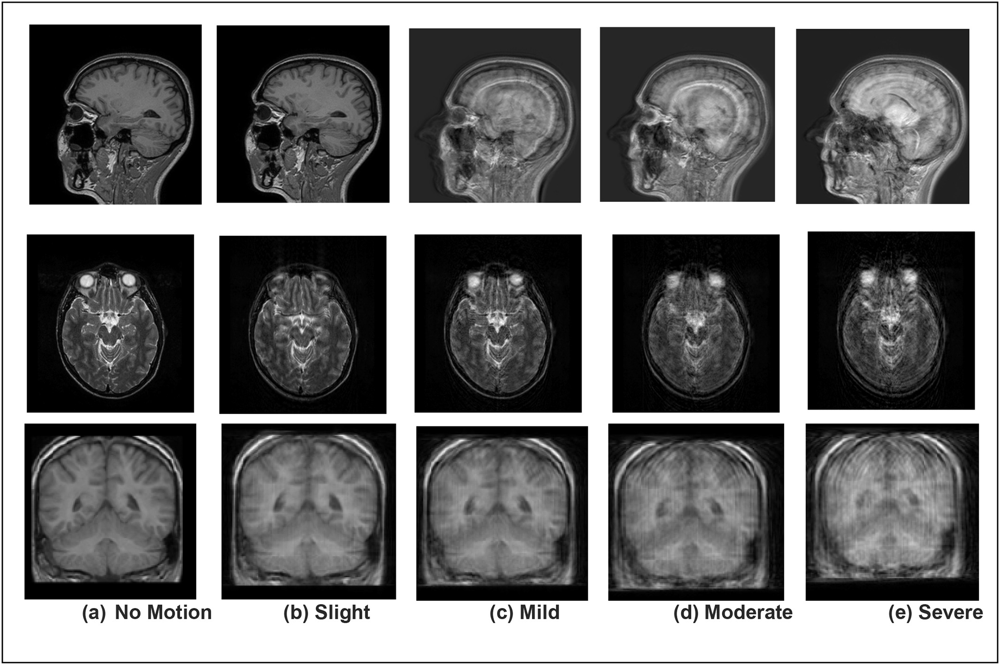
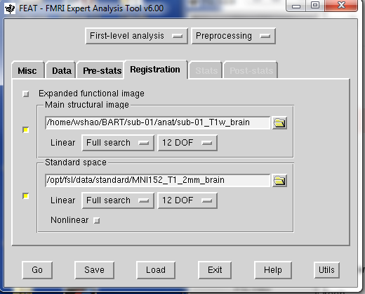

Preprocessing
=============

Like a good dish needs some preprocessed step, Preprocessing is necessary for fMRI analysis as well. there are serveal steps in FSL::

  Skull stripping
 
  Motion correction
  
  Slice-Timing Correction

  Smoothing

  Registration and Normalization 

We will operate these one by one, Are you ready? 

Inspecting the image
^^^^^^^^^^^^^^^^^^^^

Before we are actually running the analysis, it is safe for us to check the data for any problems such as scanner spikes, incorrect orientation, or poor contrast and so on.Although it might be unnecessary for the open neuroimaging data, it is really important for your to check the image before when it comes to your own data.

Open you terminal and cd to the BART directory by typing ``cd BART``.

.. image:: FSL_cd_BART.png

type ``fsl`` to open the ``FSL GUI tool``

.. image:: FSL_GUI.png

click ``FSLView`` and ``File`` to find the anat T1 image, sub-01_T1w.nii.gz and func image sub-01_task-balloonanalogrisktask_run-01_bold.nii.gz

.. figure:: FSL_FSLView_anat.png

   T1 anatomical image 

.. figure:: FSL_FSLView_func.png

   Functional image

You might notice there is a black block on the subject's face area, that because all the data from the open-source dataset need to be defaced for the purpose of privacy

For more information, please go to `here <http://www.mrishark.com/brain1.html>`__ 

Skull stripping
^^^^^^^^^^^^^^^

Brain tissue is the focus of fMRI studies, our first step is to seperate the skull and non-brain areas from the image. FSL provides a function that can help you achieve the goal.

Oppen FSL GUI by typing ``fsl``and select the first function on the GUI list, it called ``BET brain extraction``. Click the button, a new window will open up. In the input image, click the file icon, select the ``sub-01``, then ``anat``and ``sub-01_T1w.nii.gz``. The output image will be generated automatically. 

.. image:: FSL_select_anat.png

Adjust the stripping range
**************************

You might notice that there is column called Fractional intensity threshold, as the description, you can adjust the number for the skull stripping range. If you think that too much brain has been removed, you should set this to a smaller number, and vice versa if you think too little skull has been removed.The defult is 0.5.

Motion Correcation
^^^^^^^^^^^^^^^^^^

The concept is the same when we take three-dimensional pictures of the brain. If the subject is moving, the images will look blurry; if the subject is still, the images will look more defined. But that’s not all: If the subject moves a lot, we also risk measuring signal from a voxel that moves. We are then in danger of measuring signal from the voxel for part of the experiment and, after the subject moves, from a different region or tissue type.

Motion can introduce confounds into the imaging data because motion generates signal. If the subject moves every time in response to a stimulus - for example, if he jerks his head every time he feels an electrical shock - then it can become impossible to determine whether the signal we are measuring is in response to the stimulus, or because of the movement.

In the FEAT GUI, motion correction is specified in the Pre-stats tab. FEAT’s default is to use FSL’s MCFLIRT tool, which you can see in the dropdown menu. You have the option to turn off motion correction, but unless you have a really good reason to do that, otherwise, leave it as it is.

.. image:: FSL_motion_correction.png

Slice-Timing Correction
^^^^^^^^^^^^^^^^^^^^^^^

An fMRI volume is acquired in slices. Each of these slices takes time to acquire - from tens to hundreds of milliseconds.

The two most commonly methods for creating volumes are sequential and interleaved slice acquisition. Sequential slice acquisition acquires each adjacent slice consecutively, interleaved slice acquisition acquires every other slice, and then fills in the gaps on the second pass. 

.. image:: FSL_SliceTimingCorrection_Demo.gif

Later, when we use statistics model, we will assume that all of the slices were acquired simultaneously. To make this assumption valid, the time-series for each slice needs to be shifted back in time by the duration when it took to acquire that slice.

FSL’s default is to not do slice-timing correction, and to include a temporal derivative instead. 

.. image:: FSL_slice_timing.png

Smoothing
^^^^^^^^^

Although it sounds weired at the first time, people want to smooth the functional data, or replace the signal at each voxel with a weighted average of that voxel’s neighbors. Why would we want to make the images blurrier than they already are?

It is true that smoothing does decrease the spatial resolution. but there are two benefits that might outweight the disadvantages at leatst:

First, as fMRI data contains a lot of noise, and that the noise is frequently greater than the signal. By averaging over nearby voxels we can cancel out the noise and enhance the signal.

Secondly, smoothing data also can be useful when it comes to Normalization, which the goal is to normalize every subject’s brain for a standardized template brain. 

.. image:: FSL_Smoothing_Demo.gif

The default of smoothing in FSL is 5 mm

.. image:: FSL_smoothing.png

Registration and Normalization
^^^^^^^^^^^^^^^^^^^^^^^^^^^^^^

As human being, Most of us have have very brains - everyone has a 4 lobes, hippocampus or cerebellum. However, there are also differences in terms of brain size and shape. Therefore, if we want to do a group analysis, it is reasonable to ensure that each voxel for each brain in the subjects corresponds to the same part of the brain. If we are measuring a voxel in the hippocampus, we need to make sure that every subject’s hippocampus is in alignment with each other.

In order to do that, we need ``Registration`` and ``Normalization``. Just as you would fit the material into the baking molds, each brain has to be transformed to have the same size, shape, and dimensions. We do this by normalizing them to a template. A template is a standardized brain that has standard dimensions and coordinates, and most researchers have agreed to use them to reporting their results. So, if someone has a breakthrough finding, other people can check the result accordingly. 

Since we have both anatomical and functional images in our dataset. and our goal is to organize the functional images to the template so that we can do a group-level analysis across all of our subjects. It seems easy to just simply arrange the functional images directly to the template. However, it doesn’t work in reality. functional images are low-resolution, and therefore there are less likely to match up with the anatomical details of the template. So, The anatomical image is a better option.

Warping the anatomical image can be very helpful for filling the functional images into the template becuase the anatomical and functional scans are typically acquired in the same session. As long as we have normalized the anatomical image to a template and recorded what kind of transformations were done, we can apply the same transformations to the functional images as well. 

This alignment between the functional and anatomical images is called ``Registration``. Most registration use the following steps:

1 Assume that the functional and anatomical images are in roughly the same location. If they are not, align the outlines of the images.

2 Take advantage of the fact that the anatomical and functional images have different contrast weightings - that is, areas where the image is dark on the anatomical image (such as cerebrospinal fluid) will appear bright on the functional image, and vice versa. This is called mutual information. The registration algorithm moves the images around to test different overlays of the anatomical and functional images, matching the bright voxels on one image with the dark voxels of another image, and the dark with the bright, until it finds a match that cannot be improved upon.

3 Once the best match has been found, then the same transformations that were used to warp the anatomical image to the template are applied to the functional images.

.. image:: FSL_Registration_Normalization_Demo.gif

Registration tab
****************

In FSL, the registration includes all the functions you need. There two tabs you need to pay attention; 1 Main structural image,you need select the skullstripping anatomical image. 2 Standard spance, select the standard template that already installed in your FSL library, MNI152 would be the most common choice.  

In the search window below, there are three options: 1) No search; 2) Normal search; and 3) Full search. This signifies to FSL how much to search for a good initial alignment between the functional and anatomical image(for registration) and between the anatomical and template images (for normalization). The Full search option takes longer, but is worth it becase it more likely to produce better registration and normalization.

In the Degrees of Freedom window, which is the right tab after the search window, you can use 3, 6, or 12 degrees of freedom to transform the images. Registration has an additional option, BBR, which stands for Brain-Boundary Registration. This is a more advanced registration technique that uses the tissue boundaries to fine-tune the alignment between the functional and anatomical images. Similar to the Full search option above, it takes longer, but often gives a better alignment.

If you already loaded the data, checked the ``Motion correction``, ``Slice-Timing``, and ``Smoothing``. you can click ``Go`` and good to go.
 

Check the Preprocessed Data
^^^^^^^^^^^^^^^^^^^^^^^^^^^

Now, Let's review what we have done:

  1 We have downloaded the BART data and finished the set up
  
  2 We have inspect the anat and func data
  
  3 we have preprocessed the data

Along the way our learning journey, one of the most difficult parts is that you have to do the trade-off. For example, if you stripping too many brain tissues, it will affect the later process like the registration and normalization as well as if you keep the brain skull. it is a judgemental call and you have to decide what is the best for your research. The more you think about and practice with FSL, the easier it will become make the decision quicker and more accurately.    

Homework
^^^^^^^^

Since you have done the preprocessing for one subject ``sub-01``, please repeat all the procedures through ``sub-02`` and ``sub-03``

