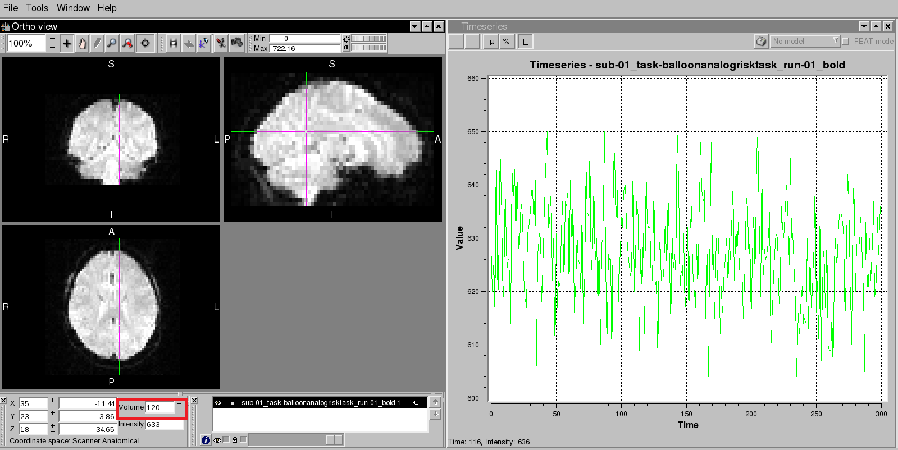

Statistics and modeling
================

After we finish all the preprocessing steps, we can go to the next - fit a model to the data. In order to understand model fitting, we need to know 3 fundamental components: 

  1 General Linear Model 

  2 The BOLD response 

  3 Time-series 

General linear model
^^^^^^^^^^^^^^^^^^^^

The General Linear Model (GLM) is a useful framework for comparing how several variables affect the continuous variables. Although it has many variants, the simplest form is described as: **Y = βX + ε**.  
In GLM, we can use one or more regressors(X) - independent variables, to fit a model for some outcome measure(Y) - or dependent variable. To do this we need to compute numbers called beta weights(β), 
which are the relative weights assigned to each regressor in oder to get the best fitting for the data. Any discrepancies between the model and the data are called residuals(ε).

.. figure:: FSL_GLM_Equation.png
  
   The symbols representing each of these terms are shown in the equation.

For example, imagine that we want to predict the chance of infecting Covid-19 based on social distance, daily interaction in person, and longitude. It is reasonable to find that social distanc has a 
negative correlation with the infection of Covid-19, the more distance you keep with other people, the less chance you will get Covid-19. In terms of daily interaction in person, it has a positive 
association, the more you interact with people in person, you are more likely to be affected by the virus. lastly, longitude has no associati in general.

Therefore, we need assign each of these regressors a beta weight so that the model can fit the real data best. To be more specific, maybe each additional meter for social distance is associated with an 
additional 0.5 decrease in infection of Covid-19, while each additional 0.5 times of personal interaction is associated with a 0.3 increase::

  Chance of infecting Covid-19 (Y) = -0.5X1(social distance) + 0.3X2(personal inteaction) + ε 

This GLM can be expanded to include many regressors, but no matter how many regressors you have, the GLM assumes that the data can be modeled as a linear combination of each of the regressors. Keep GLM 
in your mind because we will apply it in our model soon.

BOLD response
^^^^^^^^^^^^^

BOLD signal
***********

In 1990, a researcher at Bell Laboratories named Seiji Ogawa discovered that more deoxygenated blood leads to a decrease in the signal measured from a brain region. An increase in oxygenated blood, on 
the other hand, increases the signal - this increase in oxygenated blood was later shown to be correlated with increased neural firing. This change in signal is known as blood oxygen level dependent 
signal ( BOLD signal). Shortly afterward, a researcher at Massachusetts General Hospital named Ken Kwong in 1992 demonstrated that the BOLD signal could be used as an indirect measure of neural 
activity. His experiment consisted of alternately showing a flashing checkerboard and a black screen to the subject for one minute each. The BOLD signal was recorded during each condition, as shown in 
the following video:

.. image:: Kwong_fMRI_Video.gif

In the 1990’s, empirical studies of the BOLD signal demonstrated that, after a stimulus was presented to the subject, any part of the brain responsive to that stimulus - say, the visual cortex in 
response to a visual stimulus - showed an increase in BOLD signal. The BOLD signal also appeared to follow a consistent shape, peaking around six seconds and then falling back to baseline over the next 
several seconds. This shape can be modeled with a mathematical function called a Gamma Distribution. As Gamma Distribution is created with parameters to best fit the BOLD response observed by the 
these empirical studies, it is the canonical Hemodynamic Response Function(HRF).

Gamma Distribution
******************

Gamma distribution is a distribution that arises naturally in processes for which the waiting times between events are relevant. It can be thought of as a waiting time between Poisson distributed events. 
For example, suppose you are fishing and you expect to get a fish once every 1/2 hour. Compute the probability that you will have to wait between 2 to 4 hours before you catch 4 fish.One fish every 1/2 
hour means we would expect to get θ = 1 / 0.5 = 2 fish every hour on average. Using θ = 2 and k = 4, we can compute this as follows:

.. image:: FSL_Gamma_formula.PNG

When applied to fMRI data, the Gamma Distribution is called a basis function because it is the fundamental element of the model we will create and fit to the time series of the data. Furthermore, if we 
know what the shape of the distribution looks like in response to a very brief stimulus, we can predict what it should look like in response to stimuli of varying durations, as well as any combination of 
stimuli presented over time.

The HRF for a Single impulse Stimulus
*************************************

If the duration of a stimulus is very short, such as a snap of the fingers, we can say that it is an impulse stimulus - in other words, it has no duration. As you can see in the following figure, the 
shape of the BOLD signal looks like a typical Gamma Distribution, with a peak close to the beginning of the time axis (i.e., the x-axis) and a long tail to the right.

.. figure:: FSL_HRF_SingleStim.png
  :scale: 30%

The HRF for a Single Boxcar Stimulus
************************************

Although many studies use stimuli lasting only a second or less, some studies present stimuli for longer periods of time. For example, imagine that the subject looks at a flashing checkerboard for 
fifteen seconds. In this case the shape of the HRF will be more spread out with a sustained peak proportional to the duration of the stimulus, falling back to baseline only after the stimulus has ended. 
This stimulus is called a boxcar stimulus, because it looks like a boxcar on a train.

In this case the Gamma Distribution is convolved with the boxcar stimulus. Convolution is the averaging of two functions over time; as a result, the Gamma Distribution broadens as it is averaged with the 
boxcar stimulus, and returns to baseline when the stimulus is removed.

.. image:: FSL_HRF_DurationStim.png

Multiple HRFs overlaping
************************

We have seen what the BOLD signal looks like after a stimulus is presented and how the HRF models the shape of that signal. But what happens if another stimulus is presented before the BOLD response for 
the previous stimulus has returned to baseline?

.. figure:: FSL_HRF_Sum.png
  :scale: 30%
  
  Convolution of the HRFs for individual stimuli. The overall BOLD response (blue) is a moving average of the individual HRFs outlined in black, red, and 
  green. The vertical black lines on the x-axis represent impulse stimuli. Figure created by Bob Cox of AFNI.

In that case, the individual HRFs are summed together. This creates a BOLD response that is a moving average of the individual HRFs, and the shape of the BOLD signal becomes more complex as more stimuli 
are presented close together.

.. figure:: FSL_HRF_Demo.gif

  Animations originally created by Bob Cox of AFNI

Time series 
^^^^^^^^^^^

We have mentioned this concept several times before. As the basic composition of fMRI data. Remember that fMRI datasets contain several volumes strung together like beads on a string - we call this 
concatenated string of volumes a run of data. The signal that is measured at each voxel across the entire run is called a time-series.The time-series represents the signal that is measured at each voxel.

looking at the time series in FSL
*********************************
 
In order to have a closer look at time series, you can open FSLview from the ``sub-01`` directory, and choose File to open 1 of 3 bold files from **func** directory. type ``Ctrl+T`` and take a look at 
the volume tab at the buttom. The right plot here indicates the voxel you point out at the different time series positions.

