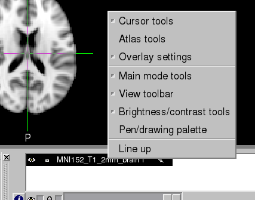

ROI analysis
============

As we just completed a group-level analysis, and identified some regions of the brain show a significant difference under the condition of the experiment. 
Now, we are going to continue our learning with region of analysis(ROI). This is called a whole-brain or exploratory analysis. When we doesn't have a 
hypothesis to test, these types of studies are beneficial.

While A large number of studies have been run about a specific topic, we can begin to make more specific hypotheses about where we should find our results in 
the brain images. For instance, memory has been studied for many years, and many fMRI studies have been published about it using different paradigms that 
compare differenmt memory tasks. Often, significant increases in the BOLD signal during various memories conditions are seen in a region of the brain known 
as the Hippocampus and medial temporal lobe. For this BART study, then, we could restrict our analysis to this region and only extract data from voxels 
within that region. This is known as a ROI analysis. A general name for an analysis in which we choose to analyze a region selected before look at 
whole-brain results is called a confirmatory analysis.

Whole-brain maps can hide important details about the effects that we’re studying. We may find a significant effect of BART conditions, but the reason the 
effect is significant could be because cash is greater than explode, or because explode is much more negative than cash, or some combination of the two. The 
only way to determine what is driving the effect is with ROI analysis, and this is especially important when dealing with interactions and more sophisticated 
designs.

Atlases
^^^^^^^

One way to do an ROI analysis is to use an atlas, a map that partitions the brain into anatomically distinct regions.

As you may know, Many atlases are already installed on FSL, and we can access them by using the FSL viewer. Open FSL view from FSL_gui and click file -> Open 
standard -> choose MNI standard space such as MNI152_T1_2mm_brain.nii.gz. you will see the Standard space, then, click the ``Atlas tools`` from the bottom 
box, a new window will appear on the left side, click ``Atlases`` to make sure the defult Atases Harvard-Oxford Cortical and Subcortical Atlases are loaded. 
Then, click the ``Structures`` and use Harvard-Oxford Subcortical Atlas, find the left hippocampus and click the ``+`` button to add the right hippocampus, 
click OK and you will see the two regions (left and right hippocampus) are highlighted, click file to save as ``lh_hippo.mask`` and ``rh_hippo.mask`` 
respectively.

.. image:: stand_space.PNG

.. image:: atlas_structure.PNG

.. image:: left_right_mask.PNG

.. image:: save_as.PNG

.. note::

  our results will have the same resolution as the template we used for normalization. The default in FSL is the MNI_152_T1_2mm_brain, which has a resolution 
of 2x2x2mm. When you create a mask, it will have the same resolution as the template that it is overlaid on. When we extract data from the mask, the data and 
the mask need to have the same resolution. To avoid any errors due to different image resolutions, use the same template to create the mask that you used to 
normalize your data.

Extract the data from anatomical mask
^^^^^^^^^^^^^^^^^^^^^^^^^^^^^^^^^^^^^

After generated the mask, we can use it to extract the contrast estimates for each participant. We want extract result from the 2nd-level analysis, not the 
3rd-level analysis since the 3rd-level analysis is a image with a single number at each voxel. Our purpose in a ROI analysis is to extract the contrast 
estimate for each subject separately.

From the directorty ``BART_fsl/BART_2ndLevel.gfeat/cope3.feat/stats``, we can find tge subject's data maps for the cash-explode contrast condition such as 
T-statistic maps, cope pictures, and variance pictures, the data maps are calculated base from these methods. let's extract data from z-statistic maps since 
this data have been transformed into a normally distributed format and it is quit easier to plot and read.

We'll combine all of the z-statistic maps into a single dataset in order to make ROI analysis easier. It requires a combination of FSL and Unix commands to 
do this. cd to BART_fsl/BART_2ndLevel.gfeat/cope3.feat/stats, and type::

  fslmerge -t allZstats.nii.gz `ls zstat* | sort -V`

This command will combine all of the z-statistic images into a single dataset along the time series (flag -t option). The first argument specifies the name 
of the output dataset (allZstats.nii.gz), and the code in backticks use asterisk wildcard function to find all files begin with "zstat," and then arranges 
them numerically from smallest to largest with the -V option.

Type ``mv allZstats.nii.gz ../../..`` to move the allZstats.nii.gz file up three levels to the main BART_fsl directory. Then, to extract the data from the 
lh_hippo.mask, use the ``fslmeants`` command::

  fslmeants -i allZstats.nii.gz -m PCG.nii.gz

This will print 16 numbers, one per subject. Each number is the contrast estimate for that subject averaged across all of the voxels in the mask.To be more 
specific, the fitst number that corresponds to the average contrast estimate for cash-explode in sub-01. The second number, for sub-02, and so on. These 
numbers can be copied and pasted into your preferred statistical software tool (such as R), where you can then perform a t-test on them.

.. image:: fslmeants.PNG

Now, you can use the right hippocampus mask and repeat the steps above to do an ROI analysis for right hippocampus on cash-explode condition. 
