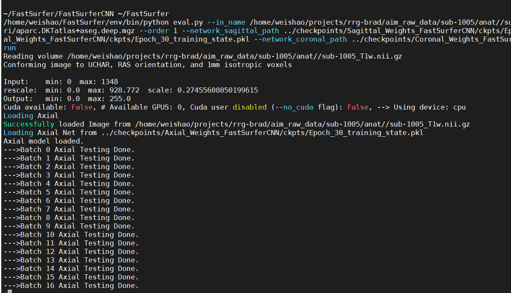

FastSurfer 
==========

After you run the recon-all with a tutorial data, I bet you might wonder how come I can skip this process time. The first solution would be FastSurfer.

`FastSurfer <https://surfer.nmr.mgh.harvard.edu/fswiki/DownloadAndInstall/>`__ is a fast and deep-learning pipeline for the fully automated processing of structural human brain MRIs. It provides conform 
outputs$

.. image:: FasteSurfer.png

FastSurfer consists of two main parts:

``FastSurferCNN`` Volumetric Segmentation.

FastSurferCNN is an advanced deep learning pipline for whole brain segmentation into 95 classes in under 1 minute, mimicking FreeSurfer’s anatomical segmentation and cortical parcellation.

go to `Here <https://github.com/deep-mi/FastSurfer>`__ either use ``git clone`` from you home directory to ge the file or download the file and put it in your home directory.

Set up and run FastSurfer
^^^^^^^^^^^^^^^^^^^^^^^^^

Set the path ``export FREESURFER_HOME=/usr(usrname)/local/freesurfer/6.0.0``

``source $FREESURFER_HOME/SetUpFreeSurfer.sh`` to activate the Freesurfer

datadir=/home/user/mri_data_directory

fastsurferdir=/home/user/fastsurfer_analysis_directory

Run FastSurfer::

  ./run_fastsurfer.sh --t1 $datadir/subject1/orig.mgz \
                      --sid subject1 --sd $fastsurferdir \
                      --parallel --threads 4 --py $(which python)(optional)

``--sd``  Output directory $SUBJECTS_DIR

``--sid`` Subject ID for directory inside $SUBJECTS_DIR to be created

``--t1``  T1 full head input. The network was trained with confirmed images, these specifications are checked in the eval.py script and the image is automatically conformed if it does not comply.

``parallel`` means we use parallel computing to run 4 threads indicated by ``threads 4``

``--py $(which python)`` specify the python Fastsurfer use 

Before you run the script, just ensure you check all the required packages

``sed -i "s/==/>=/g" requirements.txt`` and ``pip install --no-index -r requirements.txt`` might help

It is worth to notice that FastSufer needs the support from FreeSurfer and it is works for FreeSurfer6.0.0 now

