Freesurfer
==========

Now, it is time for our first main course, FreeSurfer.

What is FreeSurfer?

FreeSurfer is a brain imaging software package that focuses on analyzing magnetic resonance imaging (MRI) and functional scans of brain tissue from cross-sectional or longitudinal research, it can help 
researchers to conduct both volume-based and surface-based analyses. It is developed by the Laboratory for Computational Neuroimaging at the Athinoula A. Martinos Center for Biomedical Imaging. 
FreeSurfer includes tools for the reconstruction of topologically correct and geometrically accurate models of both the gray/white and pial surfaces, for measuring cortical thickness, surface area and 
folding, and for computing inter-subject registration based on the pattern of cortical folds

.. image:: FreeSurfer1.png 

Installation
^^^^^^^^^^^^

You can download and install FreeSufer from `Here <https://surfer.nmr.mgh.harvard.edu/fswiki/DownloadAndInstall/>`__ and follow the `Video 
<https://www.youtube.com/watch?v=BSQUVktXTzo&list=PLIQIswOrUH6_DWy5mJlSfj6AWY0y9iUce&index=2/>`__ to set up FreeSurfer

There are different versions of Freesurfer, it is recommended to use the latest one but Freesufer6.0.0 and above would be appropriate. After the installation, type::

  source $FREESURFER_HOME/SetUpFreeSurfer.sh

Then, you are supposed to see this 

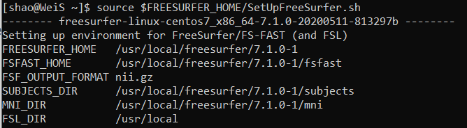

We can check whether Freesufer has been installed, there are two important messages for FreeSurfer, 1 FREESURFER_HOME is the home directory where your FreeSufer has been installed, 2 SUBJECTS_DIR is the 
subject directory where you point for the FreesSufer output results.

Test your FreeSurfer
********************

You also want to test the freesurfer performance before it run the actual data.

Go to freesurfer subject directory::

  cd $FREESURFER_HOME/subjects/

put ``mri_convert sample-001.mgz sample-001.nii.gz`` to test Freesurfer. Due to different requirements of different versions of Freesurfer, you might meet a license problem. 

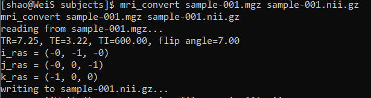

Recon-all
^^^^^^^^^

The most useful function of FreesSufer is the recon-all command, it will tell Freesufer to performs all, or any part of if you specifiy, the FreeSurfer cortical reconstruction process. the basic format::

  recon-all -all -i subjname_T1w.nii.gz -s subjname

-all tells Freesurfer to do everything, including subcortical segmentation
 
-i stands for input

-s subjet id

Normally, the input file would be T1 file, you also can improve the quality of surfaces by feed the T2 such as ``recon-all -subject subjectname -i /path/to/input_volume -T2 /path/to/T2_volume -T2pial 
-all`` FreeSurfer provided a tutorial `dataset <http://surfer.nmr.mgh.harvard.edu/fswiki/FsTutorial/Data>`__ for you to play around it. You can follow this `link 
<http://surfer.nmr.mgh.harvard.edu/fswiki/FsTutorial/Practice>`__ to play with recon-all command.

Tutorial data practice
**********************

Once you have download the tutorial dataset, ``cd`` to ``tutorial_data_20190918_1558/practice_with_data`` and put ``export SUBJECTS_DIR=$PWD`` to specify the subject output directory to the current 
directory , then, go to ``dicoms`` and input ``recon-all -all -i I50 -s Subj001`` to take the I50 and create the Subj001 output. Of course, make sure you have activated the Freesurfer by ``srouce 
$FREESURFER_HOME/SetUpFreeSurfer.sh`` before you run the command. Here is a detailed instruction and a function list for `recon-all <https://surfer.nmr.mgh.harvard.edu/fswiki/recon-all/>`__ . 
``recon-all`` usually will cost 6-8 hours, depends on the computing power you have. Fortunately, there is a way to speed up this process.
 
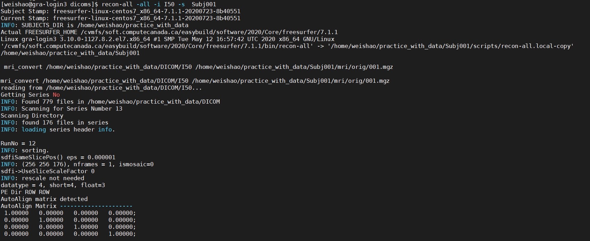

This will cost a few hours but we will come up with a solution to save our time in the next chapter. you will see a new directory has been created in the freesufer subject directory

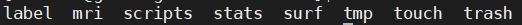

There are 3 directories you need to pay attention to, **mri** has all the volume file, **surf** contains all the surface outcome and scripts keep all the log information.

Freeview
^^^^^^^^

volume freeview
***************
                                                                                                                                                                                                           
Freeview is a visualization tool comes with Freesufer, you could test the freeview as well. ``cd $SUBJECTS_DIR``, and type::
  
  freeview -v \
    bert/mri/T1.mgz \
    bert/mri/brainmask.mgz \
    bert/mri/aseg.mgz:colormap=lut:opacity=0.2
                                                                      

freeview will invoke the freeview of freesurfer

The flag -v is used to indicated that we are open volumes, 
T1.mgz: T1 anatomical image 
brainmask.mgz: skull-stripped volume primarily used for troubleshooting 
aseg.mgz : subcortical segmentation loaded with its corresponding color table and at a opacity=0.2 

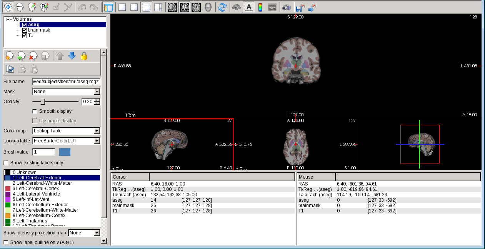

Freeview window will appear and load the data, you can play around with different functions. For example, you can use 

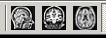

buttons at the top to change which orthogonal view appears in the main viewing window. We can also use the 

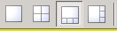

buttons to change the organization of the viewing panes. 

To change which brain slice you are viewing, use the 'Page Up' or 'Page Down' keys on your keyboard or the up and down arrows. (Mac users: press the fn key while using the up and down arrows.) While 
Freeview can load many volumes at once, we cannot necessarily see them all at once. we are able to see whichever volume is at the top of the list in the menu on the left. An exception to this are volumes 
such as the wm.mgz and aseg.mz which can be made translucent, allowing you to view the information they contain simultaneously with the volume directly below it on the list. For example, you are 
currently seeing information from both the aseg (labeled structures) and the brainmask (voxel intensities).

We can hide or turn off a layer by unchecking the check box next to the layer name. You can also use the up and down arrows (located below the menu on the left) to move the aseg down on the list, below 
the brainmask (try it!). 

.. note::

   It is important to ensure that you have install the Xming if you use WSL. 

You also can seel the volume files located in the mri directory. 

.. image:: Freesuefer_mri.PNG 

surface freeview
****************

Now, we have know the basics of volume, let verify the surface, which means we need check two things: 

1 whether the surface accurately follow the gray matter and white matter boundaries

2 whether the aseg accurately follows the subcortical intensity boundaries 

In order to do that, let's start with "brainmask". From $SUBJECTS_DIR, put the code::

freeview -v bert/mri/T1.mgz bert/mri/wm.mgz bert/mri/brainmask.mgz bert/mri/aseg.mgz:colormap=lut:opacity=0.2 -f bert/surf/lh.white:edgecolor=blue bert/surf/lh.pial:edgecolor=red 
bert/surf/rh.white:edgecolor=blue bert/surf/rh.pial:edgecolor=red

Double click on 'brainmask' in the left menu to bring it to the top of the volume list. The white surface (blue line) is used to calculate total white 
matter volume and should accurately follow the boundary between white matter and gray matter. The pial surface (red line) is used to calculate cortical gray matter volume and should accurately follow the 
boundary between the gray matter and the CSF.

.. image:: surface_check.PNG

.. note::

  There are regions where the surfaces are not intended to be accurate that we should be aware of:Areas around the hippocampus and amygdala. The surfaces will not completely include or exclude certain 
subcortical regions. These inaccuracies can be ignored as subcortical regions are excluded from the cortical measures and subcortical volume is measured by the aseg, not the surfaces. 

Subcortical Segmentation
^^^^^^^^^^^^^^^^^^^^^^^^

Uncheck all of the surfaces. Then check the box next to the aseg volume and double click it. The aseg volume will jump to the top of the left menu, above the brainmask volume. This will show the complete 
segmentation of the subcortical structures.

.. image:: Subcortical_Segmentation.PNG

Each structure is labeled with a unique color/number distinction. If you click on a voxel the structure's name and number label will be shown in the 'Cursor' section under the viewing window next to the 
word.

3D Freeview in FreeSurfer
^^^^^^^^^^^^^^^^^^^^^^^^^

As we have view the volumes and surface above, there is 3D usage from freeview, we are only use the left hemisphere for simplicity. 

1 Open up any surface from the data as did above. Type the following commands from ``$SUBJECTS_DIR``::

freeview -f bert/surf/lh.pial:annot=aparc.a2009s.annot:name=pial_aparc_des:visible=0  

2 Set the viewport to 3d view, right click in the viewport and select Hide All Slices

3 In the File menu, select Save Movie Frames

4 Set up the options as in the following picture to save the output - as we create a new directory named 3D in our home directory already..

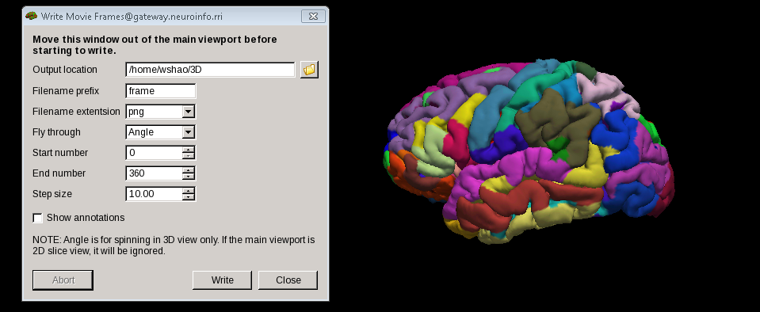

5 From terminal, navigate to the new directory our output located -3D, Run this command:: 

  convert -delay .1 *.png brainanim.gif 

.. Note:: 

  ``convert`` is from the ImageMagick library, you can find the files from `here <https://imagemagick.org/index.php>`__

To view your GIF, open it with firefox browser by type ``firefox brainanim.gif`` from your terminal 

.. image:: brainanim.gif

More details from `freeview <http://surfer.nmr.mgh.harvard.edu/fswiki/FsTutorial/OutputData_freeview/>`__

Segmentation of hippocampal subfields
^^^^^^^^^^^^^^^^^^^^^^^^^^^^^^^^^^^^^

One of important function of FreeSurfer is the subfield segmentation of Hippocampus and amygdala

After ``recon-all`` has been completed, you can take the output from ``recon-all`` and the pipline::

  segmentHA_T1.sh subject_name [SUBJECTS_DIR]

[SUBJECTS_DIR] is optional, the output files will be appear in the mri directory of SUBJECT_DIR ($SUBJECTS_DIR/subjects_name/mri/)

You can check the outfiles with freeview::

  freeview -v nu.mgz -v lh.hippoAmygLabels-T1.v21.mgz:colormap=lut -v rh.hippoAmygLabels-T1.v21.mgz:colormap=lut
  freeview -v nu.mgz -v lh.hippoAmygLabels-T1.v21.HBT.mgz:colormap=lut -v rh.hippoAmygLabels-T1.v21.HBT.mgz:colormap=lut
  freeview -v nu.mgz -v lh.hippoAmygLabels-T1.v21.FS60.mgz:colormap=lut -v rh.hippoAmygLabels-T1.v21.FS60.mgz:colormap=lut
  freeview -v nu.mgz -v lh.hippoAmygLabels-T1.v21.CA.mgz:colormap=lut -v rh.hippoAmygLabels-T1.v21.CA.mgz:colormap=lut

[lr]h.hippoSfVolumes-T1.v21.txt: these text files store the estimated volumes of the hippocampal substructures and of the whole hippocampus..

[lr]h.amygNucVolumes-T1.v21.txt: these text files store the estimated volumes of the nuclei of the amygdala and of the whole amygdala.

[lr]h.hippoAmygLabels-T1.v21.mgz: they store the discrete segmentation volumes at subvoxel resolution (0.333 mm).

[lr]h.hippoAmygLabels-T1.v21.FSvoxelSpace.mgz: they store the discrete segmentation volume in the FreeSurfer voxel space (normally 1mm isotropic, unless higher resolution data was used in recon-all with 
the flag -cm).

[lr]h.hippoAmygLabels-T1.v21.[hierarchy].mgz: they store the segmentations with the different hierarchy levels.

[lr]h.hippoAmygLabels-T1.v21.[hierarchy].FSvoxelSpace.mgz: same as above, but in FreeSurfer voxel space.

In addtion T1 scan, you can also use T2 scan as an addtional scan::

  segmentHA_T2.sh  subjects_name  FILE_ADDITIONAL_SCAN   ANALYSIS_ID  USE_T1  [SUBJECTS_DIR]

FILE_ADDITIONAL_SCAN is the additional scan to use in the segmentation

ANALAYSIS_ID is a user defined identifier that makes it possible to run different analysis with different types of additional scans

USE_T1 is a flag that indicates whether the intensities of the main T1 scan should be used (multispectral segmentation). The words USE_T1 must be replaced with a 0 or 1 on the command line

SUBJECTS_DIR is optional, and overrides the FreeSurfer subject directory when provided
                                                                                                               
For MacOC user, please follow this `video <https://www.youtube.com/watch?v=0R6SJI9MvYM&t=429s/>`__

Go `HippocampalSubfieldsAndNucleiOfAmygdala  <https://surfer.nmr.mgh.harvard.edu/fswiki/HippocampalSubfieldsAndNucleiOfAmygdala/>`__ to see all the instructions

Extract the volume matrix from FreeSurfer  
^^^^^^^^^^^^^^^^^^^^^^^^^^^^^^^^^^^^^^^^^

Once we use the freesurfer automated segmentation, we can also collect the volumes of the subregions of the hippocampus / amygdala of all subjects and write them to a single file, ectracting the volume 
matrix::

  quantifyHAsubregions.sh hippoSf <T1> <output_file> <Output_file_directory> 
 
The first argument ``quantifyHAsubregions.sh`` specifies that we want to collect the volumes of the hippocampus (hippoSf). The second argument is the name of the analysis: for the first mode of operation 
(only main T1 scans), it is simply type T1, and don't forget to name the output_file.

After a few seconds, you will see the output files in the current directory, open it with ``less`` 

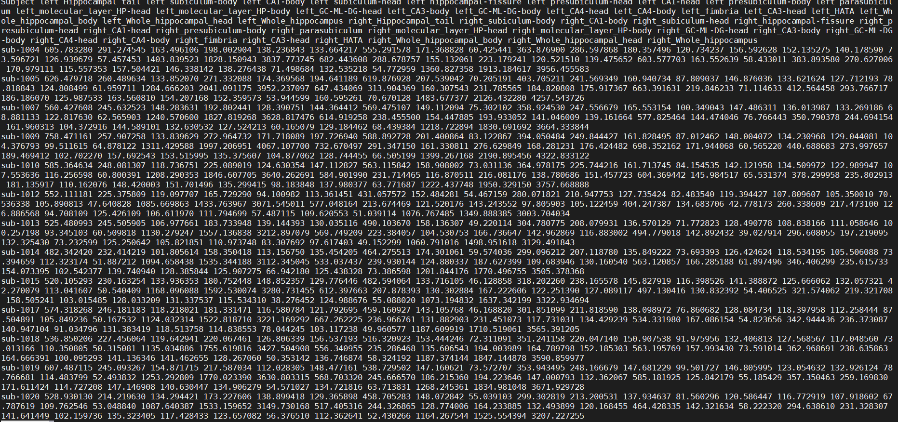

What a mess! Fortunately, there is a solution.
 
1 Open the file with Excel 2016.

2 Look for "Data" tab and "Text in/to column" button.

3 In the step 1, select "Delimited".

4 In the step 2, select first "space", and then choose "string classifier" as "." 

Change format in step 3. "Finish". And save as csv file

Then, You will get a file like this 

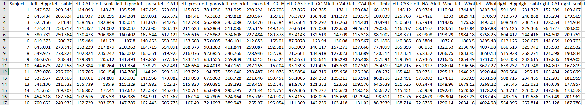

and have fun by play it around like PCA analysis.

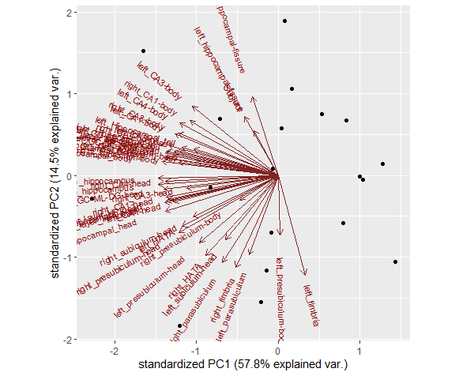

Longitudinal processing  
^^^^^^^^^^^^^^^^^^^^^^^

All data for this tutorial has already been processed for you since processing can take up to 24h. However, to continue you need to understand the three processing steps (cross, base, long) and 
associated directory names.

assume you have a subject with two time points: time_point_1 and time_point_2

[CROSS]: You would process these two images independently first (we call that cross as in crossectional analysis/processing) using the regular FreeSurfer processing stream (recon-all). You end up with 
two directories with the names OAS2_0001_MR1 and OAS2_0001_MR2

[BASE]: Then you would run the second step to create the within subject template (also called base) and end up with a new directory. There is only one base directory per subject. We decide to name the 
base: OAS2_0001. Inside this directory are the results for the average anatomy of your subject across time. You don't use this data in any analysis, and only look at it for quality checking or editing.

[LONG]: Finally you would create the two longitudinal runs (the ones you are actually interested in). You end up with two more directories (these names get automatically assigned): 
OAS2_0001_MR1.long.OAS2_0001 and OAS2_0001_MR2.long.OAS2_0001. They contain the final, most reliable and accurate processing results..

FreeSurfer commands 
^^^^^^^^^^^^^^^^^^^

There are commands that could be quite useful.

1 ``mri_info`` this command can help you find the basic information from the NIFTI files 

