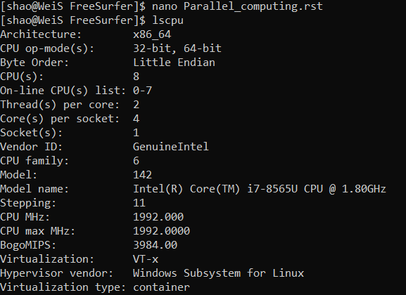

Parallel computing for recon-all
================================

The second solution to speed up recon-all is parallel computing!

A physical core is an actual physical processor core in your CPU. Each physical core has its own circuitry to read and execute instructions separately. 

Freesufer support the OpenMP code,which means that ``recon-all`` can be processed by multiple-cores/threads,you can either recon-all one subjects with multiple cores.

the command to tell recon-all run multiple cores is ``-openmp X``, X indicates how many cores you want to run with freesufer. 

First, check the CPU information, you can check it by "lscpu" in linux system environment or press Ctrl + Shift + Esc to open Task Manager and select the Performance tab to see how many cores and logical processors under the Windows system.

Then you can add X no more than the actual cpus you have::

  recon-all -all -i input_T1  -s subjname -openmp 8

