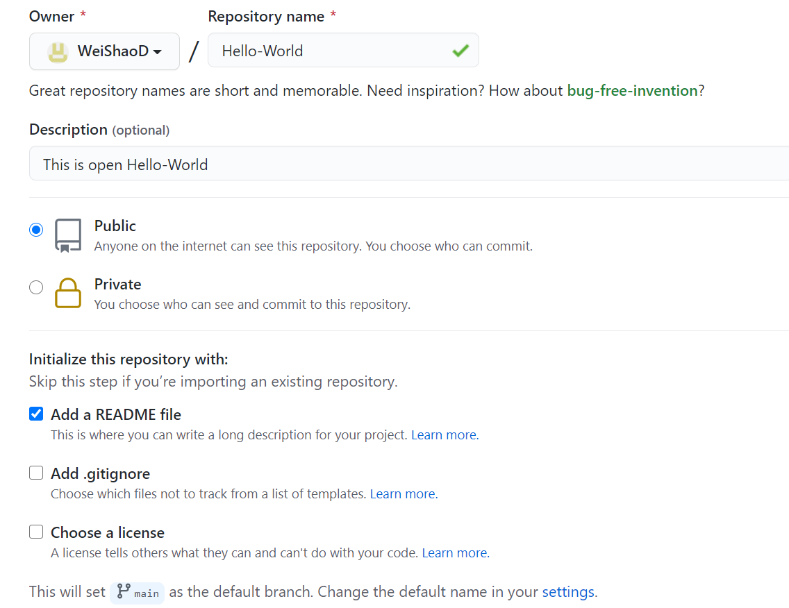
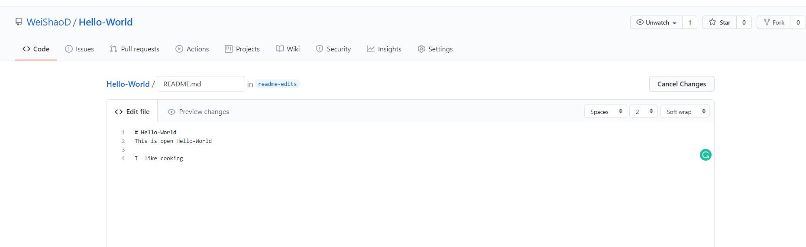
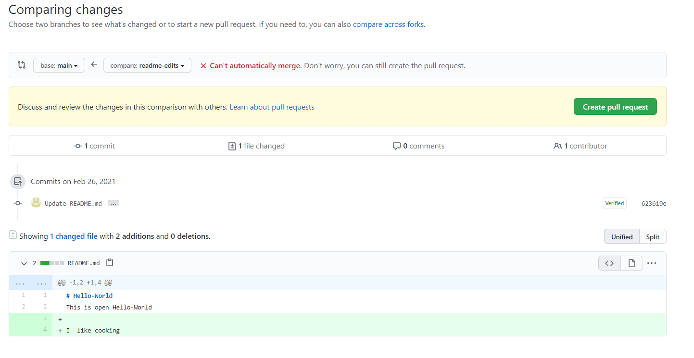
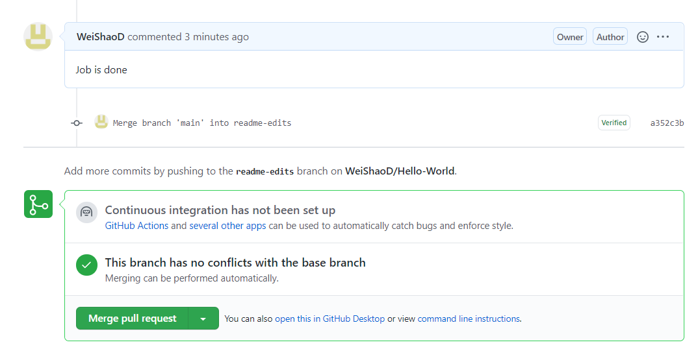

GitHub
======

What is most to a chef, collboration, collboration and collboration

So, What is GitHub?

GitHub is a code hosting platform for version control and collaboration. It lets you and others work together on projects from anywhere.

First thing first

go to `GitHub <https://github.com/>`__ create a account and sign in 

Here I just want to introduce 4 major commands for GitHub::

  repositories 
  branches
  commits
  Pull Requests

Step 1 Creat a repository 
^^^^^^^^^^^^^^^^^^^^^^^^^

A repository is usually used to organize a single project. Repositories can contain folders and files, images, videos, spreadsheets, and data sets – anything your project needs

Go the left right corner where you can see Repositories click new

Name your repository ``Hello-World``

Write a short description.

Select Initialize this repository with a README.

click Create repository

Step 2 Creat a Branch
^^^^^^^^^^^^^^^^^^^^^

Branching is the way to work on different versions of a repository at one time, By default your repository has one branch named ``main`` which is considered to be the definitive branch. We use branches to experiment and make edits before committing them to ``main``

When you create a branch off the ``main`` branch, you’re making a copy, or snapshot, of ``main`` as it was at that point in time. If someone else made changes to the ``main`` branch while you were working on your branch, you could pull in those updates

the ``main`` branch

A new branch called ``feature``

a journey that ``feature`` takes before it’s merged into ``main``

..  image:: branching.png

Creat a new branch

Go to your new repository hello-world

click branch: main

type a branch name, readme-edits, into the new branch text box

Select the Create branch text box

Now you have two branches, ``main`` and ``readme-edits``

Step 3 Make and commit changes
^^^^^^^^^^^^^^^^^^^^^^^^^^^^^^

Now, you’re on the code view for your readme-edits branch, which is a copy of main. Let’s make some edits.

Make and commit changes
Click the README.md file
Click the  pencil icon in the upper right corner of the file view to edit
Write a commit message that describes your changes
Click Commit changes button.

These changes will be made to just the README file on your readme-edits branch, so now this branch contains content that’s different from main.

Step 4 Open a Pull Request
^^^^^^^^^^^^^^^^^^^^^^^^^^

Now that you have changes in a branch off of main, you can open a pull request

Pull Requests are the heart of collaboration on GitHub. When you open a pull request, you’re proposing your changes and requesting that someone review and pull in your contribution and merge them into their branch. Pull requests show diffs, or differences, of the content from both branches. The changes, additions, and subtractions are shown in green and red.

Open a Pull Request for changes to the README

Click the Pull Request tab, then from the Pull Request page, click the green New pull reqqest

..  image:: GitHub_pull_request.PNG

select the branch you made, readme-edits, to compare with main (the original)

Look over your changes in the diffs on the Compare page, make sure they’re what you want to submit

Give your pull request a title and write a brief description of your changes

Step 5 Merge your Pull Request
^^^^^^^^^^^^^^^^^^^^^^^^^^^^^^

In this final step, it’s time to bring your changes together – merging your ``readme-edits`` branch into the ``main`` branch

Click the green Merge pull request button to merge the changes into ``main``

Click Confirm merge

Go ahead and delete the branch, since its changes have been incorporated, with the Delete branch button in the purple box.

