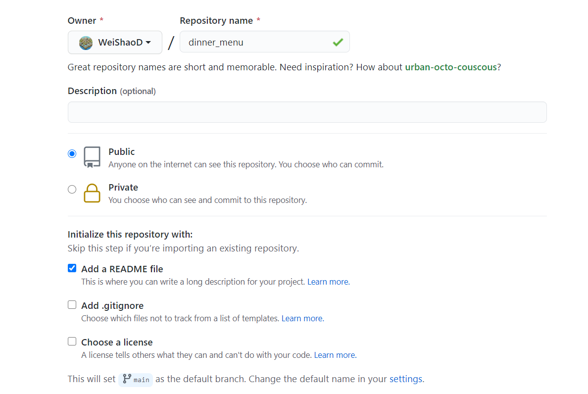
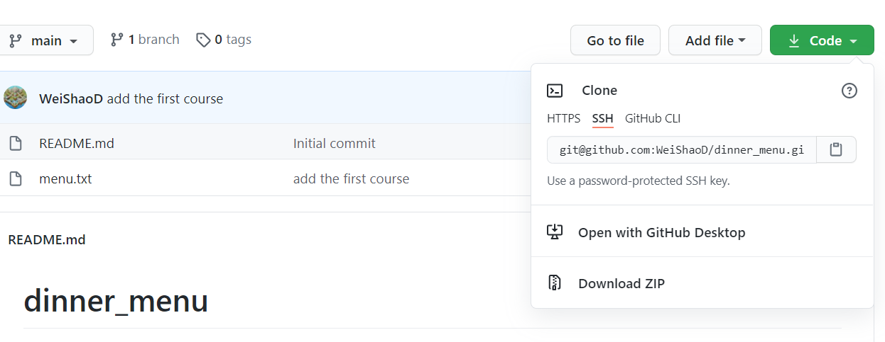
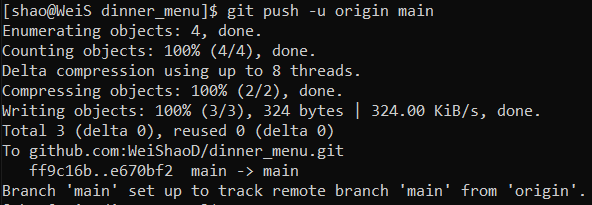
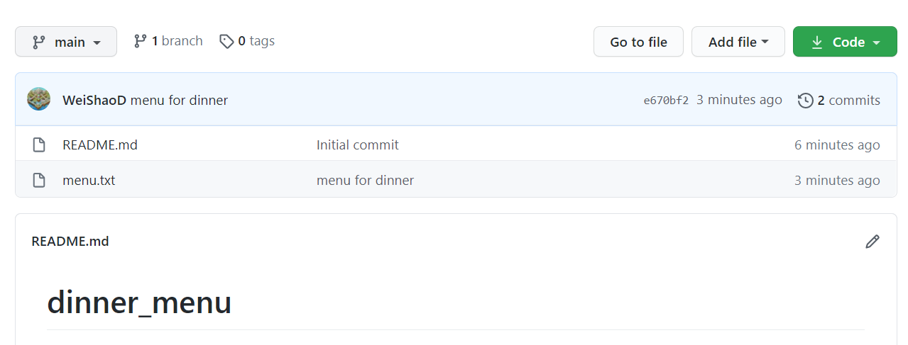
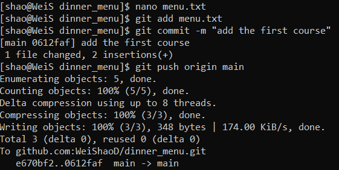

More GitHub commands
====================

After the basic content, let's have more fun by knowing how to download the content from GitHub repository/ or upload an existing local file to a GitHub 
repository with the 4 command lines::

  git clone

  git add

  git commit

  git push

GitHub configuration
^^^^^^^^^^^^^^^^^^^^
             
First, sign in with a GitHub account and create a new repository named dinner_menu

Now, open a terminal and go to the directory that you want to work on from there.
  
set up the GitHub configuration::

  git config --global user.name "your name"
  git config --global user.email "your GitHub_Emailaddress@.com"                                                             

Then, use ``git clone`` to get the remote directory content from your GitHub repository

git clone
^^^^^^^^^

``git clone`` is a Git command line that targets an existing repository and creates a clone in your directory. it is primarily used to point to an existing 
repo and make a clone or copy of that repository in a new directory.

  you can choose HTPS or SSH for your first time to clone the content, I recommend the SSH option since it will save a lot of time because GitHub won't
  ask you the password every time when you upload the content to the existing repository.

Type  ``git clone git@github.com:WeiShaoD/dinner_menu.git`` from your work directory.
   
..  image:: git_clone.PNG

Git add/commit/push
^^^^^^^^^^^^^^^^^^^

The ``git add`` adds a change in the working directory. It tells Git that you want to include updates to a particular file in the next commit. However, git 
add doesn't really affect the repository until you run git commit.

The ``git commit`` captures a snapshot of the project's currently staged changes. Committed snapshots can be thought of as “safe” versions of a project—Git 
will never change them unless you explicitly ask it to. Prior to the execution of git commit, The git add command is used to promote or 'stage' changes to 
the project that will be stored in a commit.

The ``git push`` uploads local repository content to a remote repository. pushing exports commits to remote branches therefore Pushing has the potential to 
overwrite changes, caution should be taken when pushing.
 
cd to the dinner_menu, add a new menu.txt file by typing ``nano menu.txt``, use ``git add`` and ``git commit -m ""menu for dinner""``    

..  image:: Git_add_commit.PNG 

Use ``git push -u origin main`` to synchronize your local and GitHub remote repository.
  

Now you can see the new menu from GitHub webpage.
        

It's time for you to practice these commands by editing your own dinner menu.

More details form  `here <https://docs.github.com/en/github/managing-files-in-a-repository/adding-a-file-to-a-repository-using-the-command-line/>`__  
