Conventions_and_Contrasts
=========================

ORDER OF TRACING
^^^^^^^^^^^^^^^^

Draw one ROI in all slices at a time for one hemisphere of the MTL, after you understand the lay of the land (see Getting Started with Segmentation). Move 
to the other hemisphere only after you have completed all ROIs in the first side. If you are only segmenting hippocampal subfields, then you can skip the 
PRC and ERC steps to proceed right to the hippocampal head. Otherwise, for the whole MTL, we recommend the following order per hemisphere.

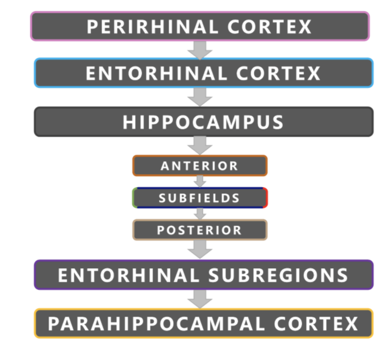
   
**Figure 3.1**:Order of segmentation in the medial temporal lobes.

NAMING CONVENTIONS AND LABELS
^^^^^^^^^^^^^^^^^^^^^^^^^^^^^

Naming conventions should include the prefix L- or R- for the hemisphere. If you have more than one segmenter or rater per subject, make sure that these 
labels and colour values are consistent. See the table below for our recommended labels::

  REGION OF INTEREST               LABEL     COLOUR      HEX
  Perirhinal Cortex                 PRC       Pink     #f791d8
  Entorhinal Cortex                 ERC       Cyan     #00ccfc
  Anterior Head                   Ant_Hipp    Orange   #e26213
  Posterior Hippocampus           Post_Hipp   Copper   #c3a37f
  Hippocampal CA1                   CA1       Green    #7fc92d
  Hippocampal Subiculum             Sub       Red      #ff0000
  Hippocampal CA3 + Dentate Gyrus  CA3/DG  Navy Blue   #3915e9
  Parahippocampal Cortex            PHC      Yellow    #fff900
  Posteromedial Entorhinal Cortex  pmERC     Purple    #994cd3

**Table 3**: Labelling and colour conventions for the OAP protocol.

CONTRASTS
^^^^^^^^^

The contrast is set to optimize the differentiation of gray matter from white matter. We recommend a minimum contrast of 200, and a maximum of 800 to 900 
on the T2-weighted image. The contrast should be consistent across raters. Generally, you can keep the same contrast throughout all slices of a brain, 
though you may adjust to better see a structure. For all structures segmented, make sure you record the minimum and maximum contrast in the segmentation 
notes spreadsheet.

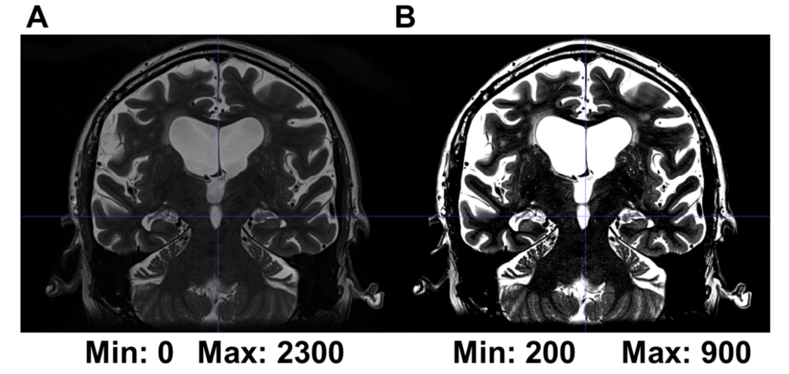

**Figure 3.2**: (A) Structures are harder to see in a T2-weighted image with default contrast. (B) Structures are clearer in a T2-weighted image when the 
minimum and maximum contrasts have been adjusted to 200 and 900, respectively.

VOXEL RULES
^^^^^^^^^^^

Cerebral spinal fluid (CSF) will appear on the T2-weighted scan as white voxels. When CSF in the collateral sulcus is greater than 1 voxel, draw around it. 
When CSF is 0 or 1 voxels wide, include it into the collateral sulcus structure. The voxel rule should also be followed when considering including CSF 
regions in other regions in the hippocampus. Furthermore, when considering whether to include the lateral border of the ERC (where the ERC climbs up the 
bank of the CS to meet the PRC), you should also follow the voxel rule and only include the border if it is 1 voxel thick or less.

LAY OF THE LAND: MEDIAL TEMPORAL LOBES LANDMARKS
^^^^^^^^^^^^^^^^^^^^^^^^^^^^^^^^^^^^^^^^^^^^^^^^

With your segmentation notes spreadsheet open in a separate window, start by identifying the landmarks outlined in the following section. This process will 
allow you to get a “feel” for your particular subject's anatomy before you actually start segmenting. You will make notes about these landmarks and which 
slice you identify them in your spreadsheet. It is recommended that you move in an anterior-posterior direction when identifying these landmarks.  It is 
critical that you follow the order outlined in this section, as certain earlier decisions on landmarks will inform later ones. Screenshots with examples 
are included to help you. Please note, however, that you will need to read the rules for each landmark carefully as your T2 images will certainly vary 
greatly (see **Variability in Landmarks** for more information).

LANDMARK 1: FIRST SLICE CONTAINING THE COLLATERAL SULCUS
^^^^^^^^^^^^^^^^^^^^^^^^^^^^^^^^^^^^^^^^^^^^^^^^^^^^^^^^

The first slice of the MTL is the first slice in your image set where you can clearly see the collateral sulcus (CS). This is the most anterior slice. The 
grey matter ribbon only consists of the perirhinal cortex. The depth of the CS determines the medial and lateral borders of the perirhinal cortex. It is 
important to identify the CS first. In your spreadsheet, note down the first and most anterior slice that you can identify the CS. Take a look at the 
example below.

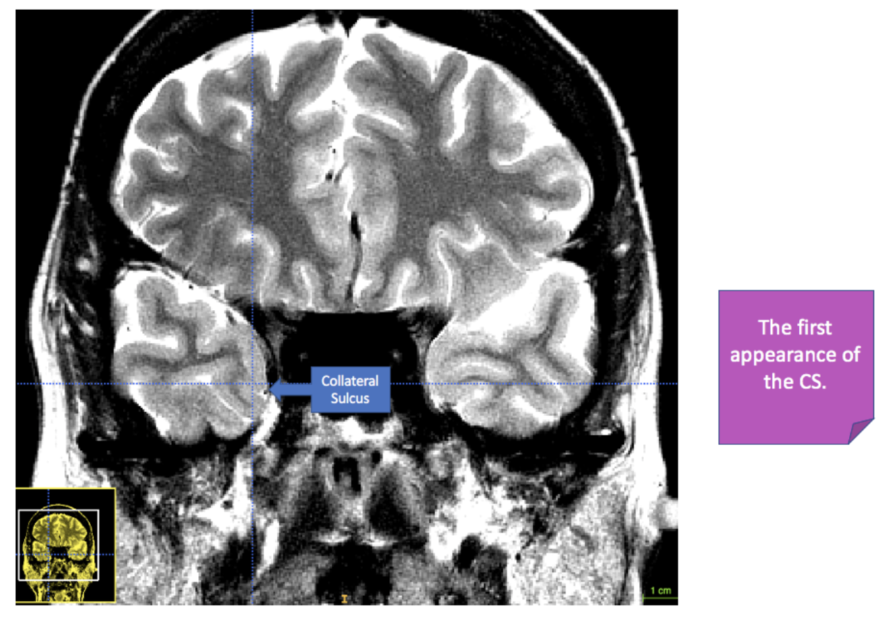

**Figure 4.1**: The first appearance of the collateral sulcus (CS) in a T2-weighted MR image.

Be careful - in some brains it is easy to confuse a prominent rhinal sulcus (RS) with the CS in early anterior slices. To learn more, see the **Collateral 
Sulcus in Segmenting Regions of Interest in the Medial Temporal Lobes**

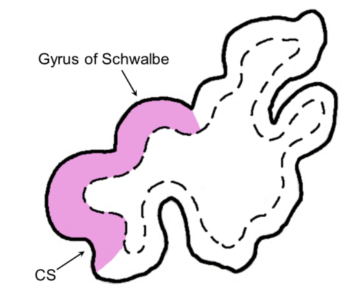

**Figure 4.2**: According to Insausti et al. (1998), the first appearance of the CS marks the transition between the temporopolar cortex (not included in 
the OAP protocol) and the perirhinal cortex (shown here in pink). Image adapted from Insausti et al. (1998). CS = collateral sulcus

LANDMARK 2: THE FRONTAL-TEMPORAL JUNCTION/LIMEN INSULAE.
^^^^^^^^^^^^^^^^^^^^^^^^^^^^^^^^^^^^^^^^^^^^^^^^^^^^^^^

This key landmark will determine where you start drawing the entorhinal cortex (ERC). To find this landmark, look for the frontal-temporal junction 
(FTJ)/limen insulae. The slice in which there is a clear band of white matter that joins the frontal lobe to the temporal lobe is the slice in which the 
FTJ/limen insulae is indicated. It is sometimes easier to visualize this landmark on a T1-weighted scan.

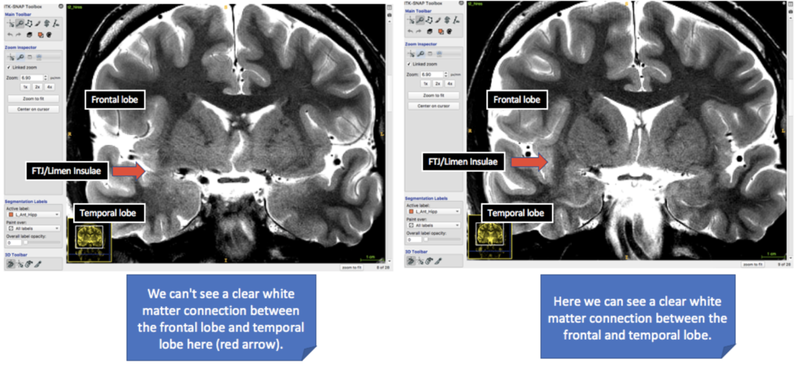

**Figure 4.3**: The two examples here compare a slice (T2-weighted) in which the limen insulae grey matter is visible in the left image; however, there is no 
clear white matter connection between the temporal and frontal lobe yet, versus in right image there is a clear connection between the white matter of the 
frontal and temporal lobe. This is a clear indication of the presence of the FTJ/limen insula, which will determine the delineation of the entorhinal 
cortex. See the next image below for another example.

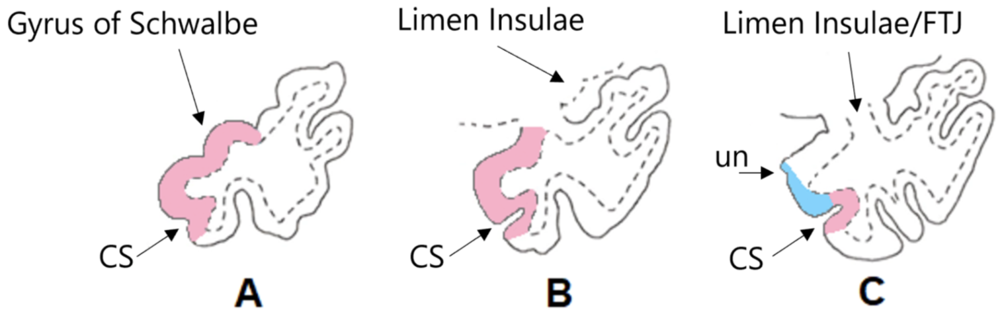

**Figure 4.4**: Adapted from Insausti et al. (1998). (A) The emergence of CS and gyrus of Schwalbe (with PRC depicted in pink), (B) Moving posteriorly, the 
limen insula is now present but the white matter connection between the frontal and temporal lobe is not clear, so we only continue to trace the PRC. (C) 
There is a clear connection between the white matter of the frontal lobe and temporal lobe. This is the slice in which you draw the ERC (depicted in blue) 
from the PRC up to the uncal notch (un). This is also the slice in which you make a note in your spreadsheet for the presence of the FTJ/limen insula. 
Boundaries based on Kivisaari et al. (2013), see **Helpful Additional Resources for Further Reading**.

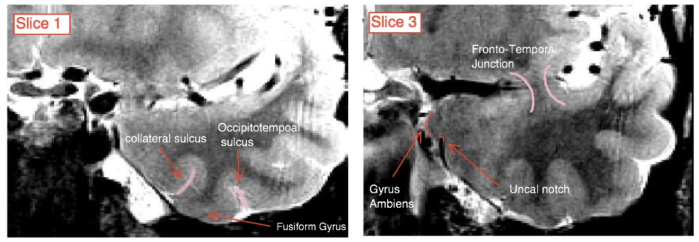

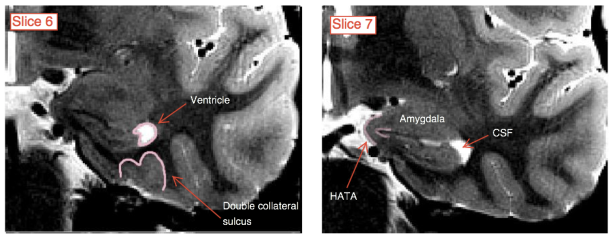

**Figure 4.5**: This image brings together the first two landmarks (CS and FTJ/limen insulae) as described above. As you move from anterior to posterior, the
CS may change from a single to double CS.

LANDMARK 3: THE FIRST SLICE CONTAINING VISIBLE HIPPOCAMPAL HEAD
^^^^^^^^^^^^^^^^^^^^^^^^^^^^^^^^^^^^^^^^^^^^^^^^^^^^^^^^^^^^^^^

Next, you will need to look for the hippocampal head. To find this landmark::

 A In its first appearance, the hippocampal head will probably look like a “bean” shape
 B The amygdala is located superior and the ventricle is lateral to the hippocampal head
 C Ambient gyrus appears in the same slice as the appearance of the hippocampal head

After identifying the hippocampal head on 2-3 slices (depending on the brain you are segmenting and the quality of the T2 scan) you will start to see 
subfields of the hippocampus. At this point, the hippocampus will look thicker than previous slices and the superior digitations of the hippocampus will 
have smoothed out. This is the first slice of the dentate gyrus (DG) and, by extension, other subfields of the hippocampus. Finally, a darker C-shaped band 
should be visible, separating hippocampal cornu ammonis area 1 (CA1) from DG. Note that in the OAP protocol, we do not distinguish between DG and cornu 
ammonis area 3 (CA3).

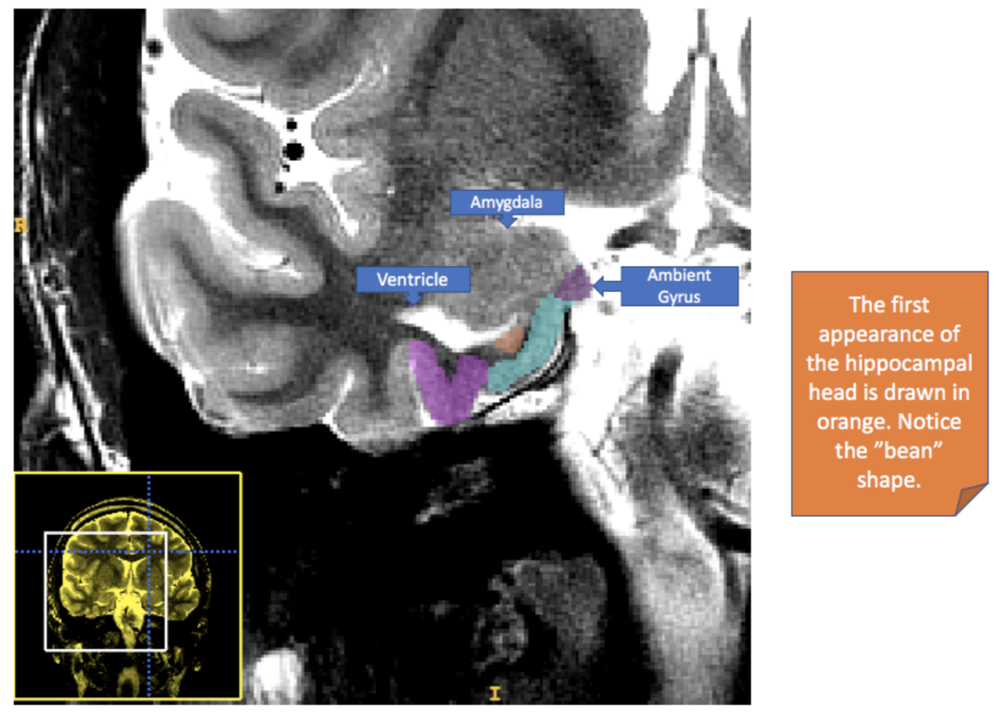

**Figure 4.6**: This image depicts the first appearance of the hippocampal head (shown in orange). Notice the ventricle laterally, and the ambient gyrus 
medially.

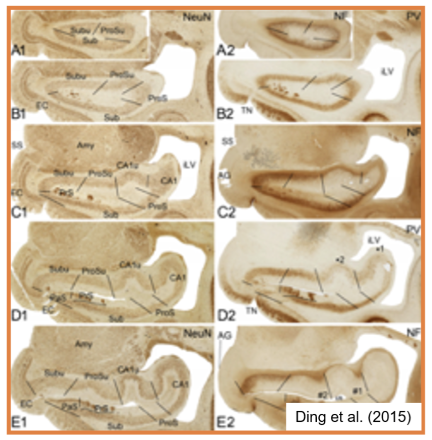

**Figure 4.7**: This image will help you determine the shape of the hippocampal head in the brain you are segmenting. The example shown is adapted from 
Ding et al. (2015). Notice how the head shape can resemble a “bean” (A1, A2, B1, B2) or more like the hippocampal body (C1, C2).

LANDMARK 4: THE FIRST SLICE CONTAINING DENTATE GYRUS
^^^^^^^^^^^^^^^^^^^^^^^^^^^^^^^^^^^^^^^^^^^^^^^^^^^^

After identifying the hippocampal head on 2-3 slices (depending on the brain you are segmenting and the quality of the T2 scan) you will start to see 
subfields of the hippocampus. At this point, the hippocampus will look thicker than previous slices and the superior digitations of the hippocampus will 
have smoothed out. This is the first slice of the dentate gyrus (DG) and, by extension, other subfields of the hippocampus. Finally, a darker C-shaped band 
should be visible, separating hippocampal cornu ammonis area 1 (CA1) from DG. Note that in the OAP protocol, we do not distinguish between DG and cornu 
ammonis area 3 (CA3).

.. image:: figure11.png

**Figure 4.8**: The image above, adapted from Ding et al. (2015), will help you with identifying dentate gyrus (highlighted in blue). 

LANDMARK 5: THE LAST SLICE CONTAINING THE UNCUS
^^^^^^^^^^^^^^^^^^^^^^^^^^^^^^^^^^^^^^^^^^^^^^^

The last slice of the uncus in the image below would be the second box from the left. You should note here that this EC/PRC to PHC transition is valid for 
2-3mm thick slices. For thinner slices, there will be more slices in between the uncal apex and the start of the PHC (Pruessner et al. (2000) suggests it 
starts 5mm posterior to the uncal apex).

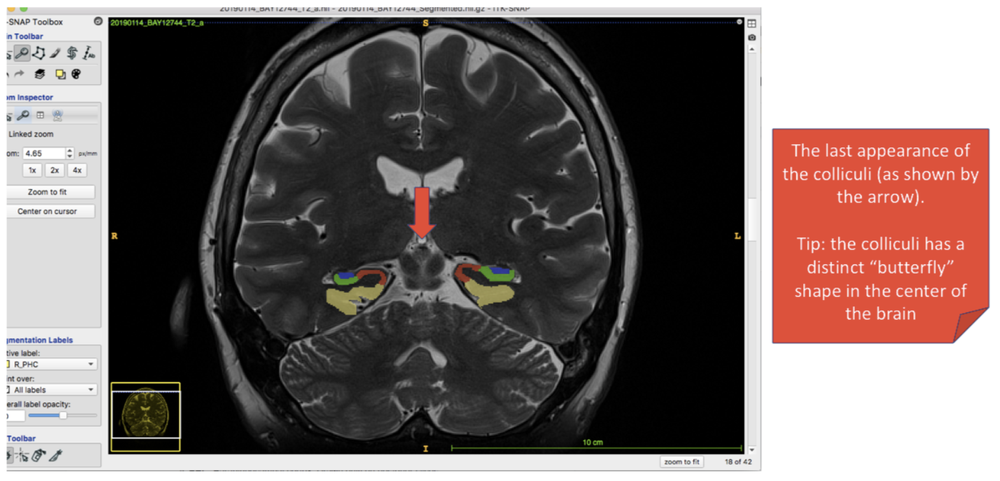

**Figure 4.9**: Anterior to posterior cortical transition showing the final slice containing the uncus. After one slice where the uncus is absent, you can 
start tracing the PHC, and the ERC/PRC disappears. Image adapted from: Carr, V.A. (2013), Variability in collateral sulcus anatomy: The challenge of 
reliably segmenting medial temporal lobe cortices. Hippocampal Subfield Segmentation Summit, Davis: Oral presentation.

LANDMARK 6: THE LAST APPEARANCE OF THE COLLICULI 
^^^^^^^^^^^^^^^^^^^^^^^^^^^^^^^^^^^^^^^^^^^^^^^^

The last clear appearance of the colliculi is the final slice where we segment the hippocampal subfields. After this slice, the hippocampus transitions to 
the tail segment.

**Figure 4.10**: The final appearance of the colliculi, which resemble a “butterfly” shape in the centre of the brain. 

LANDMARK 7: THE LAST SLICE WHERE THE HIPPOCAMPAL TAIL IS VISIBLE 
^^^^^^^^^^^^^^^^^^^^^^^^^^^^^^^^^^^^^^^^^^^^^^^^^^^^^^^^^^^^^^^^

The last slice of the MTL is the slice in your image set where you can clearly see the grey matter portion of the hippocampus tail. After the last slice of 
the MTL the bright CSF laterally to the hippocampus will clearly sweep up and meet up with the more superior ventricle.

