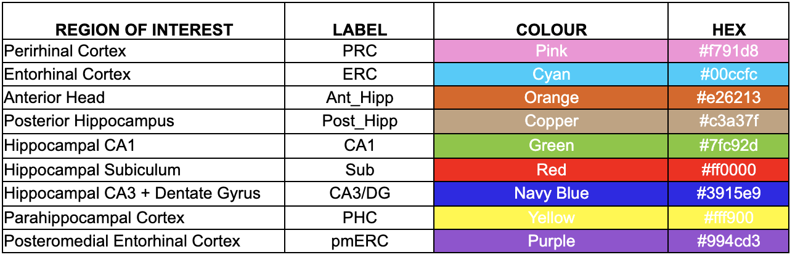
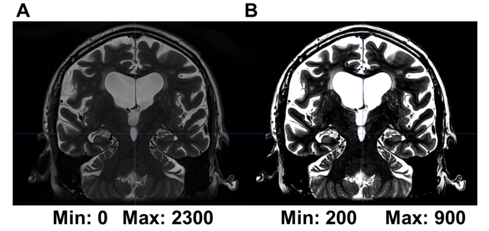

3 Conventions_and_Contrasts
===========================

ORDER OF TRACING
^^^^^^^^^^^^^^^^

Draw one ROI in all slices at a time for one hemisphere of the MTL, after you understand the lay of the land (see Getting Started with Segmentation). Move 
to the other hemisphere only after you have completed all ROIs in the first side. If you are only segmenting hippocampal subfields, then you can skip the 
PRC and ERC steps to proceed right to the hippocampal head. Otherwise, for the whole MTL, we recommend the following order per hemisphere.

.. image:: label1.png  
   
**Figure 3.1**:Order of segmentation in the medial temporal lobes.

NAMING CONVENTIONS AND LABELS
^^^^^^^^^^^^^^^^^^^^^^^^^^^^^

Naming conventions should include the prefix L- or R- for the hemisphere. If you have more than one segmenter or rater per subject, make sure that these 
labels and colour values are consistent. See the table below for our recommended labels::

  REGION OF INTEREST               LABEL     COLOUR      HEX
  Perirhinal Cortex                 PRC       Pink     #f791d8
  Entorhinal Cortex                 ERC       Cyan     #00ccfc
  Anterior Head                   Ant_Hipp    Orange   #e26213
  Posterior Hippocampus           Post_Hipp   Copper   #c3a37f
  Hippocampal CA1                   CA1       Green    #7fc92d
  Hippocampal Subiculum             Sub       Red      #ff0000
  Hippocampal CA3 + Dentate Gyrus  CA3/DG  Navy Blue   #3915e9
  Parahippocampal Cortex            PHC      Yellow    #fff900
  Posteromedial Entorhinal Cortex  pmERC     Purple    #994cd3

**Table 3**: Labelling and colour conventions for the OAP protocol.

CONTRASTS
^^^^^^^^^

The contrast is set to optimize the differentiation of gray matter from white matter. We recommend a minimum contrast of 200, and a maximum of 800 to 900 
on the T2-weighted image. The contrast should be consistent across raters. Generally, you can keep the same contrast throughout all slices of a brain, 
though you may adjust to better see a structure. For all structures segmented, make sure you record the minimum and maximum contrast in the segmentation 
notes spreadsheet.

**Figure 3.2**: (A) Structures are harder to see in a T2-weighted image with default contrast. (B) Structures are clearer in a T2-weighted image when the 
minimum and maximum contrasts have been adjusted to 200 and 900, respectively.

VOXEL RULES
^^^^^^^^^^^

Cerebral spinal fluid (CSF) will appear on the T2-weighted scan as white voxels. When CSF in the collateral sulcus is greater than 1 voxel, draw around it. 
When CSF is 0 or 1 voxels wide, include it into the collateral sulcus structure. The voxel rule should also be followed when considering including CSF 
regions in other regions in the hippocampus. Furthermore, when considering whether to include the lateral border of the ERC (where the ERC climbs up the 
bank of the CS to meet the PRC), you should also follow the voxel rule and only include the border if it is 1 voxel thick or less.

