2 Using ITK-SNAP for segmentation 
=================================

In this section, we review how to open images for segmentation and set up your workspace

STEP 1: DOWNLOADING ITK-SNAP
^^^^^^^^^^^^^^^^^^^^^^^^^^^^

First, download ITK-SNAP 3.8.0 (click `here <http://www.itksnap.org/pmwiki/pmwiki.php?n=Downloads.SNAP3/>`__ here for download link). It is strongly 
recommended that you install the latest version of ITK-SNAP for segmentation.

STEP 2: OPENING T2-WEIGHTED IMAGES
^^^^^^^^^^^^^^^^^^^^^^^^^^^^^^^^^^

In ITK-SNAP, select File from the top menu ribbon, then Open Main Image to open the T2 image for one subject. After selecting the file (.nii/.nii.gz), a 
pop-up window will open. Select Next and then Finish to open the T2. You should see four panels, with a sagittal, axial, and coronal view, plus an empty 
panel for 3D rendering.

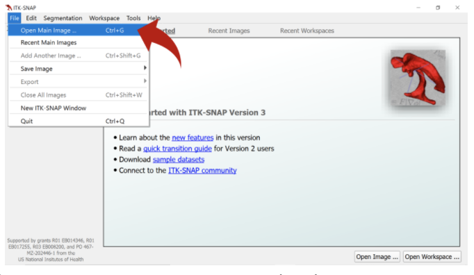

STEP 3: OPENING T1 IMAGES FOR STRUCTURAL REFERENCE
**************************************************

Next, open the T1 for the same subject as a reference. Select File, then New ITK-Snap Window. In the new window, click File and then Open Main Image to 
select the T1 file (.nii/.nii.gz). If the T1 and T2 are properly co-registered, the scans should automatically align in the same space.

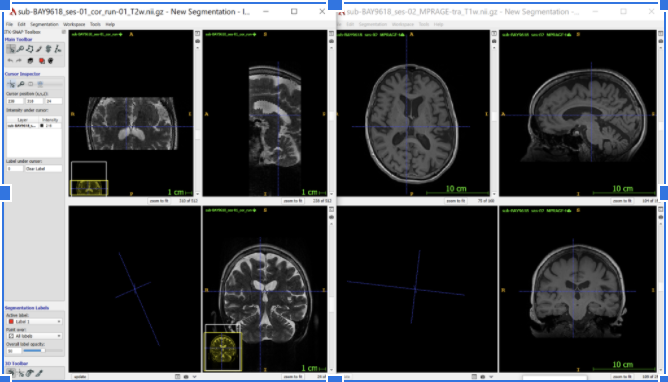

STEP 4: SWITCHING BETWEEN VIEWS
*******************************

Since segmentation is done primarily on the coronal view of the T2-weighted image, you can easily switch between views (coronal, axial, and sagittal) by 
clicking Edit in the top menu ribbon and then Views in the dropdown menu to select Next Display Layout (for shortcuts in ITK-Snap,see 
`here <http://www.itksnap.org/pmwiki/uploads/Documentation/snap_shortcuts_v3.pdf/>`__).

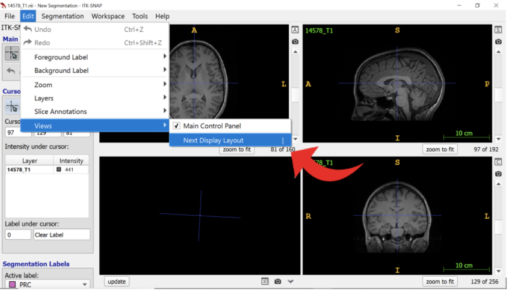

STEP 5: OPENING LABEL EDITOR
****************************

On the T2-weighted image ITK-SNAP window, select Segmentation on the top menu ribbon and click on Label Editor in the dropdown menu to change your 
segmentation labels. A pop-up window will open called Segmentation Label Editor.

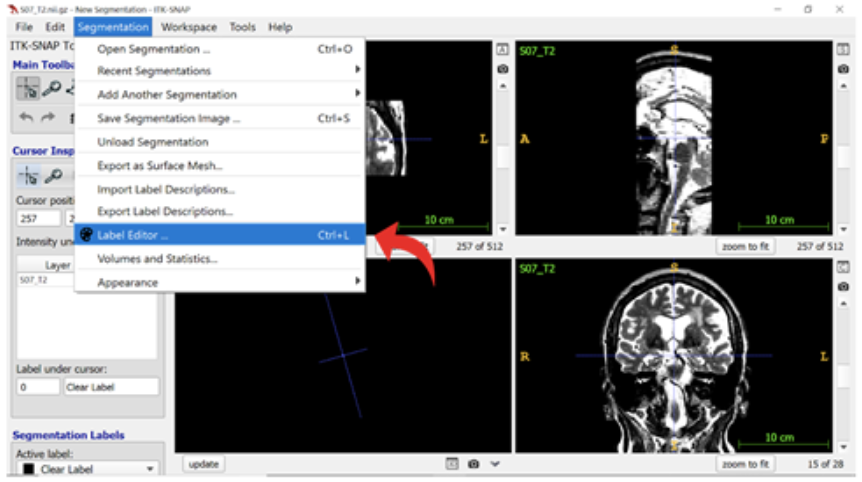

STEP 6: EDITING LABELS 
**********************

Add the appropriate labels for MTL regions by typing each region’s name in the Description field, then selecting the colour for that region. You can learn 
more about naming conventions and the standard segmentation colours in the OAP protocol in **Labels, Naming Conventions, and Contrasts**.

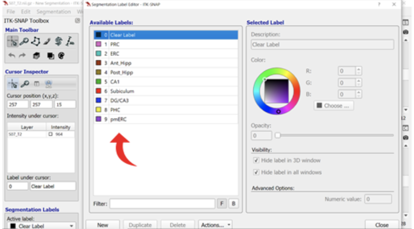

STEP 7: EXPORTING LABELS
************************

To make segmentation easier each time you re-open ITK-SNAP, you can export and save your custom labels, which you can then later re-import. Select Actions… 
at the bottom of the pop-up window and then choose Export Label Descriptions from the dropdown menu. Save these labels as a text file (.txt). In future 
sessions using ITK-SNAP, you can simply select Segmentation from the top menu ribbon and then Import Label Descriptions… to re-import this file.

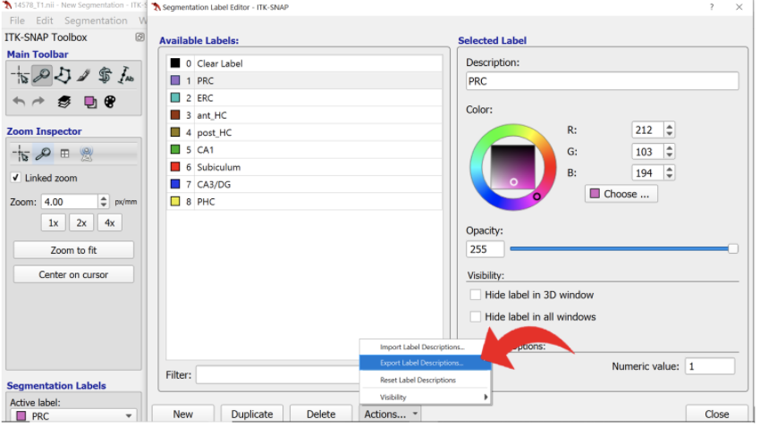

STEP 8: CHANGING IMAGE CONTRAST
*******************************

To optimize the differentiation of gray matter from white matter in the T2-weighted scan, we can change the contrast levels. Select Tools in the top menu 
ribbon and click Image Contrast, then Contrast Adjustment.

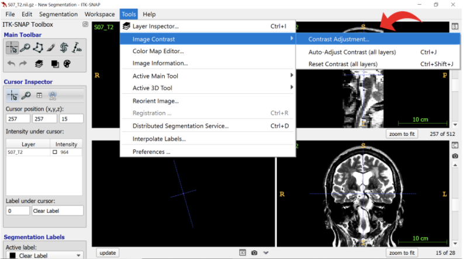

STEP 9: CHOOSING IMAGE CONTRASTS
********************************

In the pop-up window called Image Layer Inspector, you may need to adjust your image contrast to better see certain boundaries. We recommend a minimum 
contrast at approximately 200 and a maximum contrast at approximately 800 to 900. Be sure to record your contrast selection for each brain in your 
segmentation notes.

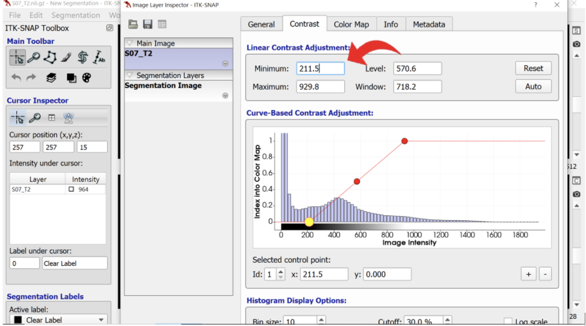

STEP 10: ORIENTATION IN ITK-SNAP
********************************

Lastly, before starting segmentation, you should get familiar with the layout of ITK-SNAP. The left side of the screen shows the right hemisphere of the 
brain, and vice versa. Small letters R (right) and L (left) represent the hemispheres on each side of the coronal view.

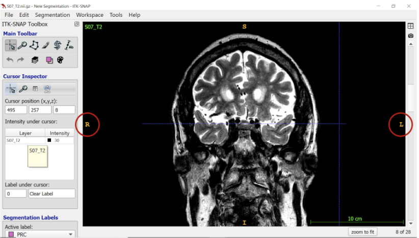

At the bottom right-hand corner of the ITK-SNAP window, you can see the total number of slices, as well as which slice you are currently on. The slice 
number should increase as you scroll from anterior to posterior in the brain. Make sure to record the total number of slices in your segmentation notes 
spreadsheet (see Getting Started with Segmentation for more information on the spreadsheet).

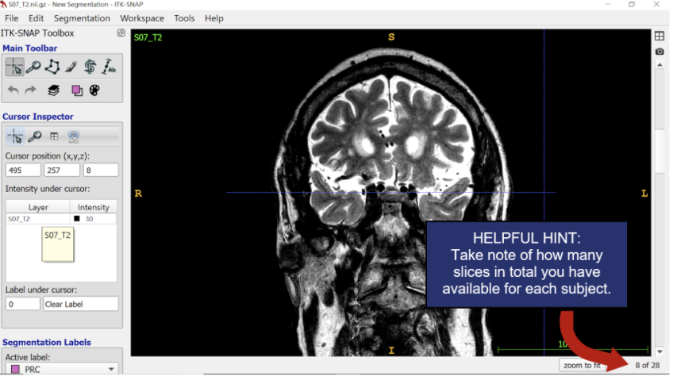

STEP 11: TRACING TOOLS AND SAVING SEGMENTATIONS
***********************************************

As a final step, let’s review the toolbox on the left-hand side panel. See the figure below (Fig. 2.11) for information on how to use the main toolbar  

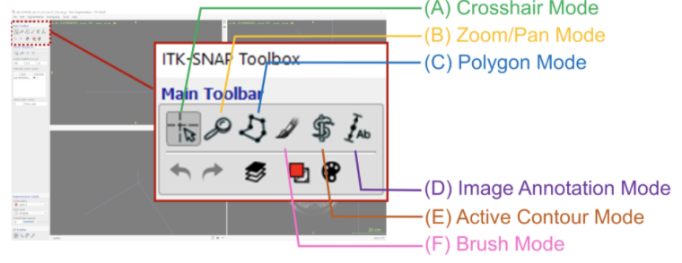

Menu options::

  TOOL MODE             DESCRIPTION
  (A) Crosshair         See cursor coordinates and move crosshairs to a specific position

  (B) Zoom/Pan          Adjust zoom on display and centre zoom on crosshair position

  (C) Polygon           Useful outline tool to create shape outlines for tracing

  (D) Image Annotation  Measure a region for segmentation depth rules or tag a slice

  (E) Active Contour    Used for automatic segmentation (not featured in this manual)

  (F) Brush             Used frequently for tracing, allowing freehand drawing on voxels 

At the bottom of the toolbox, you can adjust the active segmentation label, its opacity, and whether you want to trace over all voxels or only specific 
labels.

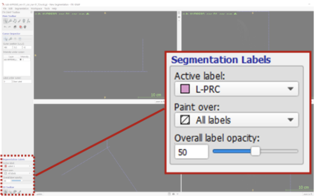

Finally, to save a segmentation, select Segmentation from the top menu ribbon and then Save Segmentation Image… in the dropdown menu. 
