4 Lay of the land: medial temporal lobes landmarks 
==================================================

With your segmentation notes spreadsheet open in a separate window, start by identifying the landmarks outlined in the following section. This process will 
allow you to get a “feel” for your particular subject's anatomy before you actually start segmenting. You will make notes about these landmarks and which 
slice you identify them in your spreadsheet. It is recommended that you move in an anterior-posterior direction when identifying these landmarks.  It is 
critical that you follow the order outlined in this section, as certain earlier decisions on landmarks will inform later ones. Screenshots with examples 
are included to help you. Please note, however, that you will need to read the rules for each landmark carefully as your T2 images will certainly vary 
greatly (see **Variability in Landmarks** for more information).

LANDMARK 1: FIRST SLICE CONTAINING THE COLLATERAL SULCUS
^^^^^^^^^^^^^^^^^^^^^^^^^^^^^^^^^^^^^^^^^^^^^^^^^^^^^^^^

The first slice of the MTL is the first slice in your image set where you can clearly see grey matter ribbon only consists of the perirhinal cortex. The 
depth of the CS determines $ important to identify the CS first. In your spreadsheet, note down the first and most ante$ example below.

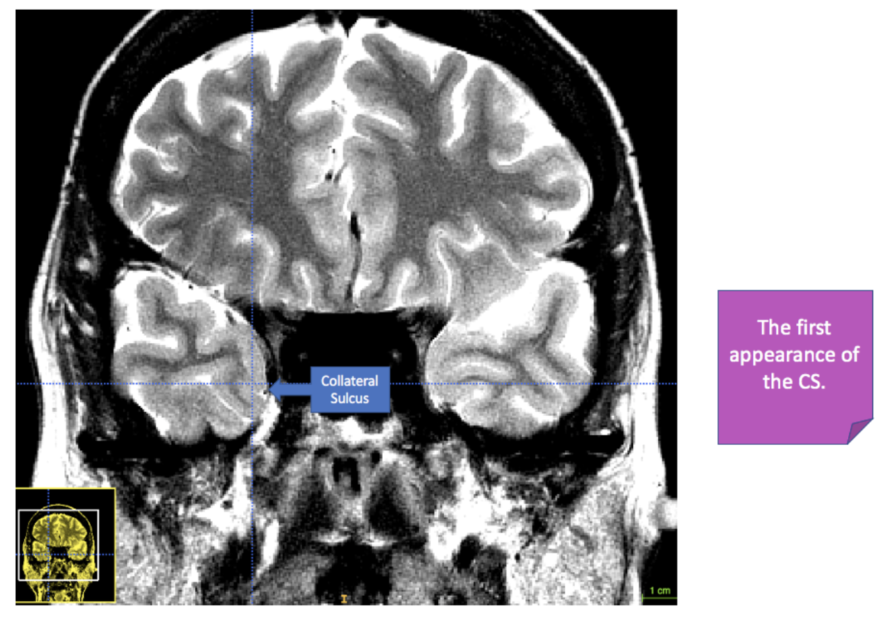

**Figure 4.1**: The first appearance of the collateral sulcus (CS) in a T2-weighted MR ima$

Be careful - in some brains it is easy to confuse a prominent rhinal sulcus (RS) with the $ Sulcus in Segmenting Regions of Interest in the Medial Temporal 
Lobes**

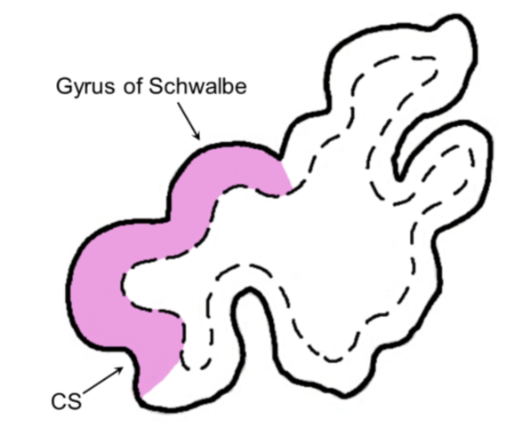

**Figure 4.2**: According to Insausti et al. (1998), the first appearance of the CS marks $ the OAP protocol) and the perirhinal cortex (shown here in 
pink). Image adapted from Insau$

LANDMARK 2: THE FRONTAL-TEMPORAL JUNCTION/LIMEN INSULAE.
^^^^^^^^^^^^^^^^^^^^^^^^^^^^^^^^^^^^^^^^^^^^^^^^^^^^^^^

This key landmark will determine where you start drawing the entorhinal cortex (ERC). To f$ (FTJ)/limen insulae. The slice in which there is a clear band 
of white matter that joins t$ FTJ/limen insulae is indicated. It is sometimes easier to visualize this landmark on a T1-$

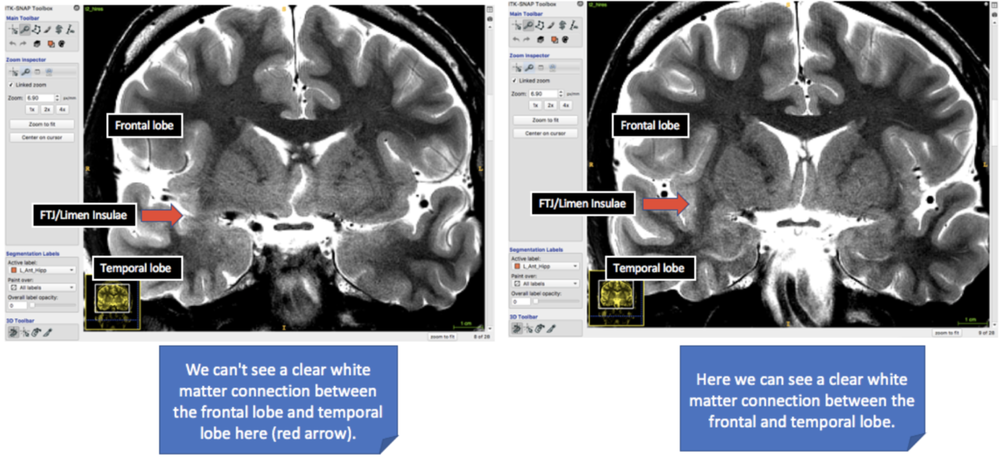

**Figure 4.3**: The two examples here compare a slice (T2-weighted) in which the limen ins$ clear white matter connection between the temporal and frontal 
lobe yet, versus in right i$ frontal and temporal lobe. This is a clear indication of the presence of the FTJ/limen ins$ cortex. See the next image below 
for another example.

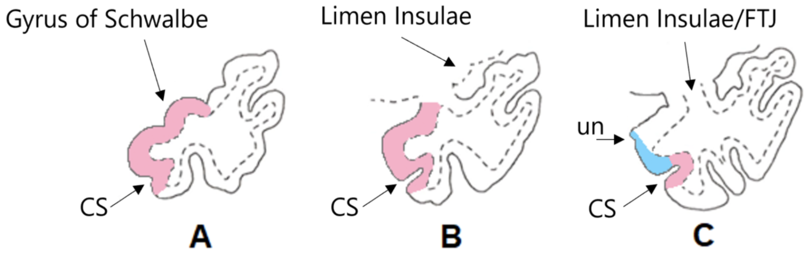

**Figure 4.4**: Adapted from Insausti et al. (1998). (A) The emergence of CS and gyrus of $ limen insula is now present but the white matter connection 
between the frontal and tempor$ There is a clear connection between the white matter of the frontal lobe and temporal lobe$ from the PRC up to the uncal 
notch (un). This is also the slice in which you make a note i$ Boundaries based on Kivisaari et al. (2013), see **Helpful Additional Resources for Furthe$

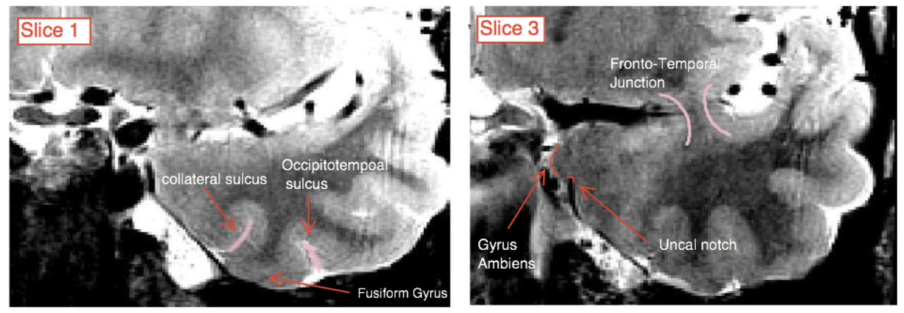

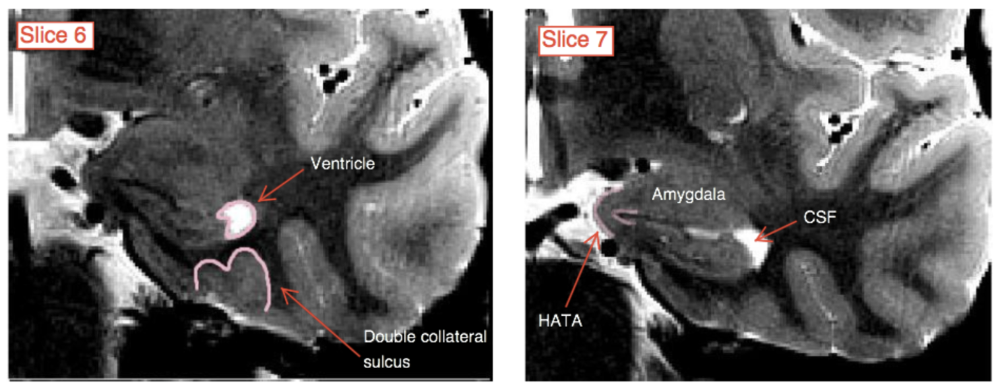

**Figure 4.5**: This image brings together the first two landmarks (CS and FTJ/limen insul$ CS may change from a single to double CS.

LANDMARK 3: THE FIRST SLICE CONTAINING VISIBLE HIPPOCAMPAL HEAD
^^^^^^^^^^^^^^^^^^^^^^^^^^^^^^^^^^^^^^^^^^^^^^^^^^^^^^^^^^^^^^^

Next, you will need to look for the hippocampal head. To find this landmark::

 A In its first appearance, the hippocampal head will probably look like a “bean” shape
 B The amygdala is located superior and the ventricle is lateral to the hippocampal head
 C Ambient gyrus appears in the same slice as the appearance of the hippocampal head

After identifying the hippocampal head on 2-3 slices (depending on the brain you are segme$ subfields of the hippocampus. At this point, the hippocampus 
will look thicker than previo$ have smoothed out. This is the first slice of the dentate gyrus (DG) and, by extension, ot$ should be visible, separating 
hippocampal cornu ammonis area 1 (CA1) from DG. Note that in$ ammonis area 3 (CA3).

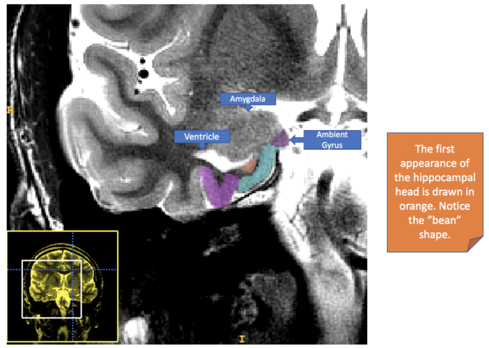

**Figure 4.6**: This image depicts the first appearance of the hippocampal head (shown in $
medially.

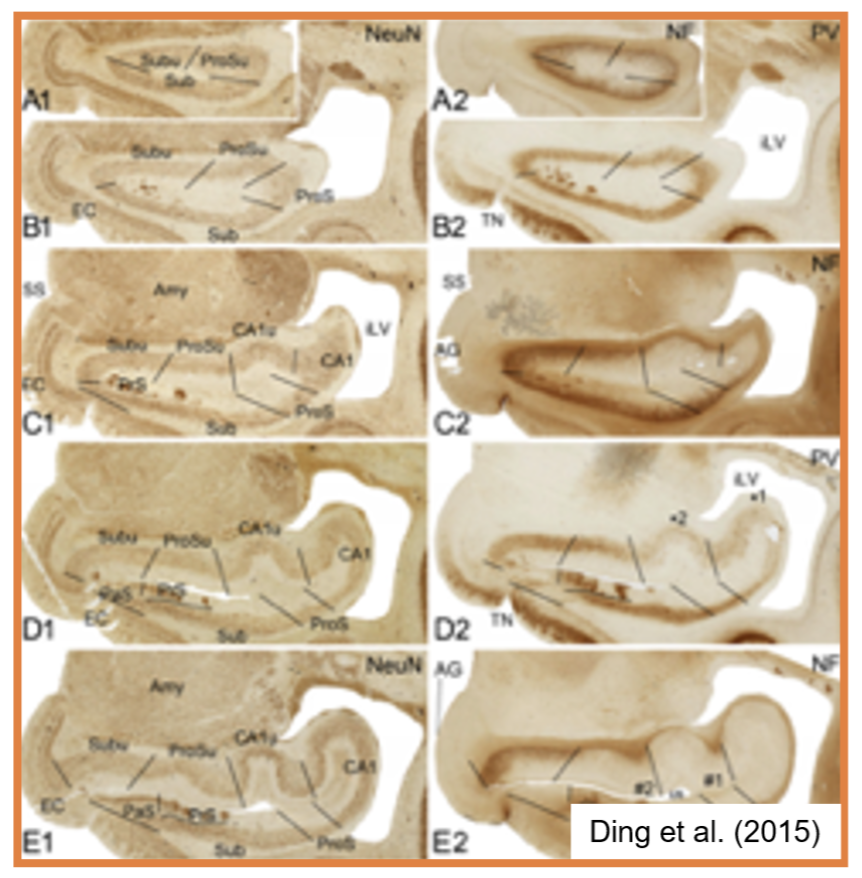

**Figure 4.7**: This image will help you determine the shape of the hippocampal head in th$
Ding et al. (2015). Notice how the head shape can resemble a “bean” (A1, A2, B1, B2) or mo$

LANDMARK 4: THE FIRST SLICE CONTAINING DENTATE GYRUS
^^^^^^^^^^^^^^^^^^^^^^^^^^^^^^^^^^^^^^^^^^^^^^^^^^^^

After identifying the hippocampal head on 2-3 slices (depending on the brain you are segme$ subfields of the hippocampus. At this point, the hippocampus 
will look thicker than previo$ have smoothed out. This is the first slice of the dentate gyrus (DG) and, by extension, ot$ should be visible, separating 
hippocampal cornu ammonis area 1 (CA1) from DG. Note that in$ ammonis area 3 (CA3).

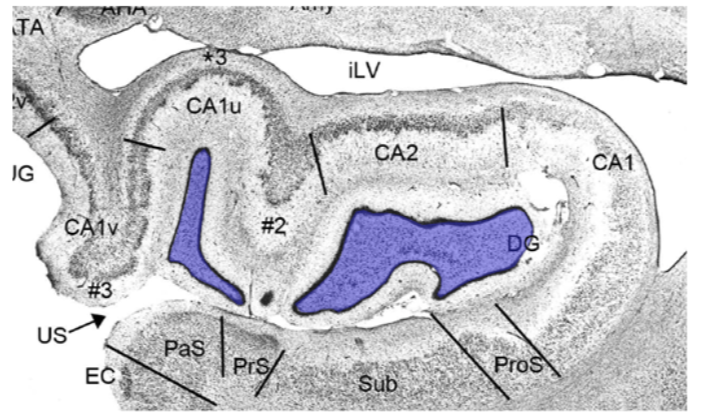

**Figure 4.8**: The image above, adapted from Ding et al. (2015), will help you with ident$

LANDMARK 5: THE LAST SLICE CONTAINING THE UNCUS
^^^^^^^^^^^^^^^^^^^^^^^^^^^^^^^^^^^^^^^^^^^^^^^

The last slice of the uncus in the image below would be the second box from the left. You $ 2-3mm thick slices. For thinner slices, there will be more 
slices in between the uncal ape$ starts 5mm posterior to the uncal apex).

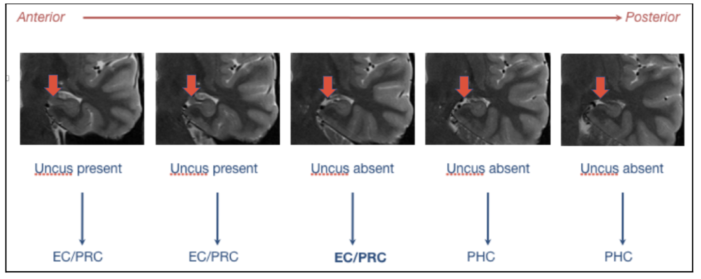

**Figure 4.9**: Anterior to posterior cortical transition showing the final slice containi$ start tracing the PHC, and the ERC/PRC disappears. Image 
adapted from: Carr, V.A. (2013), $ reliably segmenting medial temporal lobe cortices. Hippocampal Subfield Segmentation Summi$

LANDMARK 6: THE LAST APPEARANCE OF THE COLLICULI
^^^^^^^^^^^^^^^^^^^^^^^^^^^^^^^^^^^^^^^^^^^^^^^^

The last clear appearance of the colliculi is the final slice where we segment the hippoca$ the tail segment.

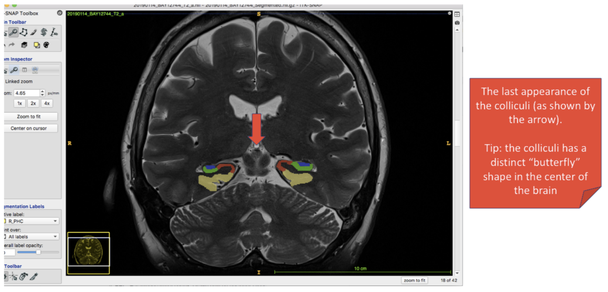

**Figure 4.10**: The final appearance of the colliculi, which resemble a “butterfly” shape$

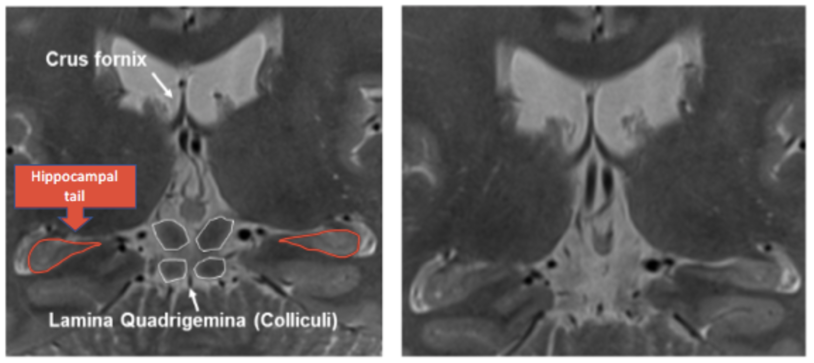

**Figure 4.11**: On the left, the final posterior slice of the hippocampal body, containin$ hippocampal body. On the right, the colliculi are no longer 
visible, making the first slic$

LANDMARK 7: THE LAST SLICE WHERE THE HIPPOCAMPAL TAIL IS VISIBLE
^^^^^^^^^^^^^^^^^^^^^^^^^^^^^^^^^^^^^^^^^^^^^^^^^^^^^^^^^^^^^^^^

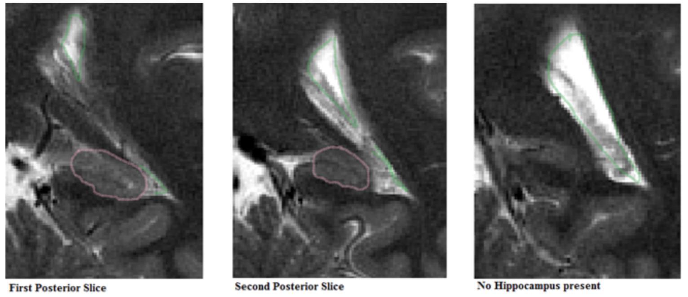

**Figure 4.12**: The “sweeping” of CSF towards the superior ventricle means that the hippo$

The last slice of the MTL is the slice in your image set where you can clearly see the gre$ the MTL the bright CSF laterally to the hippocampus will 
clearly sweep up and meet up with$

