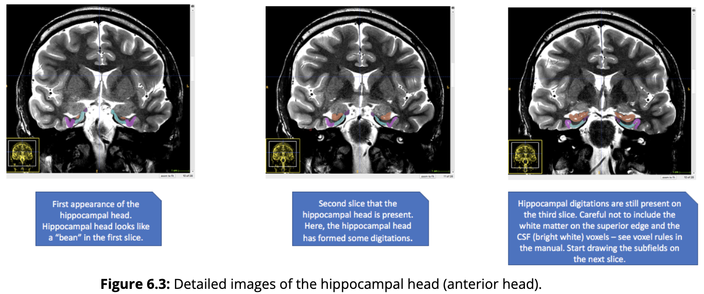
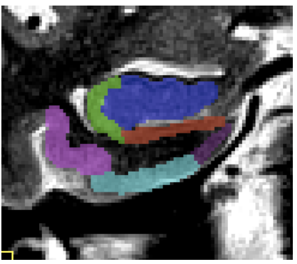

6 Segmenting Hippocampal Subfields
==================================

In the OAP protocol, the hippocampus (HPC) is segmented into the anterior (head), the body (with subfields), and the posterior (tail) regions. The figure 
below should help you with visualizing the way that subfields (i.e., subiculum, CA1, and DG+CA3) are arranged along the horizontal long axis of the HPC.

**Figure 6.1**: Illustration of the curvature of the tail in three hippocampi. In the top row (a, b) the tail shows a strong curve in the medial direction. In 
the middle row (c, d) the tail shows very little curving in either direction. In the third row (e, f) the tail shows limited curving in the medial 
direction, and stronger curving in the superior direction visible in the lateral view. Image adapted from de Flores et al. (2020).

Anterior Head
^^^^^^^^^^^^^

The anterior head (which is also sometimes referred to as the hippocampal head) is defined by the part of the HPC that falls anterior to the first 
appearance of the dentate gyrus. The OAP protocol does not differentiate this ROI into the various subfields. The most posterior part of this ROI resembles 
Figure 23.15.C in Insausti & Amaral’s (2004) book, chapter 23, which we have reproduced here below. A key feature to look for is the “bumps” or 
“digitations” on the superior portion of the HPC without a very clear stratum radiatum lacunosum moleculare (SRLM). It is important to note that the 
digitations are not always completely visible.

**Figure 6.2**: Reproduced image from Insausti & Amaral (2004; chapter 23) of the anterior head progressing to the body. 

Keep in mind that in images with 2-3mm slice thickness the anterior head usually spans 3 coronal slices, sometimes 2 and rarely 1. In higher resolution 
images, there can be more than 3 slices of anterior head. The anterior head will fall in the predetermined lateral, superior, and inferior borders. If it 
is touching the amygdala, however, the medial extent will be drawn half way up the hippocampal-amygdala transition area (HATA). Only draw this ROI until 
morphology of the HPC includes evidence of the DG in the center of the HPC, and a visible C-shape on the lateral edge, at which point you can start 
segmenting subfields. It is highly recommended that you look at the Ding et al. (2015) paper (see **Helpful Additional Resources for Further Reading**) when 
learning how to draw the HPC head.

**Figure 6.3**: Detailed images of the hippocampal head (anterior head).

Posterior Hippocampus
^^^^^^^^^^^^^^^^^^^^^

The posterior HPC (sometimes referred to as the hippocampal tail) is where the posterior thalamus and caudate meet up with the HPC. At this point along the 
long-axis, the subfields can no longer be reliably segmented. In some brains, there will be “bumps” that can be visualized on the inferior portion of the 
body (compared to the hippocampal head that had them on the superior portion). The last slice containing the colliculi (butterfly shape in the centre of 
the brain) is the last slice the hippocampal subfields are drawn (see **Landmark 6 in Lay of the Land: Medial Temporal Lobes Landmarks** above). Start 
drawing the posterior HPC on the first slice that the colliculi are no longer present.

On 3mm thick slices, the posterior HPC usually spans 2 slices, sometimes 1 and rarely 3. However, on thinner slices you will likely have up to 5 slices 
with the posterior HPC present. The posterior slice will have a clear difference of the grey matter region between it and the slice one posterior to it 
(**see Landmark 7 in Lay of the Land: Medial Temporal Lobes Landmarks above**). This will also be the last slice of the MTL, where the bright CSF laterally 
to the HPC will “sweep up” to meet up with the more superior ventricle. This image below will help you find the final slice of the hippocampal body before 
you start segmenting the posterior HPC

**Figure 6.4**: Left: Final posterior slice of the hippocampal body displaying the colliculi, crus fornix, and “tear drop” shape of the hippocampal body. 
Right: The colliculi are no longer visible, and therefore the image is considered to be the first slice of the hippocampal tail (or posterior hippocampus).

The posterior HPC is drawn in **copper** (see **Labels, Naming Conventions, and Contrasts** above for more information). 

Hippocampal CA1
^^^^^^^^^^^^^^^

After segmenting the anterior head (and identifying slices of the posterior HPC), move onto the subfields in the hippocampal body, starting with CA1. The 
most anterior sections of CA1 are drawn when the HPC starts to look like a “generic” HPC and there is a definitive C shape in the lateral portion of the 
body. This will coincide with the first slice of the appearance of the dentate gyrus (DG+CA3). The CA1 is drawn in **green** (see **Labels, Naming 
Conventions, and Contrasts** above). CA1 will always be guided by the border created by the SRLM and will include the SRLM. If the SRLM is not clear, 
extend the thickness of the SUB into the thickness of the CA1. There are 3 phases of CA1 that require different methods of drawing boundaries. See the 3 
phases below:

**CA1 Phase 1**: The HPC is “open” and in anterior MTL (i.e., uncus is present):

**Figure 6.5**: CA1 Phase 1, where the superior-medial extent of the CA1 is defined by going half way up the 1st bump, when there are 2 or fewer 
“bumps”/digitations. If there are 3+ digitations, use the “one third rule” for the superior-medial boundary (one third refers to the width of the HPC, so 
from the most medial part to the most lateral along the horizontal plane following the angle of the body). The inferior-medial extent is defined by the 
imaginary line drawn straight down from the superior border of CA1. This will give a resulting “C” shape.

**CA1 Phase 2**: The uncus is starting to disappear/disappeared and in anterior MTL:

**Figure 6.6**: CA1 Phase 2, where the superior-medial extent of the CA1 is ¾ up the “C” shape. The inferior-medial extent is the bisection of the hippocampal 
body including the CA1 along with CA3+DG.

**CA1 Phase 3**: When the uncus has disappeared and the MTL is in the posterior slices:

**Figure 6.7**: CA1 Phase 3, beginning on the second slice the uncus is absent. The superior-medial extent is ¾ up the C shape. The inferior medial-extent 
is drawn to the very medial tip of CA3+DG. It is a “teardrop” shape and the most medial potion might be easy to miss.  At this phase, you should get a 
“3-point intersection” between the CA1, Sub, and CA3+DG at the medial edge of CA1.

Subiculum
^^^^^^^^^

The subiculum (Sub) is drawn on all slices in which the hippocampus can be divided into its subregions. The subiculum is drawn in **red** (see **Labels, Naming 
Conventions, and Contrasts**). The lateral extent of the Sub will always be marked by the inferior-medial portion of CA1. There are two different rules for 
drawing the subiculum and they depend on whether you are in anterior or posterior slices.

Anterior (CA1 is in phase 1) 
^^^^^^^^^^^^^^^^^^^^^^^^^^^^

The inferior-medial border will then always be drawn to the bisection of the elbow that connects to the ERC (to the hippocampal fissure). 

Posterior (second slice the uncus is absent, CA1 is in phase 2-3)
^^^^^^^^^^^^^^^^^^^^^^^^^^^^^^^^^^^^^^^^^^^^^^^^^^^^^^^^^^^^^^^^^

The inferior-medial portion will always be drawn ½ way down the isthmus (see below for helpful tips on how to find the halfway point). The isthmus is 
measured from the end of CA1 to the beginning of the collateral sulcus (CS).

**Figure 6.8**: How to find the halfway point of the isthmus.

DG+CA3
^^^^^^

The dentate gyrus (DG) and CA3 are drawn in as one ROI. DG+CA3 is drawn in **blue** (see **Labels, Naming Conventions, and Contrasts**). It is drawn on all 
slices that the hippocampal subfields are defined. Simply follow the grey matter region defined laterally by CA1 and superiorly by the Sub. Superiorly, 
CA3/DG will be determined by a strip of bright CSF, or in more anterior regions it will border the amygdala.  This region will also be bordered by the 
temporal horn of the lateral ventricle.

When defining the region, it is important to not include the white matter (alveus and fimbria) on the superior edge. Keep in mind that this region also 
typically resembles a tear drop shape in the posterior slices. In the case where the uncal apex is present, trace out both the uncal apex and the lateral 
body of the HPC.

The medial portion is defined as the closing of the tear-drop share of the HPC. In anterior slices where the HPC is “open” white matter will surround the 
medial portion.

**Figure 6.9**: Do not include the white matter (alveus and fimbria) on the superior edge of DG and CA1.

**Figure 6.10**: In the case where the uncal apex is present, trace out both the uncal apex and the lateral body of the HPC (depicted in navy blue).
