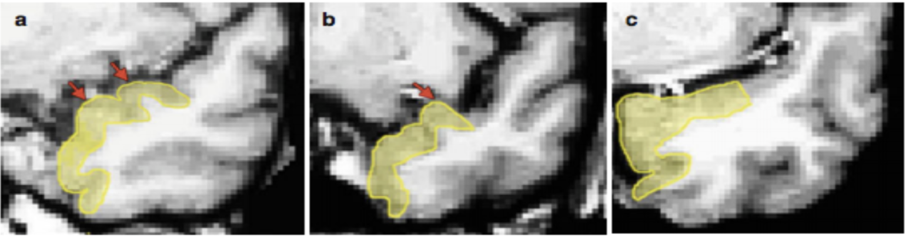

5 Segmenting the Medial Temporal Lobes
======================================

Perirhinal Cortex
^^^^^^^^^^^^^^^^^

The perirhinal cortex (PRC) is drawn in pink on all anterior slices. The first slice of PRC is drawn on the first slice in which the collateral sulcus (CS) 
is present. This is the most anterior slice of the MTL. In slices prior to the limen insulae/FTJ, the superior border is determined by the gyrus of 
Schwalbe (Figure 5.1). In slices after the limen insulae, the lateral border is determined by the depth of the CS (Figure 5.2).

**Figure 5.1**: Image adapted from Kivisaari et al. (2013) showing the superior-lateral border of the PRC, based on the presence of the gyrus of Schwalbe. 
(a) Two gyri of Schwalbe are visible (red arrows) so the superior-lateral PRC borer is drawn to the most lateral fundus. Do not include a bump that goes 
beyond the midpoint of the MTL as a gyrus of Schwalbe. (b) One gyrus of Schwalbe is visible, so the superior border is drawn to the fundus of the gyrus. 
(c) No gyri are visible, and the superior aspect of the temporal pole appears flat, so the superior-lateral border is drawn to the midpoint of the entire 
superior portion of the MTL.

If you are having trouble determining the midpoint of the MTL (i.e., the superior-lateral PRC border prior to the limen insulae/FTJ), you can flip forward 
through the slices until you find the FTJ/limen insulae. On slices before that one (i.e., more posteriorly), the superior-lateral border of the PRC should 
not extend past where the FTJ appears in more anterior slices.

After the limen insulae/FTJ appears, the medial border of the PRC is determined by the depth of the CS. See Figure 5.2 and Table 5A below for a visual of 
the CS depth rules.

Collateral Sulcus
^^^^^^^^^^^^^^^^^

The depth of the collateral sulcus (CS) determines where the medial and lateral border of your PRC. The depth rule only applies to PRC, as shown in Table 
5A below (but does not apply to PHC). However, the double CS rule does apply to the PHC as well.

In the case that there is a double CS, draw the medial edge to the fundus of the more medial CS and draw the lateral to the fundus of the more lateral CS. 
An estimated 25% to 35% of subjects will have a double CS (Insausti et al., 1998; Pruessner et al., 2002). Not all slices in one subject may be a double 
CS. In the figure below, B and C demonstrate an interrupted and a branched CS.

Note that PRC bifurcation rules still apply before the limen insulae/FTJ - so if the CS bifurcates, draw to the fundus of the more lateral sulcus. However, 
the medial boundary rule (depth rule) would not apply for the medial sulcus at this point. So, if you are drawing the CS as a double before the limen 
insulae/FTJ, include the PRC all the way to the superior lateral extent of the gyrus of Schwalbe (but, see Variability in Landmarks for examples where the 
PRC may be interrupted by an irregular CS or deep rhinal sulcus before the limen insulae/FTJ).

Entorhinal Cortex
^^^^^^^^^^^^^^^^^

The entorhinal cortex (ERC) is drawn in light blue on all anterior slices. The first slice containing the ERC will be the first slice where the limen 
insulae/FTJ is present. There are two distinct ways to draw the ERC: in slices before the HPC anterior head, and in slices after the start of the HPC.

In the slices before the anterior head:
^^^^^^^^^^^^^^^^^^^^^^^^^^^^^^^^^^^^^^^

The medial extent is drawn along the grey matter ribbon to the natural taper point in the bisection of the apex of the most medial point of parahippocampal 
gyrus (see Glossary of Key Terms). The lateral edge is drawn to the edge of the PRC (see image below).

In the slices after the start of the hippocampus:
^^^^^^^^^^^^^^^^^^^^^^^^^^^^^^^^^^^^^^^^^^^^^^^^^

The medial extent is drawn along the grey matter ribbon to the bisection of the hippocampal fissure. In more posterior slices, this will meet up with the 
subiculum. The lateral edge is drawn to the edge of PRC (see image below).

Parahippocampal Cortex
^^^^^^^^^^^^^^^^^^^^^^

The parahippocampal cortex (PHC) is drawn in yellow, on the posterior slices only. The PRC follows the grey matter ribbon connecting the subiculum to the 
collateral sulcus. Start drawing PHC on the second slice the uncus is absent (on the same slice where you start drawing CA1 phase 3). The medial extent is 
therefore the edge of the subiculum, and the lateral edge is drawn to the elbow of the collateral sulcus (collateral sulcus depth rules do not apply in the 
posterior hippocampus).

If there is a double sulcus and the medial sulci and the lateral sulci originate from the same collateral sulcus, then follow the bifurcation rules. If the 
medial and lateral sulci do not come from the same collateral sulcus or do not merge in subsequent slices, then only draw the lateral sulci and do not 
include the medial sulci in the ROI at all. If a small medial sulcus appears (usually before the appearance of the calcarine sulcus) that later merges with 
the collateral sulcus (the lateral sulcus in this case), then include both in the ROI. Always draw the medial sulcus as a whole when the collateral 
bifurcates (unlike PRC bifurcation rules). In the case there is a calcarine sulcus in the posterior regions of the MTL, draw the subiculum to its natural 
taper point, and include only the collateral sulcus in the parahippocampal cortex.

