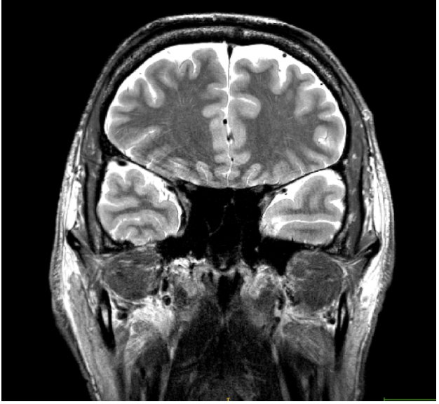

8 Variability in Landmarks
==========================

Rhinal Sulcus:
^^^^^^^^^^^^^^

Variability in the depth of the rhinal sulcus (RS) within anterior slices of the temporal lobes has been noted previously (Hanke, 1997; Xie et al., 2017). 
However, most investigations into the structure of the perirhinal cortex (PRC, i.e., Brodmann areas 35 and 36) either do not describe slices before the 
	appearance of the hippocampal head (Insausti et al., 1998; Taylor & Probst, 2008), do not distinguish the RS from the CS (Bonisha et al., 2004), or do not 
encounter any brains with significant variation of the RS before the appearance of the entorhinal cortex (Augistinack et al., 2013).

Ding and colleagues (2009) found that when a deep RS exists, anatomical area 35 is primarily found in the fundus and the lateral/anterior bank of the RS. 
In a follow-up study, Ding & Van Hoesen (2010) note that in brains with a deep RS which merges with the CS in anterior slices, area 35 is located in the 
medial bank of the CS, and area 36 occupies the fundus and lateral bank of the anterior CS.

**From these findings reported in Ding and colleagues (2009; 2010) we recommend the following for segmenting early anterior PRC slices:**

If a visible (deep) rhinal sulcus is present in early anterior slices such that it interrupts the extension of the PRC up to the Gyrus of Schwalbe from the 
CS, use the bifurcation rules. That is, when tracing the PRC before the limen insulae you should consider the rhinal sulcus and collateral sulcus as a 
double sulcus. Draw from the superior border of the Gyrus of Schwalbe to the fundus of the more lateral sulcus (i.e., CS).

**Fig**. In rare cases, a very deep RS may join with the superior temporal sulcus and interrupt the extension of the PRC up to the Gyrus of Schwalbe. Here, 
the fundus of the RS is not visible. In these slices, only trace around the CS. In subsequent slices, if the RS has a visible fundus, continue to apply 
bifurcation rules (or, if the RS disappears, continue to trace the PRC as usual).

**Other cases of variability:**

**Fig**. This image depicts a coronal slice of the basal temporal lobe. In Boxes A and B, the collateral sulcus is shown in red, the rhinal sulcus is shown 
in blue, and the OTS is shown in green (Kim et al., 2008).

**Fig**. Different sulcal pattern classes (Kim et al., 2008):
 
 A) Type 1: one-branch CS connected with RS
 
 B) Type 2: two-branch CS connected with OTS in its posterior portion
 
 C) Type 3: two-branch CS having connection between RS and OTS in its anterior portion
 
 D) Type 4: three-branch CS with no connection between the sulci

**Fig**. This is an example of a younger adult brain where the hippocampal head appears before the limen insulae.
