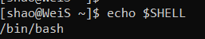

Linux system
============

.. image:: linux-logo.png

Linux set up
^^^^^^^^^^^^
Every chef needs a good cooking table, Linux system would be ours
 
Linux is a open-source operating systems created by Linus Torval, it is free and function for programming user interface as well as Graphical user interface (Windos) both.Unlike commerical system like Windows,There are many free software and libraries developed for Linux, especially the neuroimage packages.

Compared with the Windows syste, the files system of Linux is quite different

.. image:: File-Systems-Linux-vs-Windows-Edureka-768x500.png

If you use Macintosh developed by Apple such as macOS, no change needed. However, if you like me, a Windows user, you might need some extra works in order to set up for brain image analysis. This documention I will focus on the Linux system (under the Windows) only.  

A Linux distribution is an operating system made from a software collection that is based upon the Linux kernel, as well as package management system. Linux users usually obtain their operating system by downloading one of the Linux distributions, which are available for a wide variety of systems ranging from embedded devices and personal computers to powerful supercomputers.There are many popular Linux distributions include Ubuntu or Centos
 
As a windows user, Before you install the Linux distribution, make sure that you enable the Windows subsystem for `linux feature <https://www.how2shout.com/how-to/enable-windows-subsystem-linux-feature.html>`__ 

After that, you can download `Ubuntu <https://ubuntu.com/download>`__ and install it on Windows 10 with WSL. Or you can get CentOS from `here <https://github.com/wsldl-pg/CentWSL/releases/tag/8.1.1911.1>`_ and install it with WSL

Once you have done, go to the search bar and type the name. 

WSL and Xming   
^^^^^^^^^^^^^

For these MacOS, you can ship this chapter. For Windows user,The Windows Subsystem for Linux (WSL) ensure you can run a Linux distribution with "virtualized" environment under Windows OS. Some common linux distributions like CentOS and Ubuntu, are currently available from the Windows App store for download and use in WSL.

To setup WSL, the PowerShell must first be used to enable WSL. Then a linux distribution needs to be installed in the WSL environment. Subsequently additional software may need to be installed to run on the Windows side and/or in the Linux distribution running under WSL depending upon what you want to run under Linux.

In order to run X-windows based graphics programs in WSL, an X server needs to be installed on the Windows side (since the Windows OS is driving the graphics hardware and there is no native X server in Windows). Accordingly, the WSL linux environment needs to be set/tested to run X based graphics in WSL with the X server running under Windows (instead of under Linux).

set up Windows PowerShell, open it. run the "enable optional feature" command::

 Enable-WindowsOptionalFeature -Online -FeatureName Microsoft-Windows-Subsystem-Linux

Download and set up `Xming <http://www.straightrunning.com/XmingNotes/>`__ 

Shell 
^^^^^

The Shell is an interactive interface that allows users to execute other commands and utilities in Linux and other UNIX-based operating systems. When you login to the operating system, the standard shell is displayed.

There are many shells such as bash, Tcsh, Ksh,Zshm. Bash would be the defult shell for many linux systems. You can check the current shell by typing::

  echo $SHELL 

if you see this, you are good to go, or you can change the shell to bash by typing::

  chsh -s /bin/bash

.. image:: Shell_2.PNG

Basic commands 
^^^^^^^^^^^^^^

Just like some spices are good all the time, some basic commands are necessary and useful when you use linux::

  ls  #ls command lists files and directories within the file system, and shows detailed information about them

  cd  #cd (“change directory”) is used to change the current working directory in Linux 

  rm  #rm is a basic command to remove objects such as files, directories and symbolic links
 
  mv  #mv is a command that moves one or more files or directories from one place to another

  mkdir #mkdir (make directory) command allows you to create or make new directories

  cp  #cp is for copying files and directories

Now, open a terminal either by Centos or Ubuntu, you can see this 

.. image:: Centos_open.PNG

use ``ls``, you will see all the files and sub-directories in the current directory

.. image:: ls.PNG

you also can find the files in sub-directories directly::

  ls happy_birthday 

.. image:: ls_subD.PNG

cd to happy_birthday

.. image:: cd_birthday.PNG 
 
  cd happy_birthday  #go to happy_birthday directory from current working directory
  cd ..              #go back to parent directory 
  cd                 #go to the home directory 
   
make cakes and party directory 

.. image:: make_cakes_party.PNG

next, mv cakes to the party

.. image:: mv_cakes.PNG

of course, cakes are always not enough for the party, so copy the pudding.

.. image:: cp_pudding.PNG

Now, let's how many desserts we have 

.. image:: dessrts.PNG 

wait a miniuits, where is the biscuit come from, I don't want that in the party. just remove it

.. image:: rm_biscuit.PNG

Now, we have all the desserts for a birthday party

these are the 6 basic commands you will use in the future whether you use you own laptop or server for the analysis
 
you also can use:: 

man ls/cd/mv/rm/cp/mkdir for more details 

for_loops
^^^^^^^^^

For loop probably is the one of the most useful commands you apply for preocess data with neuroimage

Here is a example::

  for i in 1 2 3; do echo $i; done

The for-loop has three sections, separated by semicolons. 

1 The first section is the Declaration: it begins by assigning the first item after “in” to the variable “i”; in this case, it would assign the value “1” to “i” .The numbers after “in” are called the “List” 

2 The next section is the Body, which runs the commands written after “do,” replacing the  replacing the variable with whichever value is currently assigned to the variable, for the first loop, this will be the number “1”. Since items remain in the list, the loop goes back to the declaration and assigns the next number in the list to the variable i; in this case, the number “2”. Then the body is run, and the process repeats until the end of the list is reached

3 The last section, called the End, contains only the word “done”, meaning to exit the loop after all of the items in the list have been run through the Body of the loop

You can add more commands to the Body section, if they are separated with a semicolon. For example, we could change the loop to::

  for i in 1 2 3; do echo $i; echo “You just printed the number $i”; done

The for loops would be really useful when we run multiple subjects for the analysis, for example, you can use::

  for subj in sub-01 sub-02 .... sub-99; do echo $subj; done

to add the subjects and prolong the "list". More importantly,task would be quite simple if you can combine with other you can use for loop to help. for examplp::  

  ls . | grep ^sub- > subjList.tx 

``ls`` means we want to know something ``.`` indicate that what looking at the current directory, ``|`` means that whatever we did, keep continue, grep help us to search for a string of characters in a specified file. When it finds a match, it prints the line with the result. By typing ``^sub``, we are looking for all the files with sub- as Prefix, ``> subjlist.txt`` to create a txt file which contains all the information we searched.
  
