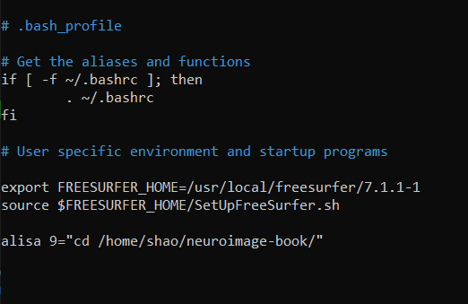

Useful tricks
^^^^^^^^^^^^^

There are some tricks that can make your Linx life easier. 

let's take bash_profile as an example, you can edit you profile by type::
  
  nano ~/.bash_profile 

nano is a default text editor for most Linux system by which you can edit the content of scripts and files 

bash_profile is a script that is executed each time you start a new shell.

Freesurfer will be activated every time when I open the terminal and I use 9 to replace the command ``cd /home/shao/neuroimage-book`` 

``find . -name "file_name".``to find the file_name related information from the subdirectory
