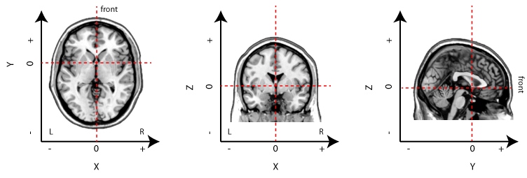
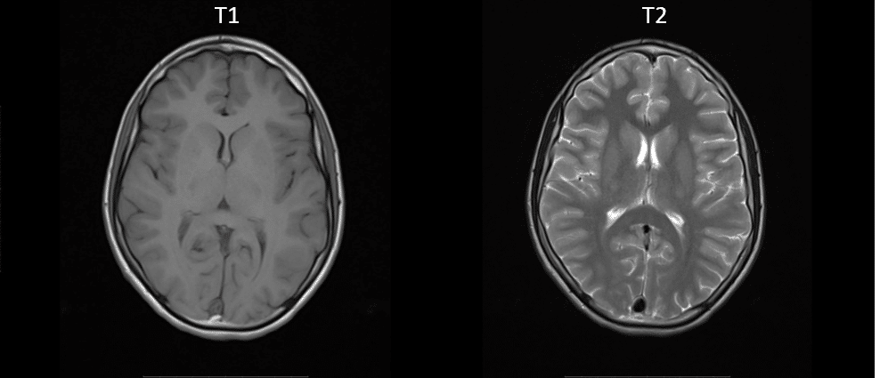

Neuroimage data
===============

Basic terminology
^^^^^^^^^^^^^^^^^

Before we start our journey, let's review some basic terms, this could cost you extra time, but it worth it. 

Voxels 
****** 

Each MRI image contains information about a three-dimensional (3D) volume of space. An MRI image is composed of a number of voxels; the voxel size is the spatial resolution of the image. A 
voxel is a 3D unit of the image with a single value, just as for digital photographs a pixel is a 2D unit of the image with a single value. The words image and volume (and sometimes scan) are often used 
interchangeably to mean “a single 3D representation of brain data”. The size of the voxel gives some indication as to the spatial resolution of the data, with smaller voxels giving a higher spatial 
resolution. A typical voxel size for a structural MRI is 1 mm x 1mm x 1mm; for fMRI, 3 mm x 3 mm x 3 mm. However, these can vary substantially from study to study.

4D files
********

It is also possible to have 4D image files—in other words, a series of 3D image files. Generally this is a timeseries; so, for a single continuous scanning run, the same data could be represented by a 
large number of 3D image files, or a single 4D file (containing the same number of 3D functional volumes). However, 4D files could also be used to store a single image per subject, for example, when 
doing group analyses. FSL makes frequent use of 4D images. SPM supports 4D images under certain circumstances, but it is possible to conduct all steps using multiple 3D images.

Isotropic
*********

In the MRI sequences used for most fMRI studies, each volume of the brain is acquired in a series of slices. Thus, each slice is acquired at a different point in time within the TR. Knowing the order in 
which the slices are acquired (ascending, descending, interleaved) can be important for certain preprocessing steps. Within a slice, the voxel dimensions are almost always equal in size, If voxels are 
equal in size in all three dimensions (e.g., 3 mm x 3 mm x 3 mm), they are isotropic.
  
TA and TR 
********* 

The time it takes to acquire an entire volume is the TA (acquisition time). The time between repeated volumes (i.e., between collecting a slice in one volume, and that same slice in the next) is the 
TR(repetition time). If one is collecting data as quickly as possible (as is usually the case), there will be no pause between volumes that are collected, and thus the TA and TR are equal. Because of 
this many people use the terms interchangeably. However, it is possible to have a TR that is longer than the TA, which would result in a pause in data collection. This is sometimes done in auditory 
studies to allow stimuli to be presented in quiet (in the absence of echoplanar scanner noise).

Run or Session
**************

An fMRI experiment may last for an hour or more, but very rarely will scanning be continuous for this hour. Typically there will be a 5–20 minute sequence of scanning, and then a break to ensure the 
subject is comfortable, before resuming scanning. These breaks are important to note when performing analysis, as many stages of analysis make assumptions about how related one volume is to the next. A 
single continuous series of scans is typically called a “run”, “block”, or “session”. FSL refers to these as "run", SPM refers to these as “sessions”, think of a session as “any continuous period of 
scanning”; it doesn’t matter whether these are separated by 30 seconds or a week.

First level and second level 
**************************** 

you might hear “1st level” or “2nd level” analyses a lot. These refer generally to variations on a summary statistics approach in which data for 
each subject are analyzed independently, and then the results from these analysis (i.e., the parameter estimates) are entered in a group analysis. In fMRI, a 1st level analysis generally refers to 
analysis of a single subject’s timeseries. Results from this analysis would tell you whether, for this subject, a region showed significant activation for a given paradigm. A 2nd level analysis is 
equivalent to a group study, in which linear contrasts of parameter estimates are fit with a statistical model. Results from a 2nd level analysis would tell you whether a pattern of activation is 
significant across a group (and thus likely to generalize across a population).

Files format
************

The Brain Imaging Data Structure (BIDS) is a standard for organizing, annotating, and describing data collected during neuroimaging experiments. Neuroimaging Informatics Technology Initiative (NIfTI) is 
file format of brain images. It is transferred from DICOM format that comes from Siemens scanners.Nearly all modern software packages use the Nifti file format. Nifti files can be a single file (with an 
``.nii`` or ``.nii.gz`` extension), or image/header pairs (file1.img, file1.hdr). In both cases, there are two sets of information about each image:

The header information, which contains information necessary to interpret the image. This includes things like how the data are encoded, and how the voxel space of the image translates into the physical 
space of the world (voxel-to-world mapping).

The image data themselves; for each voxel, a single value.

“Talairach” space
*****************

Talairach space is a three-dimensional cartesian coordinate system aligned over the brain as proposed by Talairach & Tournoux. It can also refer to this general system of alignment, within this system, 
the [0,0,0] point (X=0, Y=0, Z=0) is the anterior commisure::
 
  Negative X values indicate the left hemisphere, postive X values the right.
  Negative Y values towards the rear of the brain (relative to the anterior commisure), positive toward the front.
  Negative Z values towards the bottom of the brain (relative to the anterior commisure), positive toward the top.

         Schematic of stereotaxic brain coordinates on axial (left), coronal (middle), and sagittal (right) slices. The origin (X=0, Y=0, Z=0) is centered on the anterior commisure.

Anatomical descriptions
***********************

Towards the front of the brain (towards the eyeballs): ``anterior``

Towards the back of the brain (opposite the eyeballs): ``posterior``

Towards the top of the brain: ``superior``

Slice orientations
******************

``Axial`` are parallel to the top of the head and the floor, if you are standing straight.

``Saggital`` slices are parallel to the interhemispheric commisure (dividing the brain in two).

``Coronal`` slices are parallel to the face, perpendicular to the floor.

Different structural MRI
************************

Different types of MRI sequences provide sensitivity to various aspects of neuroanatomy. The two basic types of MRI images are T1-weighted and T2-weighted images, often referred to as T1 and T2 images. 
T1 images are probably the most common.T1 will have grey matter being darker than white matter. T2, in contrast, will have white matter being darker than grey matter.

FLARI images
************

Fluid-attenuated inversion recovery (FLAIR) is an MRI sequence with an inversion recovery set to null fluids. It can be used in brain imaging to suppress cerebrospinal fluid (CSF) effects on the image, 
so as to bring out the periventricular hyperintense lesions, such as multiple sclerosis (MS) plaques. FLAIR can be used with both three-dimensional imaging (3D FLAIR) or two dimensional imaging.

Quantitative MRI(qMRI)
*********************

Quantitative MRI (qMRI) is a collection of methods aiming at generating parametric maps that can characterize underlying tissue properties. Unlike those of 
conventional MR images (such as T1w or T2w), intensity values of quantitative maps are not represented in an arbitrary range. Instead, these maps are 
represented either in absolute physical units (seconds for T1map), or within an application dependent range of arbitrary units (myelin water 
fraction MWFmap in brain)

Resting-state fMRI
******************

Resting-State Functional Connectivity (RSC) is a kind of study that indicated the significant correlation of signal between functionally related brain 
regions in the absence of any stimulus or task stimulus or task. This correlated signal arises from spontaneous low-frequency signal fluctuations (SLFs). A 
lot of the time series of voxels correlated significantly (after filtering the fundamental and harmonics of respiration and heart rates) while only a few 
voxel time courses (< 3%) correlated with those in regions outside of the motor cortex. Subsequently, there are some evidence indicated that the presence of 
RSC in sensory cortices, specifically auditory and visual cortices. In a study, signal from visual cortex voxels during rest was used as a reference and 
correlated with every other voxel in the brain. A significant number of voxels from the visual cortex passed a threshold of 0.35, while only a few voxels 
from outside the visual cortex passed the threshold. some similar results also appear in the auditory cortex.

