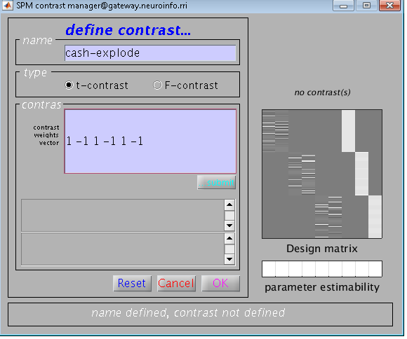
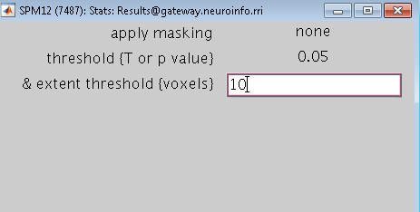
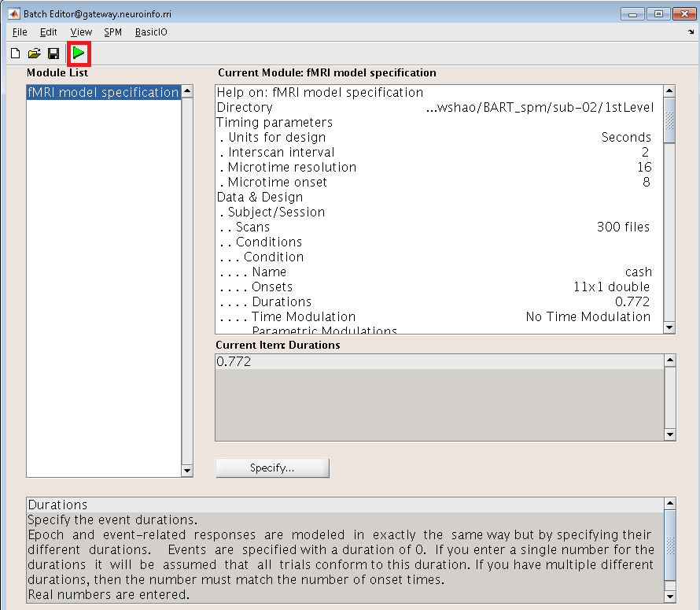

First level analysis in SPM
===========================

Specifying the Model
^^^^^^^^^^^^^^^^^^^^

.. image:: estimate.PNG

Since we have created the timing files previously, it is time for us to use them in conjunction with our imaging data to create statistical parametric maps. These maps could indicate that the correlation 
between the ideal time-series (the onset times convolved with the HRF in our model) and the time-series collected in this experiment. When we use the SPM to construct contrasts, beta weight represents 
the amount of modulation of the HRF, which is then transformed into a t-statistic.

To get started, create a sub-directory in sub-02 called 1stlevel so we can organize the data. Then, Open SPM GUI from Matlab terminal and select ``1st-Level``, select the 1stLevel directory we just 
created. All of the output of the 1st-level analysis will be keeped in this folder. After that, we'll fill out the section on Timing parameters. Select ``Seconds`` for the design unit, and enter a value 
of ``2`` for Interscan Interval. Then go to ``Data & Design``. and build three new sessions by clicking three times on ``New: Subject/Session``. Go to the func directory and use the "Filter and Frames 
fields" we used before to to pick all 300 volumes of the warped usable data(file start with swar) for the first session's Scans. And do the same for the othjer two session.

Return to the field for the first time. In the experiment, there are two conditions, and both conditions occur in each run. To construct two new condition fields, go to conditions and then New: Condition 
twice. Double-click on Name and type cash and explode. for the first condition.

In order to find out the onset times for each occurrence of the cash condition. From the Matlab terminal, navigate to the func directory and type:

cashRun1 = importdata('cash_run1.txt');
IncRun1(:,1)

Which will give you the onset times for cash condition in run_1, copy and paste the onset times onto the Onsets sector. Then we can therefore enter the number 0.772 in the ``Durations field``, (you can 
check the duration time by less sub-02_task-balloonanalogrisktask_run-01_events.tsv) and SPM will assume that it is the same duration for every trial.

Repeat the process for the explode condition in run 01, as well as the cash and explode conditions in run 02 and run 03, remembering to set the duration time to 2. Here's the code for displaying the 
onset times for the remaining onset times::

  explodeRun1 = importdata('explode_run1.txt');
  explodeRun1(:,1)

  cashRun2 = importdata('cash_run2.txt');
  explodeRun2(:,1)
  
  explodeRun2 = importdata('explode_run2.txt');
  explodeRun2(:,1)

  cashRun3 = importdata('cash_run3.txt');
  explodeRun3(:,1)

  explodeRun3 = importdata('explode_run3.txt');
  explodeRun3(:,1)

The names will be stored in a file called SPM.mat in the 1stLevel directory which we will look at later in more detail. Now, click the green ``Go button`` when you're done. It should only take a few moments 
to estimate the model. When it's all said and done, it should look like this:

.. image:: model_design.PNG 

The General Linear Model for For a single subject. The ideal time-series for the cash and explode conditions for the first session are shown in the first two columns, while the ideal time-series for the 
conditions of run 02 are shown in the next two columns, the next two columns indicate the ideal time-series for the conditions of run 03. The last three columns are basline regressors that capture the 
mean signal of each run. In this figure, time runs from top to bottom, and lighter colors represent more activity.

Estimating the Model
^^^^^^^^^^^^^^^^^^^^

We have created our GLM, the next step is to estimate the beta weights for each condition. Click ``Estimate`` from the SPM GUI, and select the SPM.mat from ``select SPM.mat`` tab from sub-02/1stLevel. 
Change the "Write residuals option" to Yes. and then click the green ``Go button``. This will take a few minutes to run.

The Contrast Manager
^^^^^^^^^^^^^^^^^^^^

When you've done estimating the model, it's time to start making contrasts. what we need to do is estimate a beta weight for the cash condition and a beta weight for the explode condition. To be more 
specific, we can determine a contrast estimate at each voxel in the brain by take the difference betwween these two conditions. A contrast map will be generated if by doing this way.

To make these contrasts, go to the ``Result button`` from SPM GUI and select the SPM.mat file that was created when the model was estimated. The design matrix is located on the right side of the screen. 
Select ``Define New Contrast`` and put cash-explode in the Name field.

type 1 -1 1 -1 1 -1 in the contrast vector window, then press submit. If the contrast is right, you will see “name identified, contrast defined” at the bottom of the window. Make sure your contrast 
manager looks like the image below, and then click OK.

Examining the Output
^^^^^^^^^^^^^^^^^^^^

Double-click on the contrast Inc-Con to open the Results window. You will first need to set a few options:

1 apply masking: Set this to “none”, as we want to examine all of the voxels in the brain, and we do not want to restrict our analysis to a mask.
2 p value adjustment to control: Click on “none”, and set the uncorrected p-value to 0.01. This will test each voxel individually at a p-threshold of 0.01. 
3 extent threshold {voxels}: Set this to 10 for now, which will only show clusters of 10 or more contiguous voxels. Right now we’re doing this to eliminate specks of voxels most likely found in noisy 
regions, such as the ventricles; later on we will learn how to do cluster correction at the group level to appropriately control for the number of individual statistical tests.

When you have finished specifying the options, you will see your results displayed on a glass brain. This shows your results in standardized space in three orthogonal planes, with the dark spots 
representing clusters of voxels that passed our statistical threshold. In the top-right corner is a copy of your design matrix and the contrast that you are currently looking at, and at the bottom is a 
table listing the coordinates and statistical significance of each cluster. The first column, set-level, indicates the probability of seeing the current number of clusters, c. The cluster-level column 
shows the significance for each cluster (measured in number of voxels, or kE) using different correction methods. The peak-level column shows the t- and z-statistics of the peak voxel within each 
cluster, with the main clusters marked in bold and any sub-clusters listed below the main cluster marked in lighter font. Lastly, the MNI coordinates of the peak for each cluster and sub-cluster is 
listed in the rightmost column.

If you left-click on the coordinates for a cluster, the coordinates will be highlighted in red and the cursor in the glass brain view will jump to those coordinates. You can click and drag the red arrow 
header in the glass brain if you like, and then right-click on the brain and select any of the options for jumping to the nearest suprathreshold voxel or the nearest local maximum.

To view the results on an image other than the glass brain, in the results window in the lower left (which contains the fields “p-values”, “Multivariate”, and “Display”), click on overlays and then 
select sections. Navigate to the spm12/canonical directory, and choose any of the T1 brains that you like. In this case, I will select the avg152 brain.

You will now see the results displayed as a heatmap on the template, and you can click and drag the crosshairs as you do in the Display window. If you place the crosshairs over a particular cluster and 
click the “current cluster” button in the Results window, the statistical table will reappear, highlighting the coordinates of the cluster you have selected.
