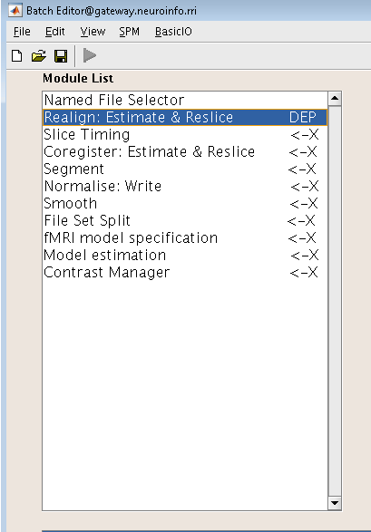
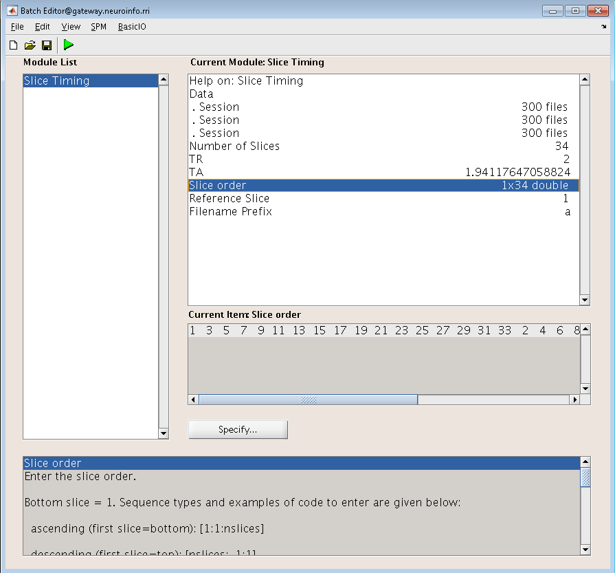
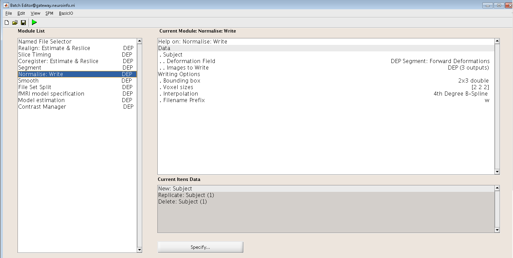
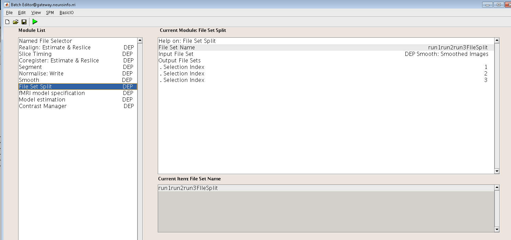
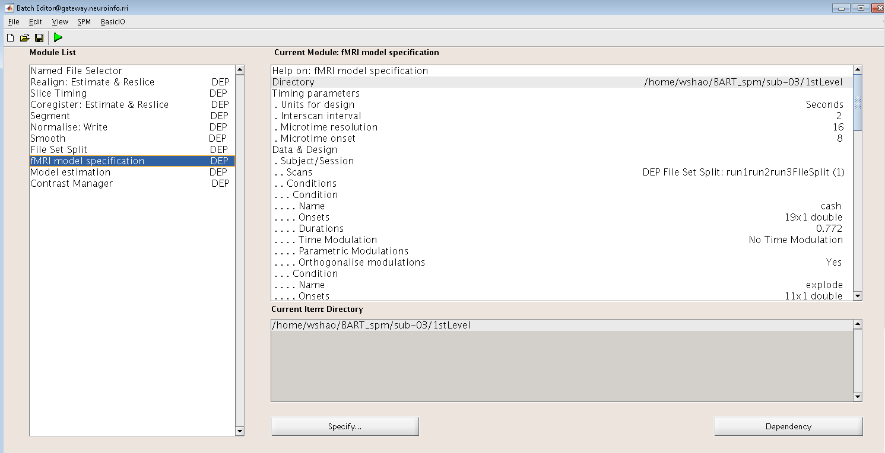
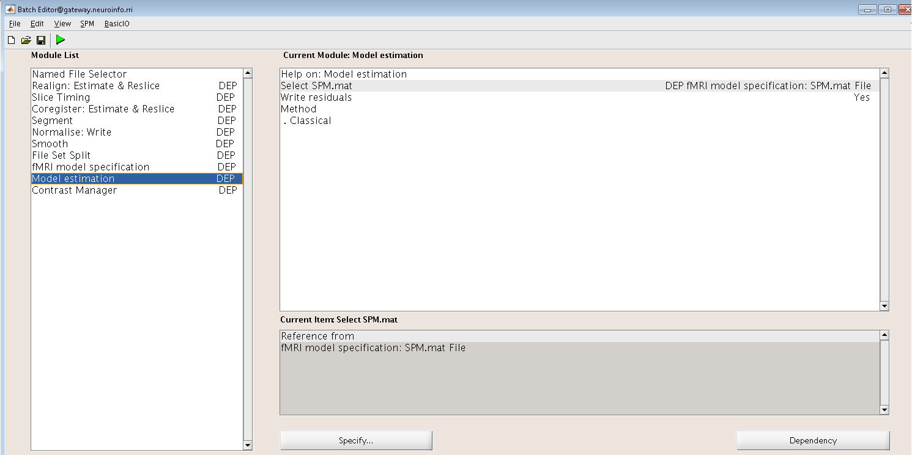
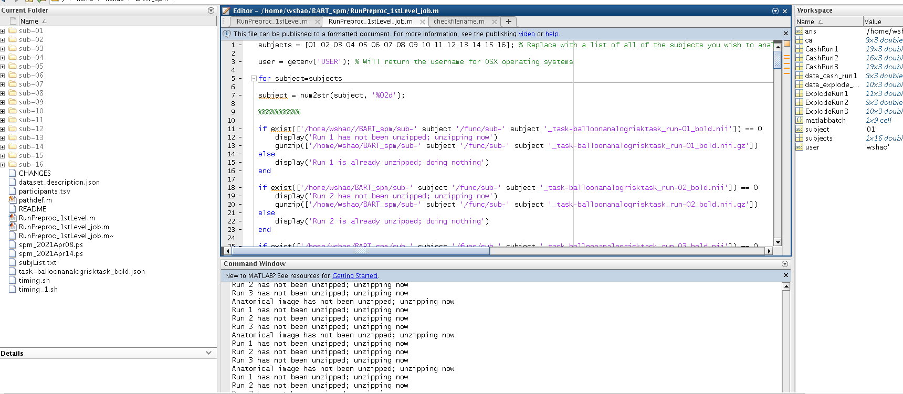

Scripting
=========

Since we have 16 subjects and each subject has 3 runs. In total, we need to repeat all the preprocessing and 1st level analysis in AFNI_GUI 48 times! it is not hard but it is a really tedious job and you 
could make errors easily. As Joey from **Friends** said, there’s gotta be a better way, and there is.

Here is the script that makes your life easier!

Creating the Template
^^^^^^^^^^^^^^^^^^^^^

To begin with, let's create a script template for our data. As you have done all the preprocessing of sub-02 from SPM GUI, what we need to do in here is clicking on each preprocessing button of the SPM 
GUI and add each of the preprocessing modules to our template. Then, just as in the previous tutorials, we'll fill in the inputs for each preprocessing and statistical modelling portion, and translate 
what we see from the SPM GUI into Matlab code.

Now, Open the SPM GUI and select Batch from the menu.

.. image:: Batch.PNG

Select the following modules in the order from the SPM at the top menu of the Batch Editor window::

  BasicIO -> File/Dir Operations -> File Operations -> Named File Selector
  SPM -> Spatial -> Realign -> Estimate & Reslice
  SPM -> Temporal -> Slice Timing
  SPM -> Spatial -> Coregister: Estimate & Reslice
  SPM -> Spatial -> Segment
  SPM -> Spatial -> Normalise -> Write
  SPM -> Spatial -> Smooth
  BasicIO -> File/Dir Operations -> File Operations -> File Set Split
  SPM -> Stats -> fMRI Model Specification
  SPM -> Stats -> Model Estimation
  SPM -> Stats -> Contrast Manager

File Selection and File Splitting
^^^^^^^^^^^^^^^^^^^^^^^^^^^^^^^^^

First and foremost, we'll address the first additional modules that aren't listed above.  ``Named File Selector`` module.

The first module requires an input name and sets of files. We will create three file sets, and enter the **run-01_bold.nii**, **run-02_bold.nii** and **run-03_bold.nii** files for each set after you use 
``gunize`` to unzip the file. After that, we will deal with the preprocessing modules, Realignment, create three sessions and enter the files for each session respectively.

Preprocessing Modules 
^^^^^^^^^^^^^^^^^^^^^

Just as we did in the previous chapters, we must now fill in each of the appropriate fields. This is the most time-consuming aspect of the tutorial, but keep in mind that if you don't script your 
analysis, you'll have to do it manually for each session. In case you may wonder what you are supposed to input for a later preprocessing step if the required data hasn’t been created yet. The ``Batch 
Editor`` can allow you to use "Dependencies" from earlier steps, indicating that the input should come from the previous step's output step. If you click the Dependency button in the Realign module for 
the first Session, for example, you can pick the option "Named File Selector: run1run2run3files(1)," Once you've filled it in, it should look like this: Realign module

.. image:: Realign.PNG

And the same with Slice Timing module,

keep continue with the coregister module, we can use ``Reference Image`` with the mean functional image generated during Realignment:

.. image:: Coregister.PNG

Followed by "Segmentation module", which we need to change a few parameters such as ``volums``.``save Bias Corrected`` and ``Deformation Fields`` 

.. image:: SPM_segment.PNG

The Normalise preprocessing step requires both the Forward Deformation fields from Segmentation, as well as both the Slice Timing outputs from Sessions 1, 2 and 3 

Normalise module

The Smooth module will use the images generated by Normalization

.. image:: smooth.PNG

label the ``File Set Name`` as run1run2run3FileSplit (this name is simply a label for reference). The Input File Set is the smoothed images from the Smoothing module, and as with the Named File Selector 
module, we create two Output File Sets. The Selection Index for the first one is 1, and the Selection Index for the second one is 2. and The Selection Index for the third one is 3, This directs the 
module to split the smoothed images into three separate sets, based on how they were labeled by the previous ``Named File Selector`` module.

File Set Split module

Model Specification module probably is the most tedious module, it will use the images created during Smoothing, and you also need fill the ``name``, ``onset time``, and ``Durations`` as well. 

fMRI model specification

The Model Estimation module analyzes the data output from Model Specification:

Model estimation

Lastly, the contrast manager will load the ``SPM.mat`` file created by the Model Estimation module, For the contrast module, we select the “Replicate&Scale” option. This will replicate the contrast 
weights across all of the sessions for that subject, and scale them in inverse proportion to the number of sessions. 

Contrast Manager

.. image:: Contrast_Manager.PNG

Editing the Matlab file
^^^^^^^^^^^^^^^^^^^^^^^

The Batch module we have just created is specific to sub-03 so that we have used sub-03’s images and timing files, and the results will only apply to sub-03. we can click the gree ``Go`` button to run 
and test the script. More importantly, after a few adjustments, we can adapt this script to all of the rest subjects in this study.

First of all, we need to save the modules into a Matlab script. Click on File -> Save Batch and Script, and label the file BART_runprproc. Save it to the BART directory that contains all of your 
subjects. This will create a Matlab script file that you can open in the Matlab window.

Open the Matlab terminal, navigate to the BART directory which contains the BART_runprproc.m script, Open it by type open BART_runproc.m from the matlab terminal. We will need to make the following 
edits:

1 Replace the subject number “03” with a variable containing a different subject number on each instance of a for-loop; 

2 Replace the username (“wshao”) with a variable pointing to the username of whichever machine name is currently being used by you.

3 change the input directory accordingly to fit in your machine 

These three changes will allow us to place the existing code in a for-loop which will run over a set of numbers indicating each subject in the study.

At the beginning of the script, type the following code::

  subjects = [01 02 03 04 05 06 07 08 09 10 11 12 13 14 15 16]; % Replace with a list of all of the subjects you wish to analyze

  user = getenv('USER'); % Will return the username for OSX operating systems

  for subject=subjects

  subject = num2str(subject, '%02d');

  if exist(['/home/wshao//BART_spm/sub-' subject '/func/sub-' subject '_task-balloonanalogrisktask_run-01_bold.nii']) == 0
      display('Run 1 has not been unzipped; unzipping now')
      gunzip(['/home/wshao/BART_spm/sub-' subject '/func/sub-' subject '_task-balloonanalogrisktask_run-01_bold.nii.gz'])
  else
      display('Run 1 is already unzipped; doing nothing')
  end

  if exist(['/home/wshao/BART_spm/sub-' subject '/func/sub-' subject '_task-balloonanalogrisktask_run-02_bold.nii']) == 0
      display('Run 2 has not been unzipped; unzipping now')
      gunzip(['/home/wshao/BART_spm/sub-' subject '/func/sub-' subject '_task-balloonanalogrisktask_run-02_bold.nii.gz'])
  else
      display('Run 2 is already unzipped; doing nothing')
  end

  if exist(['/home/wshao/BART_spm/sub-' subject '/func/sub-' subject '_task-balloonanalogrisktask_run-03_bold.nii']) == 0
      display('Run 3 has not been unzipped; unzipping now')
      gunzip(['/home/wshao/BART_spm/sub-' subject '/func/sub-' subject '_task-balloonanalogrisktask_run-03_bold.nii.gz'])
  else
    display('Run 3 is already unzipped; doing nothing')
  end

  if exist(['/home/wshao/BART_spm/sub-' subject '/anat/sub-' subject '_T1w.nii']) == 0
      display('Anatomical image has not been unzipped; unzipping now')
      gunzip(['/home/wshao/BART_spm/sub-' subject '/anat/sub-' subject '_T1w.nii.gz'])
  else
      display('Anatomical image is already unzipped; doing nothing')
  end

you need to change the directory ``/home/wshao/BART_spm`` to your subject directory, you can ``cd`` to the subject directory and type ``pwd`` to know the working directory
   
The above code does the following:

the variable user takes the value returned from the command getenv('USER'). This should return the username of the current user of the computer - in the current example, “ajahn”.

We then begin a for-loop that is initialized with the code for subject=subjects. This means that a new variable, “subject”, will assume the value of each consecutive entry in the array “subjects”. In 
other words, the first instance of the loop will assign the value “01” to subject; on the second instance, it will assign the value “02”, and so on, until the loop reaches the end of the array.

Since an array will strip any leading zeros, and since we need to convert the numbers in our array to a string, the “subject” variable is converted using the num2str command. The text '%02d' is 
string-formatting code indicating that the current value being converted from a number to a string should be zero-paddded with as many zeros as needed until the number is two characters long. 

The conditional statements look for whether the unzipped functional and anatomical files exist, and if they don’t, the files are unzipped using Matlab’s gunzip command.

Concatenating strings
^^^^^^^^^^^^^^^^^^^^^

Throughout the rest of the code that was generated when we saved the Batch module as a Matlab script, we will need to replace each instance of 03 with the string subject, and each instance of wshao (or 
whatever your username is) with the variable user that was defined above. This can be done using search and replace.

In the example code above, we used brackets to horizontally concatenate strings with variables. A line of code like the following:

['/home/wshao/BART_spm/sub-' subject '/anat/sub-' subject '_T1w.nii']

will concatenate the strings surrounded by single apostrophes with the variables. If the variable “subject” contains the value “03”, then the above code would expand to the following:

'/home/wshao/BART_spm/sub-03/anat/sub-03_T1w.nii'

You will need to perform these substitutions for the rest of the script, taking care to use single apostrophes to set off the strings from the variables. Brackets will be required for this concatenation, 
even within the cells denoted by curly braces. (Cells are arrays that can contain several different data types, such as strings and numbers.)

Loading the Onset Files
^^^^^^^^^^^^^^^^^^^^^^^

The last part of the script we have to edit is the onset times. In this experiment, each subject had different onset times for each condition. If the timing files have already been converted to a 
different format, then you can create a variable that contains the timing information and insert it into the “onset” field for the stats module. For example, the following code found around line 134 of 
the Matlab script can be changed from this, which contains onset times specific to sub-03::

  matlabbatch{9}.spm.stats.fmri_spec.sess(1).cond(1).onset = [55.013 
                                                              78.631 
                                                              96.264 
                                                              109.377 
                                                              209.904 
                                                              247.183 
                                                              253.506 
                                                              272.949 
                                                              289.177 
                                                              296.349 
                                                              305.967 
                                                              325.969 
                                                              429.214 
                                                              476.099 
                                                              525.129 
                                                              535.041 
                                                              556.235 
                                                              572.240];

To change like this::

  data_cash_run1 = load(['/home/wshao/BART_spm/sub-' subject '/func/cash_run1.txt']);

  matlabbatch{9}.spm.stats.fmri_spec.sess(1).cond(1).onset = data_cash_run1(:,1);

In which the variable data_cash_run1 stores the onset times for the subject in the current loop, and then enters those numbers into the onset field. Note that the code (:,1) indicates that only the first 
column of the variable should be read, which contains the onset times. What's more, you need to do this 6 times, the cash and explode 3 times each. 

Running the Script
^^^^^^^^^^^^^^^^^^

When you have finished editing the script, save it and return to the Matlab terminal. You can then execute the script by typing::

  BART_runprproc

You will then see windows pop up as each preprocessing and statistical module is run, similar to what you would see if you executed each module manually through the GUI.

Next Steps
^^^^^^^^^^

The script will take a while(depends on the performance of the machine) to run for all the 16 subjects, When you are finished, we will examine the output.

you can find a copy of this full script from github page `here <https://github.com/WeiShaoD/SPM_script/blob/main/SPM_script.m>`__.  
