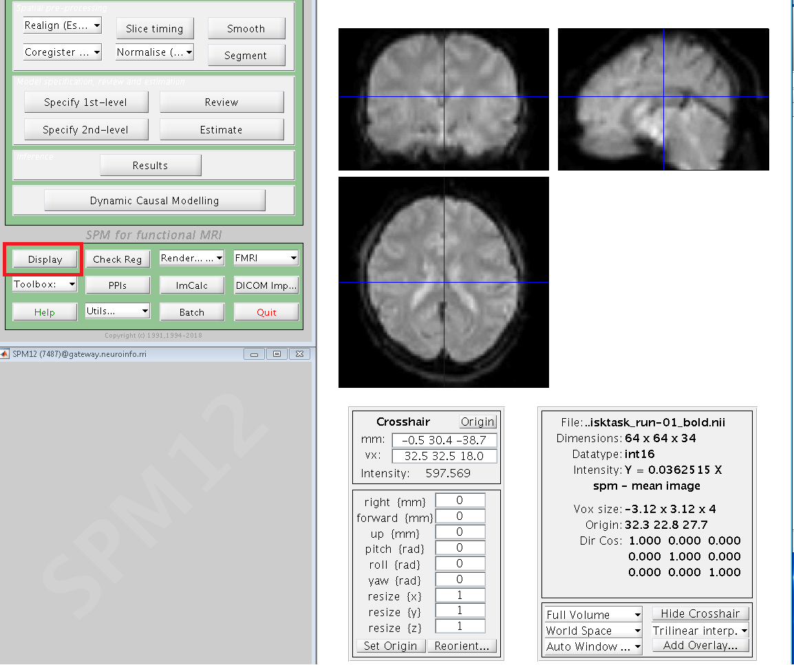

Preprocessing
=============

Remember our drink menu? It is a little different for what we should do in SPM but overall there are very similar, Anyway, let’s have a couple of drinks before the meal

Since we have download and rename the dataset, let's look at our data first to check if there are any artifacts or problems with the image data. call the ``Matlab`` and navigate to **BART_spm** directory.

Viewing the Anatomical images 
^^^^^^^^^^^^^^^^^^^^^^^^^^^^^

Whenever you download imaging data, check the anatomical and functional images for any artifacts - scanner spikes, incorrect orientation, poor contrast, and so on. It will take some time to develop an 
eye for what these problems look like, but with practice it will become quicker and easier to do.

To begin, let’s take a look at the anatomical image in the anat folder for sub-02. If you haven’t already opened SPM, navigate to the sub-02 folder and then type::

  spm fmri

and press return, which will open the SPM graphical user interface. If you click on the ``Display`` button, you will be prompted to select an image.

.. image:: SPM_display.PNG

.. note::

  SPM can read any image that are in NIFTI format, but they cannot be compressed - that is, if the datasets end with a .gz extension, you will first need to unzip them by navigating to the directory 
containing the images and then type ``gunzip *.gz`` 

Viewing the Functional images
^^^^^^^^^^^^^^^^^^^^^^^^^^^^^

When you are done looking at the anatomical image, click on the Display button again, navigate to the func directory, and select the run-1 functional image.

A new image will be displayed in the orthogonal viewing windows. This image also looks like a brain, but it is not as clearly defined as the anatomical image. This is because the resolution is lower. It 
is typical for a study to collect a high-resolution T1-weighted (i.e., anatomical) image and lower-resolution functional images, which are lower resolution in part because they are collected at a very 
fast rate. One of the trade-offs in imaging research is between spatial resolution and temporal resolution: Images collected at higher temporal resolution will have lower spatial resolution, and vice 
versa.

Many of the quality checks for the functional image are the same as with the anatomical image: Watch out for extremely bright or extremely dark spots in the grey or white matter, as well as for image 
distortions such as abnormal stretching or warping. One place where it is common to see a little bit of distortion is in the orbitofrontal part of the brain, just above the eyeballs. There are ways to 
reduce this distortion, but for now we will ignore it.

Another quality check is to make sure there isn’t excessive motion. Functional images are often collected as a time-series; that is, multiple volumes are concatenated together into a single dataset. To 
view the time-series of volumes in rapid succession, click the Check Reg button and load the sub-01_task-flanker_run-1_bold.nii data. This will display a single volume in three planes: Coronal, Sagittal, 
and Axial. Right click on any of the planes and click the Browse button. You will be prompted to select an image; click on the currently selected file to remove it, and then enter the string run-1 in the 
Filter field, and 1:146 in the Frames field. Select all of the resulting images, and click Done.

You will now see a horizontal scrolling bar at the bottom of the display window. Clicking on the right or left arrows will advance or go back one volume; you can also click and drag the scrolling bar to 
view the volumes more rapidly. Clicking on the > button in the bottom right will start movie mode, which flips through the volumes at a rapid pace. Clicking on the button again will stop the movie. To 
see a plot of the time-series activation at the voxel under the crosshairs, right-click again on any of the planes, select “Browse”, and then select “Display profile”. This opens up another figure that 
you can view simultaneously as you flip through the volumes.

Also, during the Realignment preprocessing step you will generate a movement parameter file showing how much motion there was between each volume. To begin learning about the preprocessing steps, click 
the Next button.
