Preprocessing
=============

Remember our drink menu? It is a little different for what we should do in SPM but overall there are very similar, Anyway, let’s have a couple of drinks before the meal

Since we have download and rename the dataset, let's look at our data first to check if there are any artifacts or problems with the image data. call the ``Matlab`` and navigate to **BART_spm** directory.

Viewing the Anatomical images 
^^^^^^^^^^^^^^^^^^^^^^^^^^^^^

Whenever you download imaging data, check the anatomical and functional images for any artifacts - scanner spikes, incorrect orientation, poor contrast, and so on. It will take some time to develop an 
eye for what these problems look like, but with practice it will become quicker and easier to do.

To begin, let’s take a look at the anatomical image in the anat folder for sub-02. If you haven’t already opened SPM, navigate to the sub-02 folder and then type::

  spm fmri

and press return, which will open the SPM graphical user interface. If you click on the ``Display`` button, you will be prompted to select an image.

.. image:: SPM_display.PNG

.. note::

  SPM can read any image that are in NIFTI format, but they cannot be compressed - that is, if the datasets end with a .gz extension, you will first need to unzip them by navigating to the directory 
containing the images and then type ``gunzip *.gz`` 

Viewing the Functional images
^^^^^^^^^^^^^^^^^^^^^^^^^^^^^

When you are done looking at the anatomical image, click on the Display button again, navigate to the func directory, and select the **run-01** functional image.

A new image will be displayed in the orthogonal viewing windows. This image also looks like a brain, but it is not as clearly defined as the anatomical image. This is because the resolution is lower. It 
is typical for a study to collect a high-resolution T1-weighted (i.e., anatomical) image and lower-resolution functional images, which are lower resolution in part because they are collected at a very 
fast rate. One of the trade-offs in imaging research is between spatial resolution and temporal resolution: Images collected at higher temporal resolution will have lower spatial resolution, and vice 
versa.

.. image:: SPM_dsiplay_2.PNG

During the Realignment preprocessing step you will generate a movement parameter file showing how much motion there was between each volume.

Realignment and Slice-Timing Correction
^^^^^^^^^^^^^^^^^^^^^^^^^^^^^^^^^^^^^^^

Similarly, when we preprocess fMRI data we are cleaning up the three-dimensional images that we acquire every TR. An fMRI volume contains not only the signal that we are interested in - changes in 
oxygenated blood - but also fluctuations that we are not interested in, such as head motion, random drifts, breathing, and heartbeats. We call these other fluctuations noise, since we want to separate 
them from the signal that we are interested in. Some of these can be regressed out of the data by modeling them (which is discussed in the chapter on modeling fitting), and others can be reduced or 
removed by preprocessing.

To begin preprocessing sub-02 data, read through the following chapters. We will begin with Realignment and Slice-Timing Correction, which correct misalignments and timing errors in the functional 
images, before moving on to Coregistration and Normalization, which align the functional and structural images and move them both to a standardized space. Finally, the images are Smoothed in order to 
increase signal and cancel out noise. The typical sequence of preprocessing steps is numbered in the image below:

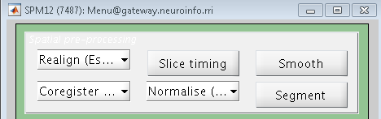

The first step of preprocessing is to realign the functional images. If you think of a time-series as a deck of cards, with each volume as a separate card, realignment will put all the cards in the same 
orientation and make the sides line up - similar to what you do after you shuffle a deck of cards.

If you click on the button Realign (Estimate & Reslice), a window opens up showing the options for realigning and reslicing the data. The Estimate part refers to estimating the amount that each volume is 
out of alignment with a reference volume, and Reslice indicates that these estimates will be used to nudge each of the volumes into alignment with the reference volume. The reference volume is set in the 
field “Num Passes”, which allows you to specify whether the volumes will be aligned to the mean of all of the volumes, or to the first volume. For this tutorial, leave it as the default, and leave the 
rest of the defaults alone, as well.

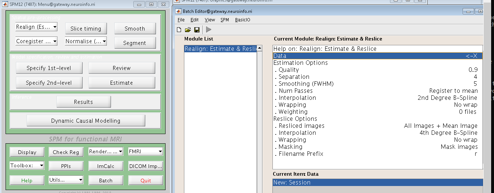

Loading the Images
******************

In this experiment, there were three runs of data in per subject ( each run of SPM refers as a session). Look at the Data tab, click on **New: Session** to add three sessions. An <-X appeared to the 
right of each Session field. Click Specify at the button to open up the Image Selection window. Navigate to the func directory of sub-02 and select the file 
"sub-02_task-balloonanalogrisktask_run-01_bold.nii,1"", 1 in here indicates that only the first frame, or volume, is available. However, In order to select all of the volumes for this run, type 1:300 and 
press enter in the "Frames field" (underneath the Filter field) to expand the 300 number of frames available for selection.

.. note::
 
  If you don’t know how many frames are in the current dataset, you can use ``3dinfo`` and ``mri_info`` command to check the frrams if you have installed AFNI or freesurfer. or you can set the upper 
bound to an high number like 1:10000. The list of files will max out at the number of available frames, and so will ensure that you do not miss any.

.. image:: SPM_frame_3dinfo.PNG

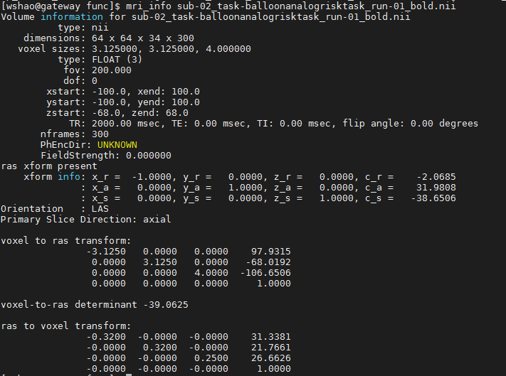

You might notice that all of the **frames** for run-01, run-02 and run-03 have been selected, even though we only want run-01 frames in this session. To limit our file selection to only the frames we are 
interested in, we can use the "Filter field". In this case, to the left of the .* characters that are already in the field, type run-01 and press return. This will refresh the screen to display only 
those frames which include the string run-01. Either click "rec" or right click select all of the images.

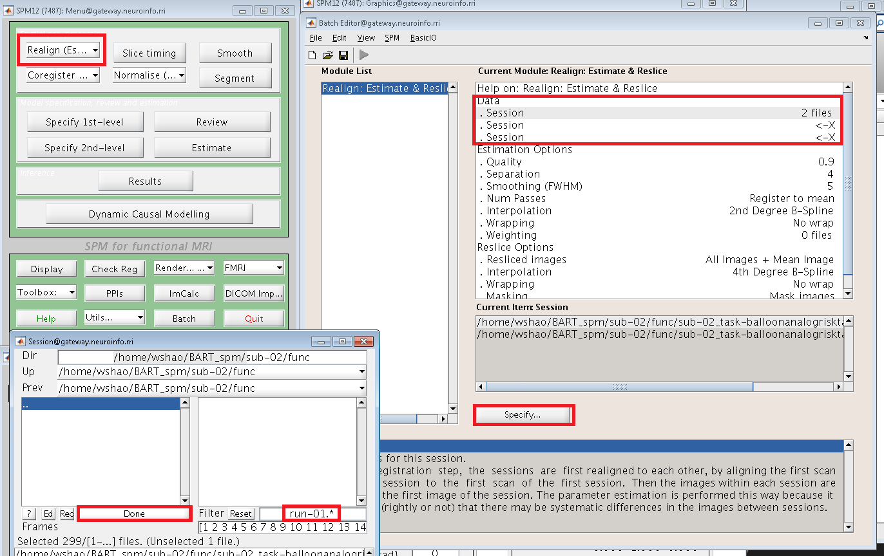

You need to repeat all the steps above and choose 300 frames from the choose **run-02** and **run-03** 

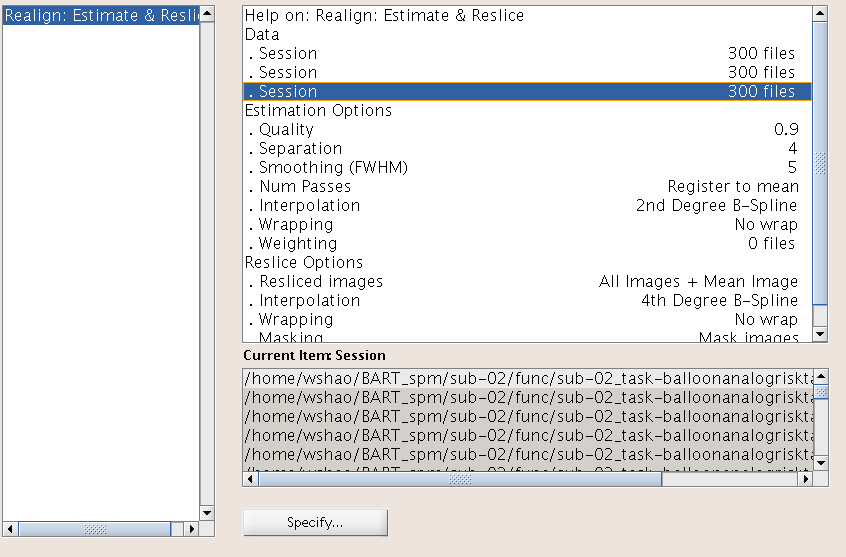

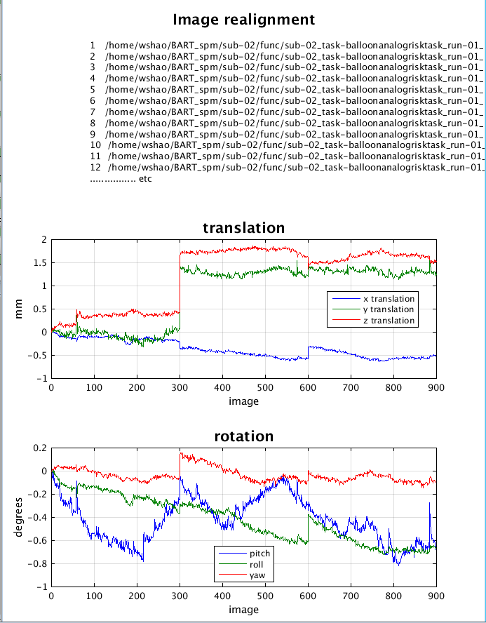

Slice-Timing Correction in SPM
^^^^^^^^^^^^^^^^^^^^^^^^^^^^^^

Similar to what we did with Realignment, we will first click on the Slice Timing button in the SPM GUI. Click on the Data field and create two new Sessions. Double-click on the first Session, and in the 
Filter column type ^rsub-02_task-flanker_run-1.*. In the Frames field, enter 1:300 and press enter; select all of the frames that are displayed, and click Done. Do the same procedure for the run-02 and 
run-03 files for the second session.

For the ``Number of Slices field``, we will need to find out how many slices there are in each of the volumes in our dataset. From the Matlab terminal navigate to the directory sub-02/func and type::

  V = spm_vol('sub-02_task-balloonanalogrisktask_run-01_bold.nii')

This will load the header of the image into a variable called V. If you now type V and press return, you will see that it contains the following fields::

  300x1 struct array with fields:

    fname
    dim
    dt
    pinfo
    mat
    n
    descrip
    private

``fname`` is the name of the file, and ``dim`` contains the dimensions for each volume in the file. ( all you need to know is that they contain other header information that SPM needs to read the file.) 

It will return the dimensions of the first volume in the time-series in the x-, y-, and z-directions. You should see something like this:

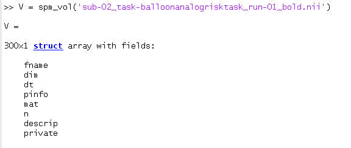

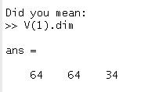

This means that the first volume of the time-series has the dimensions of 64x64x34 voxels, with 34 being the number of slices in the z-dimensions. We will assume that the dimensions of each image and the 
number of slices will be the same for every volume in the subject’s functional data.

Go back to the SPM_GUI window, double-click on Number of Slices, enter a value of 34, and click OK.

Enter 2 for TR, use the formula enter 2-(2/34) for the TA. Enter [1:2:34 2:2:34] for ``Slice order``, and for ``Reference Slice`` enter a value of 1. Leave the filename prefix as a. Do this same 
procedure for run-02 and run-03 as well. When you are finished, the preprocessing window should look like this:

.. image:: Slice_Timing.PNG

When the images have been slice-time corrected, you are ready to coregister the functional data to the anatomical data; in other words, we will align the two sets of images as best we can.

Co-registration with SPM
^^^^^^^^^^^^^^^^^^^^^^^^

To co-register the functional and anatomical images, go back to the SPM GUI and click on Coregister (Estimate & Reslice). This will open up a batch editor window with only two fields that need to be 
filled in - a Reference Image and a Source Image.

The Reference Image is the image that will remain stationary; the Source Image, on the other hand, is moved around until a best fit is found between the Reference and the Source image, using the cost 
functions described above. For most experiments, you will want to use a representative of the functional data as the Reference Image, and the anatomical data as the Source Image, since we generally want 
to introduce as few edits as possible to the functional data.

Double-click on the Reference Image, and select the meansub-08_task-flanker_run-1_bold.nii. For the source image, navigate to the anat directory and select the file sub-08_T1w.nii. Then click the green 
Go button. This step should only take a few moments.

When it finishes, another window will be generated showing the coregistration results with the mean functional image on the left and the anatomical image on the right. Click and drag the crosshairs in 
either image to see how well the images are aligned - in addition to the outlines of the brains being matched, you should also check to make sure that internal structures such as the ventricles are 
aligned as well. Remember that the intensities will be flipped: Darker areas in the anatomical image (such as the ventricles) will appear brighter in the functional image.

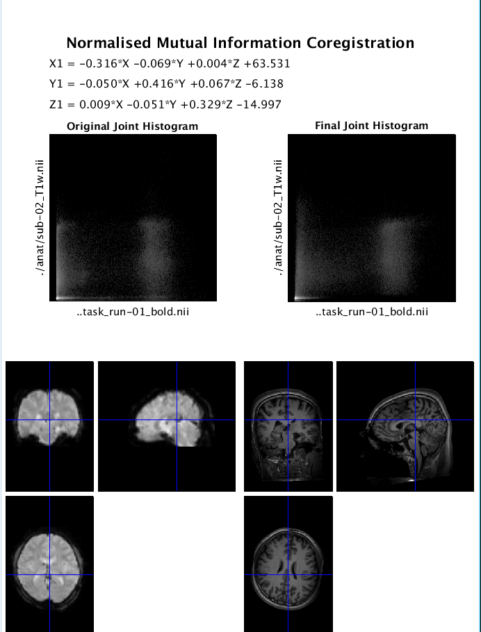

Tissue Probability Maps
^^^^^^^^^^^^^^^^^^^^^^^

The brain is composed of two major tissue types: 1 Grey matter (containing high densities of unmyelinated neurons) and 2 white matter (containing high densities of myelinated neurons). The brain is also 
surrounded by cerebrospinal fluid (CSF), and large amounts of CSF are contained in internal spaces within the brain called ventricles.

Knowing which voxels belong to which tissue type can assist in Normalizing the anatomical image, warping it to match a template in standardized space. SPM has images of six tissue priors representing 
their best guess as to which voxel in standardized space belongs to which tissue type. Accurately mapping the tissues of our anatomical image to the tissues of the template will increase the accuracy of 
our registration.

Why six priors, instead of the three we just listed? The anatomical image also contains non-brain tissues, such as soft tissue (e.g., dura mater) and skull. The last tissue type is reserved for all other 
tissues not captured by any of the above; usually this just means air inside the sinuses and outside the brain, but it can also detect abnormal tissue, such as tumors.

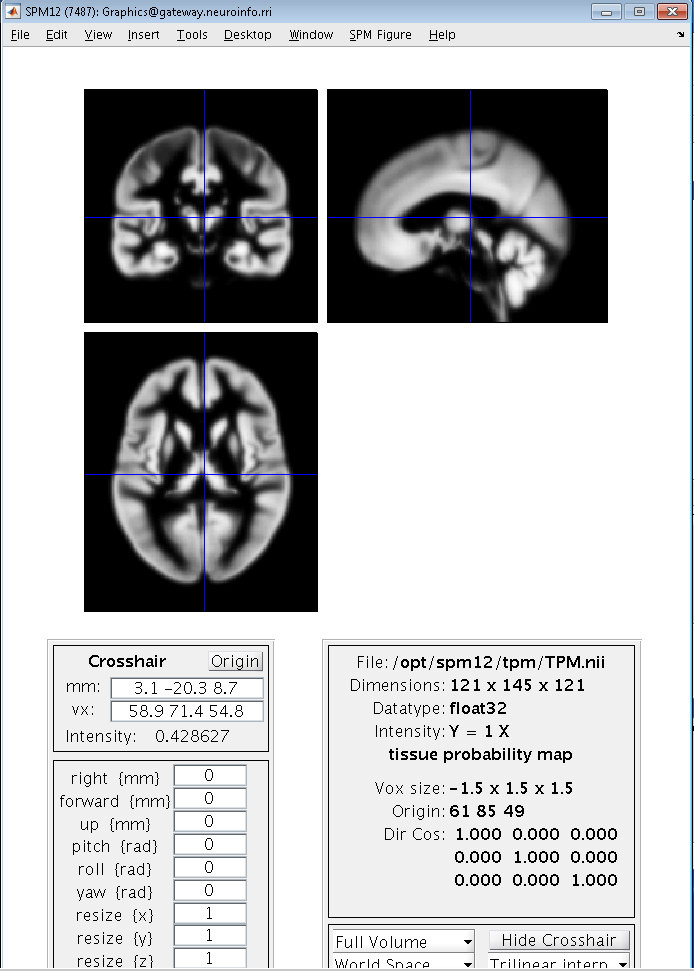

Segmentation 
^^^^^^^^^^^^

let's setting up the ``Segmentation`` , which requires the realigned anatomical file as input. Open Segmentation button on the SPM GUI, and click the "volumes field". Select the file rsub-02_T1w.nii, and 
then set the ``Save Bias Corrected field`` from Save Nothing to Save Bias Corrected. Lastly, at the very bottom of the menu, change ``Deformation Fields`` to Forward. Then click the green Go button.

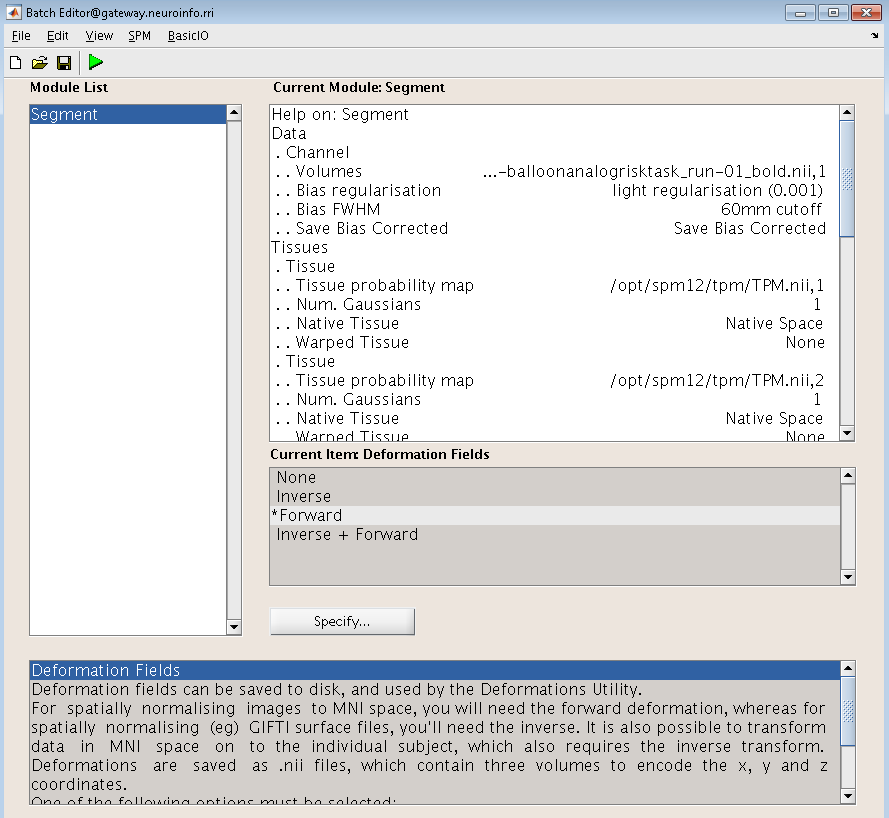

Once the segmentation has finished, we are now ready to use the information generated by this step for ``Normalization``.

Normalization
^^^^^^^^^^^^^

After the anatomical image has been segmented, we can use those segmentations to normalize the image. From the SPM GUI, click on Normalize (Write), from ``Data field`` and create a new Subject. Select 
the ``Deformation Field`` that you created in the func directory during ``Segmentation`` (the files should be called “y_rsub-02_T1w.nii”), next, ``Images to Write``, select all of the realigned and 
slice-time corrected images for the run-1, which means you need select all 900 files from the 3 runs. Typing ^ar.* in the "Filter field", and entering 1:300 in the "Frames field".

In the ``Writing Options`` section, we can change the voxel resolution of the images that are warped. The default of 2x2x2 will create higher-resolution images, but the files will take up more space on 
your computer. But you also can choose smaller files with lower resolution by changing this to 3 3 3.

Checking the Output
*******************

Once the functional images have been normalized, let's check out the output. From SPM GUI, click on ``Check Reg``, and select one of our functional volumes that has a w prepended (w = warped, that is, 
normalized). We also need choose the second image, which is a template image. Go to the spm canonical directory such as ...spm12/canonical and select a averaged template like avg152T1.nii, please 
carefully make sure that both the outlines of the brains and the internal structures are well-aligned between these two.

.. image: normalization_output.PNG

Smooth
^^^^^^

Click the ``Smooth`` from SPM GUI and select ``Images to Smooth``. choose all the 300 warped frame functional images of each run. ( you can use ^warsub in "Filter fields" and 1:900 in "Frames fields" to 
select the images), then click ``Go`` button.

..image:: smooth.PNG

Smoothed Images
^^^^^^^^^^^^^^^

As before, use ``Check Reg`` to load a representative volume from the output file, and view it with a warped functional image that hasn’t been smoothed side by side. 

.. image:: 
