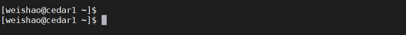

SuperComputer
=============

A good chef not only can handle his/her own kitchen but also others

a supercomputer like central kitchen, everyone can get access to it and do some amazing jobs without actual buy all the expensive tools 

Nowadays, every university or neuroimage research institution might have the right and we can take advantage of it, you can run the analysis on your own laptop or you can run the analysis on supercomputers! 

first of all, you need a key to the door of central kitchen, and MobaXterm can do this job

Go to `MobaXterm <https://surfer.nmr.mgh.harvard.edu/fswiki/DownloadAndInstall/>`__ and find the right edition to set up. 

.. image:: MobaXterm.PNG

if you have the access to any server/supercomputer, you can take the Cedar cluter from computecanada as a example:: 

  ssh -Y (user id)@cedar.computecanada.ca

Secure Shell(ssh)ssh is a widely-used standard to connect to remote servers in a secure way. SSH connection is encrypted. You can use ssh to execute commands, submit jobs, follow the progress of these jobs and in some cases, transfer files, etc..

The option -Y forwards X11 traffic which allows you to use graphical applications on the remote server. You also need to have an X11 server installed on your workstation.For windows, MobaXterm normally comes with an X11 server.

user id is the id you registered in ComputeCanada, @Cedar.computecanada.ca means I want to connect the Cedar cluster 

Then, if you see a similar terminal like this, it means you are in

In some cases, you can use ssh -Y (user id)@(server IP)as the command to connect the remote server.

