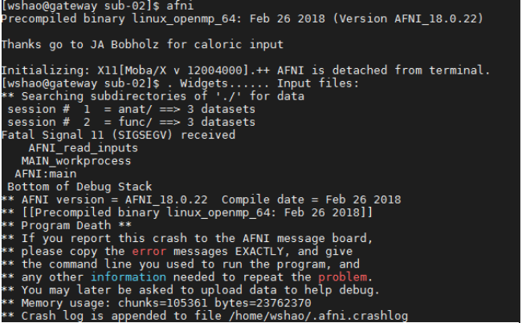
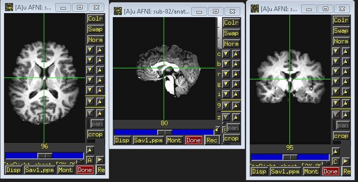
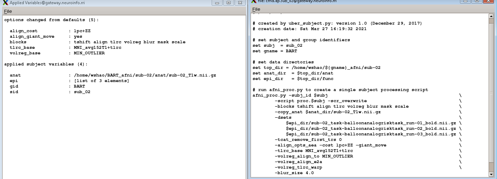

Preprocessing I
===============

Remember our drink menu? It is a little different for what we should do in AFNI but overall there are very similar, Anyway, let’s have a couple of drinks before the meal

Inspecting the image
^^^^^^^^^^^^^^^^^^^^

Before we are actually running the analysis, it is beneficial for us to check the data for any problems such as scanner spikes, incorrect orientation, or poor contrast, and so on. Although it might be 
unnecessary for the open neuroimaging data, it is really important for you to check the image before when it comes to your own data.

Let's start from **sub-02**, ``cd`` to ``BART_afni/sub-02/anat`` directory and type ``afni`` to open the AFNI graphical user interface. you might see this

That because AFNI will look for any images in the current directory by default - and load all of them into the program. If you want to load only the anatomical T1 image into the AFNI viewer, you would 
either go to sub-02/anat and type type: ``afni sub-02_T1w.nii.gz`` or type ``afni anat/sub-02_T1w.nii.gz`` from ``sub-02`` directory

.. figure:: AFNI_inspect_anat.PNG

  T1 anat image of sub-02

When you are done with the anatomical image, click on the ``Read`` button from the menu at the top of your screen. In the “Directories” sidebar, double-click on the filepath that ends in two dots such as 
.., which indicates one directory above the current directory. Then double-click on the func directory in the “Sessions” sidebar. This loads all of the images in the func directory, which you can look at 
the AFNI viewer.

.. figure:: AFNI_inspect_func.PNG
  
   functional image of sub-02

If you want to go back to look at the anat image again, click on **Switch** and select the another session. Inspect the image by clicking around in one of the viewing windows. Notice how the other 
viewing windows and crosshairs change as a result - this is because MRI data is collected as a three-dimensional image, and moving along one of the dimensions will change the other windows as well.

Be careful with two things:
 
1 Lines that look like ripples in a pond. These are called **Gibbs Ringing Artifacts**, and they may indicate an error in the reconstruction of the MR signal from the scanner. These ripples may also be 
caused by the subject moving too much during the scan. In either case, if the ripples are large enough, they may cause preprocessing steps like brain extraction or normalization to fail.

.. image:: AFNI_Gibbt.gif

2 Abnormal intensity differences within the grey or the white matter. These may indicate pathologies such as aneurysms or cavernomas, and they should be reported to your radiologist right away; make sure 
you are familiar with your laboratory’s protocols for reporting artifacts. You can take a `gallery of pathologies <http://www.mrishark.com/brain1.html/>`__ as a reference. 

You might notice there is a black block/missing information on the face areas, it is because all the data from the open-source dataset need to be defaced for the purpose of privacy.

Skull stripping
^^^^^^^^^^^^^^

When it comes to skull stripping, AFNI has 2 options for you.The first one would be ``3dSkullStrip``, which is the command for brain extraction. Now, cd to ``BART_afni/sub-02/anat`` and type 
``3dSkullStrip``, you will see this doesn't work and the program give you error messages, it is because we need to specify more details such as the ``-input`` flag, which stands for the input command as 
well as the file ``sub-02_T1w.nii.gz``. Therefore, the actual command would be ``3dSkullStrip -input sub-02_T1w.nii.gz``. type it and wait for a few minutes, you will see two new files 
**skull_strip_out+orig.BRIK** and **skull_strip_out+orig.HEAD** . use ``afni`` look at either one of the two files, 4 new windows will appear, and you can see the resutls.
 

You might not satisfied the quality of skull stripping and the output file name also could be confusing. Don't worry, you also can add more, ``3dSkullStrip -push_to_edge -input sub-02_T1w.nii.gz -prefix 
sub-02_brain`` would be a good choice. ``-push_to_edge`` can help you avoid removing any cortex parts since we rather have more dura than the lack of cortex. ``-prefix`` will label the output file name 
rather than the default setting. Therefore, the actual command for a good skull stripping would be::

  3dSkullStrip -push_to_edge -input sub-02_T1w.nii.gz -prefix sub-02_brain
 
Check the quality 
*****************

You can take the new skull stripping file as overlay with the origal T1 anat file as underlay by type ``afni sub-02_brain+orig.BRIK sub-02_T1w.nii.gz`` , and go to the central area, apply the underlay 
and overlay.

.. image:: AFNI_underlay.PNG

.. image:: AFNI_overlay.PNG

.. image:: AFNI_skull_quality.PNG
 
Type ``3dSkullStrip -help`` from you terminal to look more information of this command

The second option would be easier to use and more intuitive because it associated with a new graphical interface developed by AFNI in recent years, **uber_subject.py**  

uber_subject 
^^^^^^^^^^^^

Go to sub-02 directory and type ``uber_subject.py``, and you can see a window appears. 

uber_subject.py is a graphical interface that can integrate all the input specified by the user and directs it into another program called afni_proc.py. The latter command will generate a large script 
that contains every AFNI command needed to run preprocessing.

.. image:: AFNI_ubersubjecy.PNG

Now, take a deep breath, let's go through this interface roughly. **subject ID** and **group ID** stand for the name you are going to label for the subject and group. “Analysis Initialization”. By 
default, the data analysis type will be “task” , which makes sense given most fMRI analyses have a task for the participants during the scanning, unless you are going to do Resting-state fMRI (we will 
takl about it in the future). The domain is “volume” because we are analyzing the volumetric data rather than surface analysis (a program of AFNI, SUMA, could do this kind of job). Regarding the words in 
the field after “processing blocks” are **tshift**, **align**, **tlrc**, **volreg**, **blur**, **mask**, **scale**, and **regress**, we will learn them in more details in the next, as well as what 
preprocessing step they correspond to, and why we do them.

Setting up the uber_subject 
***************************

After the basic introduction of uber_subject, we will continue the setting. type sub_02 and BART in the sub ID and group ID accordingly. Go to processing tab from "Analysis Initialization" and remove the 
regress block. (it is a general linear model for each subject, we don't need it now). Then navigate to "anatomical dataset" and click on the browse anat button, find the anat directory, select the 
"sub-02_T1w.nii.gz", and ckeck the "anat has skull" botton. Next, select the functional images by clicking the "browse EPI" button from “EPI datasets” section, EPI = echo planar image. We will go to the 
func directory, and hold down shift to select the files "sub-02_task-balloonanalogrisktask_run-01_bold.nii.gz" "sub-02_task-balloonanalogrisktask_run-02_bold.nii.gz" 
"sub-02_task-balloonanalogrisktask_run-03_bold.nii.gz". The first half of the AFNI GUI should look as follows:

.. image:: AFNI_preprocess.png

As we are not yet doing regression, we will skip over the “stimulus timing files” and “symbolic GLTs” sections, and take a look at the default of “expected options” field. No TRs will be removed as 0 in 
"first TRS to remove", the volume with the least amount of variability image will be used as the reference for alignment since the default is "MIN_OUTLIER" in volume registration base, a smoothing kernel 
of 4mm will be applied from "blur size". Any volumes that contain movement of 0.3mm from TR to TR will be flagged.

Again, we are not doing regression model yet, just skip over the “extra regress options”, and go to “extra align options” and “extra tlrc options”. Choose "lpc+ZZ" in cost function and check the align 
box by using giant_move. This is prepare for functional and anatomical images are far away from each other by any case, it will be used with the align_epi_anat.py command in order to bring them into a 
closer initial alignment. Lastly, choose the MNI 152 T1 standard space (template) "MNI_avg152T1+tlrc" from the “extra tlrc options” sectio. the second half of the AFNI GUI looks like this:

.. image:: AFNI_subject_2.PNG

Run the uber_subject
********************

When you are done setting up, you can execute it by clicking the leftmost button of the GUI, ignore the warning message and click OK.Three are three icons, from left to right, the first one generates the 
**afni_proc.py** command that includes everything that you just specified in the GUI. Click on this icon, and it will return two windows: One listing each of the options that were changed from the 
defaults and listing each of the inputs, and another showing the code of the “afni_proc.py" command. Take a look at it to see the commands and differences.

When you have looked over the paper, click on the next icon, a new sheet of paper will show up. This will execute the "afni_proc.py" code listed in the previous window, and return any warnings or 
errors that you should be aware of. You will also see a couple of lines of code specifying how to run the output of this command, which is a file called **proc.sub_02**.

.. image:: AFNI_proc_2.PNG

Close the window, We are now ready to run this script. You can simply press the Green icon button at the top of the uber_subject.py GUI that next to the first two button. you will see another window open 
up that shows each command being run, and its corresponding output: and go back to your Terminal by ``Ctrl+Z`` and type ``bg`` to hide the executing task into background. From the sub-02 directory, you 
will notice that there is a new directory called **subject_results** in the current directory. cd to it and a directory named **group.BART** has been created, Navigate into this directory you will find 
**subj.sub_02**. There are 4 files within this directory:

1 cmd.ap.sub_02: This is the afni_proc.py file that was generated by uber_subject.py a. 

2 output.cmd.ap.sub_02: This is the output of afni_proc.py that generates any warnings or errors you should be aware of. 

You have saw these two files when you click the first and second execute button

3 proc.sub_08: The AFNI script that perform the actual preprocessing. 

4 output.proc.sub_02 the log files of afni_proc.py, which record the preprocessing information when it execute the commands

The last two are more important since they have all the information for you to debug when you do your own data with AFNI.

.. image:: AFNI_proc_3.PNG

The preprocessing will take a few minutes,  While it is running, let's review the preprocessing steps.
